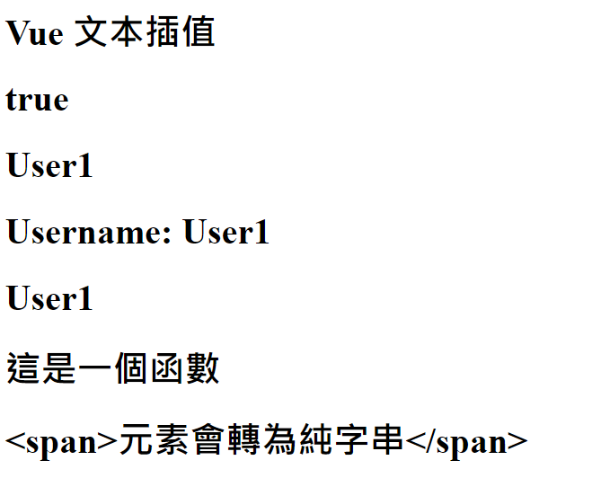

# Vue 3 學習筆記

根據 Vue 3 官方文檔整理的學習筆記，大部分與官方文檔相同。

## 官方文檔

> https://vuejs.org/ <br> https://cn.vuejs.org/

## 目錄

- [初始化專案](#初始化專案)
- [創建一個 Vue 應用](#創建一個-vue-應用)
- [模板語法](#模版語法)
- [響應式狀態 ref & reactive](#響應式狀態-ref--reactive)
- [淺層響應式狀態 shallowRef & shallowReactive](#淺層響應式狀態-shallowref--shallowreactive)
- [readonly](#readonly)
- [DOM 更新時機](#dom-更新時機)
- [toRefs & toRef](#torefs--toref)
- [計算屬性 computed](#計算屬性-computed)

## 初始化專案

### 創建專案 (基於 Vite 創建)

```bash
npm create vue@latest
```

### 根據引導選擇專案依賴及環境


### 項目運行

```bash
cd <project-name>

npm install
npm run dev
```


### 目錄清理

1.刪除 /assets/base.css

2.刪除 /assets/main.css

3.刪除 /components 下全部範例組件

4.修改 main.js - 刪除 import main.css

```javascript
import { createApp } from 'vue'
import App from './App.vue'

const app = createApp(App)
app.mount('#app')
```

5.修改 App.vue

```vue
<script setup></script>

<template>
  <h1>Hello Vue3!</h1>
</template>

<style></style>
```

6.清理後運行結果


## 創建一個 Vue 應用

### 1. main.js 通過 `createApp()` 函數創建一個新的應用實例

```javascript
import { createApp } from 'vue'
const app = createApp({
  // 根組件選項設定
})
```

### 2. 根組件

`createApp()` 傳入的物件其實是一個組件，每個應用都需要一個根組件，其他組件將作為其子組件。

如果使用的是單文件組件(SFC)，則可以直接從另一個文件中導入根組件。

```javascript
import { createApp } from 'vue'
// 從一個單文件組件中導入根組件
import App from './App.vue'
const app = createApp(App)
```

### 3. 掛載應用

應用實例必須在調用了 `.mount()`方法後才會渲染出來，該方法接收一個 **容器** 作為參數，可以為 **實際的 DOM 元素** 或是一個 **CSS 選擇器**。

```html
<!-- index.html -->
<body>
  <div id="app"></div>
  <script type="module" src="/src/main.js"></script>
</body>
```

```javascript
// main.js
import { createApp } from 'vue'
// 從一個單文件組件中導入根組件
import App from './App.vue'

const app = createApp(App)
// 掛載在 id 為 app 的元素上
app.mount('#app')
```

> 注意：
>
> 1.根組件的內容將會渲染在容器元素裡面，容器元素自己不會被視為應用的一部份
>
> 2.`.mount()` 應該始終在整個應用配置和資源註冊完成之後被調用，且它的返回值是根組件實例而不是應用實例

**補充：DOM 中的根組件模板**

根組件的模板通常是組件本身的一部份，但也可以直接通過在掛載容器內編寫模版。

DOM 內模板通常用於**無構建步驟的 Vue 應用程序**，也可以與伺服器端框架一起使用，其中根模板可能是由伺服器動態生成的。

[Codepen demo](https://codepen.io/ypinpin/pen/bGJKzOL)

```html
<!-- index.html -->
<!-- 掛載容器 -->
<div id="app">
  <!-- 直接編寫根組件模板內容 -->
  <button @click="count++">{{ count }}</button>
</div>

<script>
  import {
    createApp,
    ref,
  } from 'https://unpkg.com/vue@3/dist/vue.esm-browser.js'

  const app = createApp({
    // 當根組件沒有設定 template 選項時
    // Vue 將自動使用容器的 innerHTML 作為模板
    setup() {
      const count = ref(0)
      return {
        count,
      }
    },
  })
  // 掛載
  app.mount('#app')
</script>
```

## 模版語法

### 1. 文本插值

最基本的數據綁定是文本插值，使用 Mustache 語法(雙大括號)，會將數據解析為**純文本**。

支持使用表達式( 可以合法地寫在 return 後面的即為表達式 )或引用 `<script>` 中聲明的變數、函數。

> 綁定在表達式中的函數在組件每次更新的時候都會被重新調用，因此不應該產生任何副作用，例如改變數據或觸發異步操作。

語法：`{{ 表達式 }}`

```vue
<script setup>
const username = 'User1'
const message = () => '這是一個函數'
const html = '<span>元素會轉為純字串</span>'
</script>

<template>
  <h1>{{ 'Vue 文本插值' }}</h1>
  <h1>{{ 8 > 5 ? 'true' : 'false' }}</h1>
  <h1>username</h1>
  <h1>Username: {{ username }}</h1>
  <h1>{{ message() }}</h1>
  <h1>{{ html }}</h1>
</template>
```



### 2. 原始 HTML

想插入 HTML，需要使用 `v-html` 指令

> 注意：小心使用，容易造成 XSS 漏洞，永遠不要使用使用者提供的 HTML 內容。

語法：`v-html="值"`

```vue
<script setup>
const rawHtml = '<i>html元素</i>'
</script>

<template>
  <p>Using text interpolation: {{ rawHtml }}</p>
  <p>Using v-html directive: <i v-html="rawHtml"></i></p>
</template>
```


### 3. Attribute 綁定

HTML attributes 中不能使用雙大括號，因此想要響應式的綁定一個 attribute 應該使用 `v-bind` 指令。

若綁定的值是 `null` 或是 `undefined` 該 attribute 會從渲染的元素上**移除**。

語法：`v-bind:attribute-name="值"`

```vue
<div v-bind:id="dynamicId">layout</div>
```

可以簡寫為 `:attribute-name="值"`

```vue
<div :id="dynamicId">layout</div>
```


一樣支持使用表達式、函數

```vue
<div :id="`list-${id}`"></div>

<time :title="toTitleDate(date)" :date-time="date">
  {{ formatDate(date) }}
</time>
```

**同名簡寫 (3.4+ 可用)**

```vue
// 與 :id="id" 相同
<div :id>layout</div>

// 這個一樣有效
<div v-bind:id>layout</div>
```

### 4. Boolean 型 attribute

會根據 `true` / `false` 值來決定 attribute 是否存在於該元素上，例如 disabled。

當 isButtonDisabled 為真值或一個空字串
( `<button disabled="">` )時，
元素會包含這個 disabled attribute，而當其為其他假值時 attribute 將被忽略。

```vue
<script setup>
const isButtonDisabled = true
</script>

<template>
  <button :disabled="isButtonDisabled">Button</button>
</template>
```


### 5. 動態綁定多個值

通過使用不帶參數的 `v-bind` 設定，一次綁定多個值。

```vue
<script setup>
const objectOfAttrs = {
  id: 'container',
  class: 'wrapper',
}
</script>

<template>
  <div v-bind="objectOfAttrs">container</div>
</template>
```


## 響應式狀態 ref & reactive

當響應式狀態發生變化時，`<template>` 中使用到的會自動重新渲染。

- ref：基本類型數據、物件類型數據 (物件、陣列)

  - ref 的變數在 js 內必須使用 `.value` 取得值

- reactive：物件類型數據 (物件、陣列)
  - 屬性為基本數據類型被解構為本地變數或是傳遞給函數時會丟失響應性，可以使用 `toRefs` 及 `toRef` 解決。[原因說明](https://blog.csdn.net/qq_41370833/article/details/132565060)
  - 重新指定新的物件會失去響應式 (可以使用 `Object.assign` 去整體替換)
- 使用原則：
  - 基本類型數據使用 ref
  - 物件類型數據，層級不深，ref 及 reactive 都可以使用
  - 物件類型數據，層級較深，建議使用 reactive

```vue
<script setup>
import { ref, reactive } from 'vue'
let name = ref('小明')
let obj = ref({ count: 0 })
let fruit = reactive({
  name: 'apple',
  price: 20,
})

function changeName() {
  name.value = name.value === '小明' ? '小白' : '小明'
}

function addCount() {
  obj.value.count++
}

function addPrice() {
  fruit.price += 10
}
</script>

<template>
  <div>
    <div>
      name:
      {{ name }}
      <button @click="changeName">changeName</button>
    </div>
    <div>
      obj:
      {{ obj }}
      <button @click="addCount">add obj count</button>
    </div>
    <div>
      fruit:
      {{ fruit }}
      <button @click="addPrice">add fruit price</button>
    </div>
  </div>
</template>
```

## 淺層響應式狀態 shallowRef & shallowReactive

與前面的 ref & reactive 不同，只針對淺層數據具有響應式，對深層的數據不做處理，**可以避免大型數據的響應性造成的性能開銷**。

shallowRef：只會對 `.value` 的變化進行響應式處理

```vue
<script setup>
import { shallowRef } from 'vue'
const obj = shallowRef({ count: 1 })

function changeObjCount() {
  // 不會觸發響應
  obj.value.count++
  console.log('obj', obj.value)
}
function changeObj() {
  // 會觸發響應
  let count = obj.value.count + 1
  obj.value = { count: count }
  console.log('obj', obj.value)
}
</script>

<template>
  <div>
    <div>
      obj (shallowRef):
      {{ obj }}
      <button @click="changeObjCount">changeObjCount</button>
      <button @click="changeObj">changeObj</button>
    </div>
  </div>
</template>
```

shallowReactive：只會使物件的**最頂層屬性**為響應式狀態，內部的嵌套屬性則不會為響應式

```vue
<script setup>
import { shallowReactive } from 'vue'
const state = shallowReactive({
  foo: 1,
  nested: {
    bar: 2,
  },
})

function changeFoo() {
  // 更改頂層的屬性是響應式的
  state.foo++
  console.log('state', state)
}
function changeNestedBar() {
  // 下層嵌套的屬性不會是響應式
  state.nested.bar++
  console.log('state', state)
}
</script>

<template>
  <div>
    <div>
      state (shallowReactive):
      {{ state }}
      <button @click="changeFoo">changeFoo</button>
      <button @click="changeNestedBar">changeNestedBar</button>
    </div>
  </div>
</template>
```

## readonly

`readonly()` 接收一個物件(不論是普通的或響應式)或是一個 ref，返回一個原值的只讀代理(深層的，淺層的可以使用 [shallowReadonly](https://cn.vuejs.org/api/reactivity-advanced.html#shallowreadonly) )。

```vue
<script setup>
import { reactive, readonly } from 'vue'
const original = reactive({ count: 0 })

const copy = readonly(original)

function changeOriginal() {
  // 可以正常修改響應
  original.count++
}

function changeCopy() {
  // 不能修改且會得到警告
  copy.count++
}
</script>

<template>
  <div>
    <div>
      original:
      {{ original }}
      <button @click="changeOriginal">changeOriginal</button>
      <br />
      copy (readonly):
      {{ copy }}
      <button @click="changeCopy">changeCopy</button>
    </div>
  </div>
</template>
```

## DOM 更新時機

當修改了響應式狀態時，DOM 會被自動更新，但是**更新不是同步的**，Vue 會在 **next tick** 更新週期中緩衝所有狀態的修改，用來確保不管進行多少次狀態修改，每個組件都只會被更新一次

要等待 DOM 更新完成後再執行額外的程式碼，可以使用 `nextTick()` 全局 API

```vue
<script setup>
import { nextTick } from 'vue'
async function increment() {
  count.value++
  await nextTick()
  //現在DOM已經更新了
}
</script>
```

## toRefs & toRef

將響應式物件中的每一個屬性轉換為 ref (響應式)

`toRefs` 可以批量轉換多個屬性

```vue
<script setup>
import { reactive, toRefs, toRef } from 'vue'

let person = reactive({
  personName: '小明',
  age: 18,
  gender: '男',
})

let { personName, age } = toRefs(person)
let gender = toRef(person, 'gender')

function changePersonName() {
  personName.value = personName.value === '小明' ? '小白' : '小明'
}

function changePersonAge() {
  age.value++
}

function changePersonGender() {
  gender.value = gender.value === '男' ? '女' : '男'
}
</script>

<template>
  <div>
    person:
    {{ person }}
    <br />
    personName:
    {{ personName }}
    <button @click="changePersonName">changePersonName</button>
    <br />
    age:
    {{ age }}
    <button @click="changePersonAge">changePersonAge</button>
    <br />
    gender:
    {{ gender }}
    <button @click="changePersonGender">changePersonGender</button>
  </div>
</template>
```

## 計算屬性 computed

根據已有的數據計算出新數據並返回一個`計算屬性ref`，模板內無需添加 `.value`。

計算屬性會**自動追蹤響應式依賴**，所以當內部綁定的屬性變動時皆會更新。

與直接使用 function 定義返回結果會相同，但是**使用計算屬性會對響應式資料進行緩存**，只有在內部屬性變動時才會重新計算，function 則每次皆會進行計算。

> 注意：const now = computed(() => Date.now())，會讀取緩存，永遠不會更新，因為 `Date.now()` 不是一個響應式依賴

計算屬性默認是**只讀的**，如果要進行修改需要同時設定 `getter` 及 `setter`

```vue
<script setup>
import { ref, computed } from 'vue'
let firstName = ref('張')
let lastName = ref('三')

// 只讀取不修改
// let fullName = computed(() => {
//   return firstName.value + '-' + lastName.value
// })

// 讀取又修改
let fullName = computed({
  get() {
    return firstName.value + '-' + lastName.value
  },
  set(val) {
    firstName.value = val.split('-')[0]
    lastName.value = val.split('-')[1]
  },
})
function changeFullName() {
  fullName.value = fullName.value === '張-三' ? '李-四' : '張-三'
}
</script>

<template>
  <div class="person">
    姓：<input type="text" v-model="firstName" /> <br />
    名：<input type="text" v-model="lastName" /> <br />
    全名：<span>{{ fullName }}</span> <br />
    <button @click="changeFullName">修改名字</button>
  </div>
</template>
```
