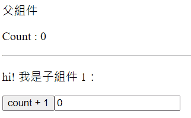
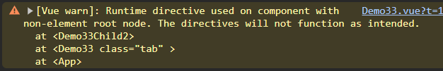
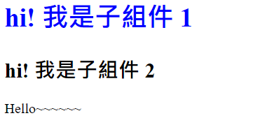

# Vue 3 學習筆記

主要根據 Vue 3 官方文檔整理的學習筆記，方便查閱。

## 官方文檔

> https://vuejs.org/ <br> https://cn.vuejs.org/

## 目錄

- [初始化專案](#初始化專案)
- [創建一個 Vue 應用](#創建一個-vue-應用)
- [模板語法](#模版語法)
- [v-bind 屬性(Attribute)綁定](#v-bind-屬性attribute綁定)
- [響應式狀態 ref & reactive](#響應式狀態-ref--reactive)
- [淺層響應式狀態 shallowRef & shallowReactive](#淺層響應式狀態-shallowref--shallowreactive)
- [readonly](#readonly)
- [DOM 更新時機](#dom-更新時機)
- [toRefs & toRef](#torefs--toref)
- [computed 計算屬性](#computed-計算屬性)
- [響應式數據監聽 watch & watchEffect](#響應式數據監聽-watch--watcheffect)
  - [watch](#watch)
  - [watcheffect](#watcheffect)
- [Class 與 Style 綁定](#class-與-style-綁定)
  - [綁定 class](#綁定-class)
  - [綁定 style](#綁定-style-內聯樣式)
- [條件渲染 v-if & v-show](#條件渲染-v-if--v-show)
- [列表渲染 v-for](#列表渲染-v-for)
  - [渲染多個元素](#渲染多個元素)
  - [v-for 使用物件](#v-for-使用物件)
  - [v-for 使用整數值](#v-for-使用整數值)
  - [v-if 不可與 v-for 同時使用](#v-if-不可與-v-for-同時使用)
  - [組件上使用 v-for](#組件上使用-v-for)
  - [陣列的變化偵測](#陣列的變化偵測)
- [事件處理 v-on](#事件處理-v-on)
  - [事件修飾符](#事件修飾符)
  - [按鍵修飾符](#按鍵修飾符)
- [雙向綁定 v-model](#雙向綁定-v-model)
  - [各類型輸入基本用法](#各類型輸入基本用法)
  - [動態值綁定](#動態值綁定)
  - [修飾符](#修飾符)
- [生命週期鉤子](#生命週期鉤子)
- [模板引用 ref 屬性](#模板引用-ref-屬性)
- [組件](#組件)
  - [定義一個組件](#定義一個組件)
  - [組件註冊](#組件註冊)
  - [使用組件](#使用組件)
  - [動態組件](#動態組件)
- [props 傳遞 (父傳子)](#props-傳遞-父傳子)
  - [基本用法](#基本用法)
  - [傳遞其他類型值](#傳遞除了字串外的其他類型值)
  - [使用物件綁定多個 props](#使用物件綁定多個-props)
  - [單向數據流](#單向數據流)
  - [props 校驗](#props-校驗)
- [組件事件 (子傳父)](#組件事件-子傳父)
- [組件 v-model 雙向綁定](#組件-v-model-雙向綁定)
  - [基本綁定用法](#基本綁定用法)
  - [v-model 的參數](#v-model-的參數)
  - [多個 v-model 綁定](#多個-v-model-綁定)
  - [處理 v-model 自定義修飾符](#處理-v-model-自定義修飾符)
- [透傳 Attributes](#透傳-attributes)
- [插槽 Slots](#插槽-slots)
- [依賴注入 (Provide/Inject)](#依賴注入-provideinject)
- [異步組件](#異步組件)
- [組合式函數 (Composables)](#組合式函數-composables)
- [自定義指令](#自定義指令)
- [插件 (Plugins)](#插件-plugins)

## 初始化專案

### 創建專案 (基於 Vite 創建)

```bash
npm create vue@latest
```

### 根據引導選擇專案依賴及環境


### 項目運行

```bash
cd <project-name>

npm install
npm run dev
```


### 目錄清理

1.刪除 /assets/base.css

2.刪除 /assets/main.css

3.刪除 /components 下全部範例組件

4.修改 main.js - 刪除 import main.css

```javascript
import { createApp } from 'vue';
import App from './App.vue';

const app = createApp(App);
app.mount('#app');
```

5.修改 App.vue

```vue
<script setup></script>

<template>
  <h1>Hello Vue3!</h1>
</template>

<style></style>
```

6.清理後運行結果


## 創建一個 Vue 應用

### 1. main.js 通過 `createApp()` 函數創建一個新的應用實例

```javascript
import { createApp } from 'vue';
const app = createApp({
  // 根組件選項設定
});
```

### 2. 根組件

`createApp()` 傳入的物件其實是一個組件，每個應用都需要一個根組件，其他組件將作為其子組件。

如果使用的是單文件組件(SFC)，則可以直接從另一個文件中導入根組件。

```javascript
import { createApp } from 'vue';
// 從一個單文件組件中導入根組件
import App from './App.vue';
const app = createApp(App);
```

### 3. 掛載應用

應用實例必須在調用了 `.mount()`方法後才會渲染出來，該方法接收一個 **容器** 作為參數，可以為 **實際的 DOM 元素** 或是一個 **CSS 選擇器**。

```html
<!-- index.html -->
<body>
  <div id="app"></div>
  <script type="module" src="/src/main.js"></script>
</body>
```

```javascript
// main.js
import { createApp } from 'vue';
// 從一個單文件組件中導入根組件
import App from './App.vue';

const app = createApp(App);
// 掛載在 id 為 app 的元素上
app.mount('#app');
```

> 注意：
>
> 1.根組件的內容將會渲染在容器元素裡面，容器元素自己不會被視為應用的一部份
>
> 2.`.mount()` 應該始終在整個應用配置和資源註冊完成之後被調用，且它的返回值是根組件實例而不是應用實例

**補充：DOM 中的根組件模板**

根組件的模板通常是組件本身的一部份，但也可以直接通過在掛載容器內編寫模版。

DOM 內模板通常用於**無構建步驟的 Vue 應用程序**，也可以與伺服器端框架一起使用，其中根模板可能是由伺服器動態生成的。

[Codepen demo](https://codepen.io/ypinpin/pen/bGJKzOL)

```html
<!-- index.html -->
<!-- 掛載容器 -->
<div id="app">
  <!-- 直接編寫根組件模板內容 -->
  <button @click="count++">{{ count }}</button>
</div>

<script>
  import {
    createApp,
    ref,
  } from 'https://unpkg.com/vue@3/dist/vue.esm-browser.js';

  const app = createApp({
    // 當根組件沒有設定 template 選項時
    // Vue 將自動使用容器的 innerHTML 作為模板
    setup() {
      const count = ref(0);
      return {
        count,
      };
    },
  });
  // 掛載
  app.mount('#app');
</script>
```

## 模版語法

### 1. 文本插值

最基本的數據綁定是文本插值，使用 Mustache 語法(雙大括號)，會將數據解析為**純文本**。

支持使用表達式( 可以合法地寫在 return 後面的即為表達式 )或引用 `<script>` 中聲明的變數、函數。

> 綁定在表達式中的函數在組件每次更新的時候都會被重新調用，因此不應該產生任何副作用，例如改變數據或觸發異步操作。

語法：`{{ 表達式 }}`

也可以使用 `v-text` 指令，它設置元素的 `textContent` 屬性。元素內不允許有內容。

語法：`v-text="值"`

```vue
<script setup>
const username = 'User1';
const message = () => '這是一個函數';
const html = '<span>元素會轉為純字串</span>';
</script>

<template>
  <div>
    <h1>{{ 'Vue 文本插值' }}</h1>
    <h1>{{ 8 > 5 ? 'true' : 'false' }}</h1>
    <h1>{{ username }}</h1>
    <h1>Username: {{ username }}</h1>
    <h1 v-text="username"></h1>
    <h1>{{ message() }}</h1>
    <h1>{{ html }}</h1>
  </div>
</template>
```


### 2. 原始 HTML

想插入 HTML，需要使用 `v-html` 指令

> 注意：小心使用，容易造成 [XSS 漏洞](https://zh.wikipedia.org/zh-tw/%E8%B7%A8%E7%B6%B2%E7%AB%99%E6%8C%87%E4%BB%A4%E7%A2%BC)，永遠不要使用使用者提供的 HTML 內容。

語法：`v-html="值"`

```vue
<script setup>
const rawHtml = '<i>html元素</i>';
</script>

<template>
  <p>Using text interpolation: {{ rawHtml }}</p>
  <p>Using v-html directive: <i v-html="rawHtml"></i></p>
</template>
```


## v-bind 屬性(Attribute)綁定

HTML 屬性中不能使用雙大括號，因此想要響應式的綁定一個 HTML 屬性或自定義屬性應該使用 `v-bind` 指令。

若綁定的變數值是 `null` 或是 `undefined` 該屬性會從渲染的元素上**移除**。

語法：`v-bind:屬性名="變數"`

可以簡寫為 `:屬性名="變數"`

```vue
<script setup>
const vue_url = 'https://vuejs.org/';
const google_url = 'https://www.google.com/';
</script>

<template>
  <h1><a v-bind:href="vue_url">Vue</a></h1>
  <h1><a :href="google_url">Google</a></h1>
</template>
```


一樣支持使用表達式、函數

```vue
<div :id="`list-${id}`"></div>

<time :title="toTitleDate(date)" :date-time="date">
  {{ formatDate(date) }}
</time>
```

**同名簡寫 (3.4+ 可用)**

```vue
// 與 :id="id" 相同
<div :id>layout</div>

// 這個一樣有效
<div v-bind:id>layout</div>
```

### Boolean 型屬性

會根據 `true` / `false` 值來決定屬性是否存在於該元素上，例如 disabled。

當 isButtonDisabled 為**真值或一個空字串**( `<button disabled="">` )時，元素會包含這個 disabled 屬性，而當其為其他假值時 disabled 屬性 將被忽略。

```vue
<script setup>
const isButtonDisabled = true;
</script>

<template>
  <button :disabled="isButtonDisabled">Button</button>
</template>
```


### 動態綁定多個屬性

通過使用**不帶參數的 `v-bind` 設定**，一次綁定多個屬性。

```vue
<script setup>
const objectOfAttrs = {
  id: 'container',
  class: 'wrapper',
};
</script>

<template>
  <div v-bind="objectOfAttrs">container</div>
</template>
```


## 響應式狀態 ref & reactive

當響應式狀態發生變化時，`<template>` 中使用到的會自動重新渲染。

- ref：基本類型數據、物件類型數據 (物件、陣列)

  - ref 的變數在 js 內必須使用 `.value` 取得值

- reactive：物件類型數據 (物件、陣列)
  - 屬性為基本數據類型被解構為本地變數或是傳遞給函數時會丟失響應性，可以使用 `toRefs` 及 `toRef` 解決。[原因說明](https://blog.csdn.net/qq_41370833/article/details/132565060)。
  - 重新指定新的物件會失去響應式 (可以使用 `Object.assign` 去整體替換)
- 使用原則：
  - 基本類型數據使用 ref
  - 物件類型數據，層級不深，ref 及 reactive 都可以使用
  - 物件類型數據，層級較深，建議使用 reactive

```vue
<script setup>
import { ref, reactive } from 'vue';
const name = ref('小明');
const obj = ref({ count: 0 });
const fruit = reactive({
  name: 'apple',
  price: 20,
});

function changeName() {
  name.value = name.value === '小明' ? '小白' : '小明';
}

function addCount() {
  obj.value.count++;
}

function addPrice() {
  fruit.price += 10;
}
</script>

<template>
  <div>
    <div>
      name:
      {{ name }}
      <button @click="changeName">changeName</button>
    </div>
    <div>
      obj:
      {{ obj }}
      <button @click="addCount">add obj count</button>
    </div>
    <div>
      fruit:
      {{ fruit }}
      <button @click="addPrice">add fruit price</button>
    </div>
  </div>
</template>
```


## 淺層響應式狀態 shallowRef & shallowReactive

與前面的 ref & reactive 不同，只針對淺層數據具有響應式，對深層的數據不做處理，**可以避免大型數據的響應性造成的性能開銷**。

shallowRef：只會對 `.value` 的變化進行響應式處理

```vue
<script setup>
import { shallowRef } from 'vue';
const obj = shallowRef({ count: 1 });

function changeObjCount() {
  // 不會觸發響應
  obj.value.count++;
  console.log('obj', obj.value);
}
function changeObj() {
  // 會觸發響應
  let count = obj.value.count + 1;
  obj.value = { count: count };
  console.log('obj', obj.value);
}
</script>

<template>
  <div>
    <div>
      obj (shallowRef):
      {{ obj }}
      <button @click="changeObjCount">changeObjCount</button>
      <button @click="changeObj">changeObj</button>
    </div>
  </div>
</template>
```

shallowReactive：只會使物件的**最頂層屬性**為響應式狀態，內部的嵌套屬性則不會為響應式

```vue
<script setup>
import { shallowReactive } from 'vue';
const state = shallowReactive({
  foo: 1,
  nested: {
    bar: 2,
  },
});

function changeFoo() {
  // 更改頂層的屬性是響應式的
  state.foo++;
  console.log('state', state);
}
function changeNestedBar() {
  // 下層嵌套的屬性不會是響應式
  state.nested.bar++;
  console.log('state', state);
}
</script>

<template>
  <div>
    <div>
      state (shallowReactive):
      {{ state }}
      <button @click="changeFoo">changeFoo</button>
      <button @click="changeNestedBar">changeNestedBar</button>
    </div>
  </div>
</template>
```


## readonly

`readonly()` 接收一個物件(不論是普通的或響應式)或是一個 ref，返回一個原值的只讀代理(深層的，淺層的可以使用 [shallowReadonly](https://cn.vuejs.org/api/reactivity-advanced.html#shallowreadonly) )。

```vue
<script setup>
import { reactive, readonly } from 'vue';
const original = reactive({ count: 0 });

const copy = readonly(original);

function changeOriginal() {
  // 可以正常修改響應
  original.count++;
}

function changeCopy() {
  // 不能修改且會得到警告
  copy.count++;
}
</script>

<template>
  <div>
    <div>
      original:
      {{ original }}
      <button @click="changeOriginal">changeOriginal</button>
      <br />
      copy (readonly):
      {{ copy }}
      <button @click="changeCopy">changeCopy</button>
    </div>
  </div>
</template>
```


## DOM 更新時機

當修改了響應式狀態時，DOM 會被自動更新，但是**更新不是同步的**，Vue 會在 **next tick** 更新週期中緩衝所有狀態的修改，用來確保不管進行多少次狀態修改，每個組件都只會被更新一次

要等待 DOM 更新完成後再執行額外的程式碼，可以使用 `nextTick()` 全局 API

```vue
<script setup>
import { nextTick } from 'vue';
async function increment() {
  count.value++;
  await nextTick();
  //現在DOM已經更新了
}
</script>
```

## toRefs & toRef

將響應式物件中的每一個屬性轉換為 ref (響應式)

`toRefs` 可以批量轉換多個屬性

```vue
<script setup>
import { reactive, toRefs, toRef } from 'vue';

const person = reactive({
  personName: '小明',
  age: 18,
  gender: '男',
});

const { personName, age } = toRefs(person);
const gender = toRef(person, 'gender');

function changePersonName() {
  personName.value = personName.value === '小明' ? '小白' : '小明';
}

function changePersonAge() {
  age.value++;
}

function changePersonGender() {
  gender.value = gender.value === '男' ? '女' : '男';
}
</script>

<template>
  <div>
    person:
    {{ person }}
    <br />
    personName:
    {{ personName }}
    <button @click="changePersonName">changePersonName</button>
    <br />
    age:
    {{ age }}
    <button @click="changePersonAge">changePersonAge</button>
    <br />
    gender:
    {{ gender }}
    <button @click="changePersonGender">changePersonGender</button>
  </div>
</template>
```


## computed 計算屬性

語法：`computed(有返回值的函數)`

根據已有的數據計算出新數據並返回一個`計算屬性ref`，模板內無需添加 `.value`。

`computed` 會**自動追蹤響應式依賴**，所以當內部綁定的響應式數據變動時皆會更新。

與直接使用 function 定義返回的結果會相同，但是**使用計算屬性會對響應式資料進行緩存**，只有在內部響應式數據變動時才會重新計算，function 則每次皆會進行計算。

> 注意：const now = computed(() => Date.now())，會讀取緩存，永遠不會更新，因為 `Date.now()` 不是一個響應式依賴。

計算屬性默認是**只讀的**，如果要進行修改需要同時設定 `getter` 及 `setter`。[補充說明 `getter` 及 `setter`](https://ithelp.ithome.com.tw/articles/10275281)。

```vue
<script setup>
import { ref, computed } from 'vue';
const count = ref(0);
const firstName = ref('張');
const lastName = ref('三');

// 只讀取不修改
const doubleCount = computed(() => {
  return count.value * 2;
});
function addCount() {
  count.value++;
}

// 讀取又修改
const fullName = computed({
  get() {
    return firstName.value + '-' + lastName.value;
  },
  set(val) {
    firstName.value = val.split('-')[0];
    lastName.value = val.split('-')[1];
  },
});
function changeFullName() {
  fullName.value = fullName.value === '張-三' ? '李-四' : '張-三';
}
</script>

<template>
  <div>
    count : {{ count }}
    <br />
    doubleCount : {{ doubleCount }}
    <button @click="addCount">addCount</button>
    <hr />
    姓：<input type="text" v-model="firstName" /> <br />
    名：<input type="text" v-model="lastName" /> <br />
    全名：<span>{{ fullName }}</span> <br />
    <button @click="changeFullName">修改名字</button>
  </div>
</template>
```


## 響應式數據監聽 watch & watchEffect

當響應式數據發生改變時，可以執行指定的邏輯操作。

### watch

預設為**懶執行**，即有變化才執行指定的回調函數，若想馬上執行一次可以加上 `{immediate: true}`。

回調函數提供新值與舊值作為參數。

要手動停止監聽，可以調用 `watch` 返回的函數。

`watch` 可以監視以下四種數據：

1. ref (包含計算屬性)
2. reactive 物件
3. `getter` 函數
4. 以上多個數據組成的陣列

#### § ref (包含計算屬性)

監視 ref 的**基本類型**數據，**直接寫變數名**即可，監視 **value 值**的改變。

```vue
<script setup>
import { ref, watch } from 'vue';
// ref 的基本類型數據
const count = ref(0);
// 方法
function addCount() {
  count.value += 1;
}
// 監聽 ref 數據，並保存返回函數
const stopWatch = watch(count, (newVal, oldVal) => {
  console.log('count改變了', newVal, oldVal);
  if (newVal >= 10) {
    // 手動停止監聽
    stopWatch();
    console.log('停止監聽!!');
  }
});
</script>

<template>
  <div>
    <span>監視ref的基本類型數據：count: {{ count }}</span>
    <button @click="addCount">count+1</button>
  </div>
</template>
```

監視 ref 的**物件類型**數據，直接寫變數名監視的為物件的地址值變化(**只會監視 `.value` 的直接變化**)。

若要監視物件內部屬性的數據變化，必須**手動開啟深度監視 `{deep:true}`**。

> 注意：只有當物件地址值 (`.value`) 改變，才能夠取得不同的 newVal 和 oldVal。若修改的是物件中的屬性，newVal 與 oldVal 抓到的物件內容是相同的，因此皆會顯示為修改後的數據。

```vue
<script setup>
import { ref, watch } from 'vue';
// ref 的物件類型數據
const data = ref([1, 2, 3]);
// 方法 - 修改物件中的屬性
function addData() {
  let count = data.value.length + 1;
  data.value.push(count);
}
// // 方法 - 修改物件本身
function changeData() {
  data.value = [1];
}
// 監聽 ref 物件數據，要手動設定 deep
watch(
  data,
  (newVal, oldVal) => {
    console.log('data改變了', newVal, oldVal);
  },
  { deep: true }
);
</script>

<template>
  <div>
    <span>監視ref的物件類型數據：data: {{ data }}</span>
    <button @click="addData">addData</button>
    <button @click="changeData">changeData</button>
  </div>
</template>
```

#### § reactive 物件

監視 reactive 的物件類型數據，直接寫變數名監視，**會自動開啟深度監視**，且 `deep` 配置無效。

reactive 無法替換物件，但是可以使用 `Object.assign` 來**替換掉物件內的屬性**，需要注意實質上地址值是沒有改變的(同一個物件)。

> 注意：物件中的任意屬性修改後，獲取的 newVal 與 oldVal 仍然會是相同的物件，因此皆會顯示為修改後的數據。 <br />
> 想要正確監聽指定屬性的 oldVal 則可以使用 `getter` 函數的方式。

```vue
<script setup>
import { reactive, watch } from 'vue';
// reactive 的物件類型數據
const person = reactive({
  name: 'Peter',
  age: 18,
  books: {
    book1: 'book111',
    book2: 'book222',
    c: {
      d: '123',
    },
  },
});
// 更改屬性
function changeName() {
  person.name += '!';
}
function changeAge() {
  person.age += 2;
}
// 更改深層屬性
function changeBook1() {
  person.books.book1 += '~';
}
function changeBookD() {
  person.books.c.d += '-';
}
// 使用Object.assign替換reactive物件屬性(還是同一個物件，地址值無更改)
function changePerson() {
  Object.assign(person, {
    name: 'Joy',
    age: 40,
    books: {
      book1: 'book1',
      book2: 'book2',
      book3: 'book3',
      c: {
        d: '567',
      },
    },
  });
}
// 監視reactive定義的物件數據，默認深度監視
// newVal, oldVal 皆會為新值
watch(person, (newVal, oldVal) => {
  console.log('person改變了', newVal, oldVal);
});
</script>

<template>
  <div>
    <span>監視reactive的物件類型數據：person: {{ person }}</span>
    <br />
    <button @click="changeName">changeName</button>
    <button @click="changeAge">changeAge</button>
    <button @click="changeBook1">changeBook1</button>
    <button @click="changeBookD">changeBookD</button>
    <button @click="changePerson">changePerson</button>
  </div>
</template>
```

#### § getter 函數

可以使用 `getter` 函數形式來監聽 ref 或 reactive 定義的物件類型中的某個屬性變化。

當屬性值為**基本類型**時，可以正確獲取 newVal 與 oldVal。

當屬性值為**物件類型**時，此時監視的一樣是物件的**地址值變化**，監視內部屬性變化**需要手動開啟深度監視**，且 newVal 與 oldVal 只會在物件本身更改時正確獲取，直接修改物件內部屬性獲取的 newVal 與 oldVal 仍然會是相同的物件，因此皆會顯示為修改後的數據。

```vue
<script setup>
import { reactive, watch } from 'vue';
// 使用 getter 函數監聽屬性變化
const person2 = reactive({
  name: 'Peter',
  age: 18,
  books: {
    book1: 'book111',
    book2: 'book222',
  },
});
// 更改屬性
function changeP2Name() {
  person2.name += '!';
}
// 更改深層屬性
function changeP2Book1() {
  person2.books.book1 += '~';
}
// 更改物件屬性
function changeP2Book() {
  person2.books = {
    book1: 'book1',
    book2: 'book2',
    book3: 'book3',
  };
}
// 監視 reactive 定義的物件的屬性值為基本類型
watch(
  () => person2.name,
  (newVal, oldVal) => {
    console.log('person2 的 name 改變了', newVal, oldVal);
  }
);
// 監視 reactive 定義的物件的屬性值為物件類型
// 要手動開啟深度監視，沒開啟則只有 person2.books 本身被更改才會觸發
watch(
  () => person2.books,
  (newVal, oldVal) => {
    console.log('person2 的 books 改變了', newVal, oldVal);
  }
);
// 開啟深度監視後，此時的 newVal, oldVal 一樣只有 person2.books 本身被更改才會不同
watch(
  () => person2.books,
  (newVal, oldVal) => {
    console.log('深度監視 person2 的 books 改變了', newVal, oldVal);
  },
  { deep: true }
);
// 要正確獲取 book1 的 oldVal，則需要直接監聽 book1 屬性
watch(
  () => person2.books.book1,
  (newVal, oldVal) => {
    console.log('person2 的 books 的 book1 改變了', newVal, oldVal);
  }
);
</script>

<template>
  <div>
    <span>使用 getter 函數監聽屬性變化：person2: {{ person2 }}</span>
    <br />
    <button @click="changeP2Name">changeP2Name</button>
    <button @click="changeP2Book1">changeP2Book1</button>
    <button @click="changeP2Book">changeP2Book</button>
  </div>
</template>
```

#### § 監聽以上的多種數據

可以使用**陣列**將想要同時監聽的多個數據包起來，其中一個數據變動都會觸發同一個回調函數。

獲取的 newVal 和 oldVal 會是相同順序的一整個陣列 (是否能成功獲取不同的新舊值，參考前面的情況)

```vue
<script setup>
import { ref, reactive, watch } from 'vue';
// 監聽多個數據 ---------------------------------------------
const sum = ref(0);
const fruit = reactive({
  name: 'Apple',
  price: 20,
});

function addSum() {
  sum.value++;
}
function addFruitPrice() {
  fruit.price += 10;
}

watch([sum, () => fruit.price], (newVal, oldVal) => {
  console.log('sum 或 fruit 改變了', newVal, oldVal);
});
</script>

<template>
  <div>
    <span>監聽多個數據：sum: {{ sum }} | fruit: {{ fruit }}</span>
    <br />
    <button @click="addSum">addSum</button>
    <button @click="addFruitPrice">addFruitPrice</button>
  </div>
</template>
```

#### § 總結


---

### watchEffect

與 `watch` 相同都可以監聽數據的變化，差別為 `watchEffect` 不用明確指出監視的數據(**自動追蹤響應式依賴**)，且會**立即執行一次回調**。
[官方文檔](https://cn.vuejs.org/guide/essentials/watchers.html#watcheffect)。


```vue
<script setup>
import { ref, watchEffect } from 'vue';
const min = 1;
const max = 50;
const photoId = ref(min);
let data = ref(null);

function changeId(num) {
  photoId.value += num;
  if (photoId.value < min) {
    photoId.value = min;
  } else if (photoId.value > max) {
    photoId.value = max;
  }
}

function fetchPhoto(id) {
  fetch(`https://jsonplaceholder.typicode.com/photos/${id}`)
    .then((res) => res.json())
    .then((json) => {
      data.value = json;
      console.log(data.value);
    });
}
// photoId 變動時自動獲取新資料
watchEffect(() => {
  fetchPhoto(photoId.value);
});
</script>

<template>
  <div>
    {{ data }}
    <br />
    photoId: {{ photoId }}
    <br />
    <button @click="changeId(-1)" :disabled="photoId === min">prev</button>
    <button @click="changeId(1)" :disabled="photoId === max">next</button>
  </div>
</template>
```

## Class 與 Style 綁定

### 綁定 class

透過 `:class` 指令可以綁定指定的 class 值。也可以和一般的 `class` 共存。

#### § 綁定物件

可以在物件中設定屬性來操作多個 class。屬性名即為 class 名稱(字串)，根據屬性值的真假值判斷 class 是否存在。

- 內聯形式

  語法： `:class="{ 'class名稱2': class是否存在, 'class名稱2': class是否存在 }"`

  以下範例中，'active' 及 'text-danger' 是否存在取決於 isActive 及 hasError 的真假值。

  ```vue
  <script setup>
  import { ref } from 'vue';
  // 控制 class 的開關
  const isActive = ref(true);
  const hasError = ref(false);
  </script>

  <template>
    <div>
      <h1 class="static" :class="{ active: isActive, 'text-danger': hasError }">
        內聯形式
      </h1>
    </div>
  </template>
  ```

  

- 直接綁定一個物件

  語法： `:class="classObject"`

  ```vue
  <script setup>
  import { ref, reactive } from 'vue';
  // 控制 class 的物件
  const classObject = reactive({ active: true, 'text-danger': false });
  </script>

  <template>
    <div>
      <h1 :class="classObject">直接綁定一個物件</h1>
    </div>
  </template>
  ```

  

- 綁定一個返回物件的 `computed`

  語法： `:class="computed 返回的物件"`

  ```vue
  <script setup>
  import { ref, computed } from 'vue';
  // 控制 class 的物件
  const isShow = ref(true);
  const error = ref('fatal');
  // computed 返回一個物件
  const classObject2 = computed(() => ({
    show: isShow.value && !error.value,
    'text-danger': error.value && error.value === 'fatal',
  }));
  </script>

  <template>
    <div>
      <h1 :class="classObject2">綁定一個返回物件的 computed</h1>
    </div>
  </template>
  ```

  

#### § 綁定陣列

可以在陣列中直接設定要顯示的 class 名稱。class 名稱可以為變數或直接設定字串。

- 一般陣列形式

  語法： `:class="[class名稱1, class名稱2]"`

  ```vue
  <script setup>
  import { ref } from 'vue';
  // class 的名稱
  const activeClass = ref('active');
  const errorClass = ref('test-danger');
  </script>

  <template>
    <div>
      <h1 :class="[activeClass, errorClass, 'text-ted']">一般陣列形式</h1>
    </div>
  </template>
  ```

  

- 條件渲染

  語法： `:class="[條件判斷 ? class名稱1 : '', class名稱2]"`

  `errorClass`、`text-ted` 會一直存在，但 `activeClass` 只會在 `isActive` 為真時存在

  ```vue
  <script setup>
  import { ref } from 'vue';
  // class 的名稱
  const activeClass = ref('active');
  const errorClass = ref('test-danger');
  // 條件開關
  const isActive = ref(true);
  </script>

  <template>
    <div>
      <h1 :class="[isActive ? activeClass : '', errorClass, 'text-ted']">
        條件渲染
      </h1>
    </div>
  </template>
  ```

  

- 也可以在陣列中嵌套物件

  語法： `:class="[{ 'class名稱1': class是否存在 }, class名稱2]"`

  ```vue
  <script setup>
  import { ref } from 'vue';
  // class 的名稱
  const activeClass = ref('active');
  const errorClass = ref('test-danger');
  // 條件開關
  const isActive = ref(true);
  </script>

  <template>
    <div>
      <h1 :class="[{ active: isActive, 'text-ted': false }, errorClass]">
        陣列中嵌套物件
      </h1>
    </div>
  </template>
  ```

  

#### § 組件上綁定 class

只有一個根元素的組件，class 會**自動被添加到根元素上並與該元素已有的 class 合併**。

若組件有**多個根元素**，則必須指定由哪個根元素來接收 class，**可以通過 `$attrs` 屬性來指定**

- 父組件：

  組件上可以直接設定 `class`，也可以使用上方的方法進行 class 綁定 。

  ```vue
  <script setup>
  import { ref } from 'vue';
  import Demo11Child1 from './Demo11Child1.vue';
  import Demo11Child2 from './Demo11Child2.vue';

  // class 開關
  const isActive = ref(true);
  </script>

  <template>
    <div>
      <Demo11Child1 class="baz boo" />
      <Demo11Child1 :class="{ active: isActive }" />
      <Demo11Child2 class="baz boo" />
    </div>
  </template>
  ```

- 子組件 1 (單個根元素)：

  ```vue
  <template>
    <h1 class="foo bar">hi! 我是子組件 1</h1>
  </template>
  ```

- 子組件 2 (多個根元素)：

  在模板中的元素上使用 `$attrs` 屬性獲取 class

  語法：`:class="$attrs.class"`

  ```vue
  <template>
    <h1 class="foo bar" :class="$attrs.class">hi! 我是子組件 2</h1>
    <p>我是子組件 2 的其他根元素</p>
  </template>
  ```

  

---

### 綁定 style (內聯樣式)

透過 `:style` 指令支持綁定物件類型，物件內屬性對應的是 HTML 的 `style` 屬性。

#### § 綁定物件

推薦使用 `camelCase`，也支持 `kebab-cased` (對應 css 中的實際名稱)。

- 直接綁定樣式

  語法： `:style="{ style屬性: 屬性值 }"`

  ```vue
  <script setup>
  import { ref } from 'vue';
  // 控制 style 的樣式值
  const activeColor = ref('red');
  const fontSize = ref(30);
  </script>

  <template>
    <div>
      <h1 :style="{ color: activeColor, fontSize: fontSize + 'px' }">
        直接綁定樣式(使用 camelCase)
      </h1>
      <h1 :style="{ 'font-size': fontSize + 'px' }">
        直接綁定樣式(使用 kebab-cased)
      </h1>
    </div>
  </template>
  ```

  

- 綁定一個樣式物件

  語法： `:style="styleObject"`

  ```vue
  <script setup>
  import { reactive } from 'vue';
  // 樣式物件
  const styleObject = reactive({
    color: 'red',
    fontSize: '13px',
  });
  </script>

  <template>
    <div>
      <h1 :style="styleObject">綁定一個樣式物件</h1>
    </div>
  </template>
  ```

  

- 更複雜的邏輯也一樣可以使用返回樣式物件的 `computed`

#### § 綁定陣列

可以綁定一個**包含多個樣式物件的陣列**，這些物件會被**合併渲染**。

語法： `:style="[styleObject1, styleObject2]"`

```vue
<script setup>
import { reactive } from 'vue';
// 樣式物件
const baseStyles = reactive({
  color: 'red',
  letterSpacing: '5px',
});
const overridingStyles = reactive({
  color: 'blue',
  fontSize: '30px',
});
</script>

<template>
  <div>
    <h1 :style="[baseStyles, overridingStyles]">
      綁定一個包含多個樣式物件的陣列
    </h1>
  </div>
</template>
```


#### § 自動前綴

當在 `:style` 中使用了需要瀏覽器特殊前綴的 css 屬性時，Vue 會在運行時檢查該屬性是否支持在當前瀏覽器中使用，若不支持會嘗試自動加上相應的特殊前綴。

#### § 樣式多值

可以使用陣列對一個樣式屬性提供多個不同前綴的值。僅會渲染瀏覽器**支持的最後一個值**。

以下範例中，支持不需要特別前綴的瀏覽器中都會渲染為 `display: flex`。

```vue
<template>
  <div>
    <div :style="{ display: ['-webkit-box', '-ms-flexbox', 'flex'] }">
      <div>item1</div>
      <div>item2</div>
    </div>
  </div>
</template>
```


## 條件渲染 v-if & v-show

### v-if 指令

可以根據條件切換元素，切換時**會被銷毀及重建**。搭配 `v-else-if` 、 `v-else` 指令則可以設置多個條件切換。

需要同時切換多個元素時可以使用 `<template>` 包裝元素，將指令設置在 `<template>` 上。 `<template>` 是一個不可見的包裝器元素，最後渲染的結果不會包含 `<template>`。

語法：`v-if="條件1"` `v-else-if="條件2"` `v-else`

```vue
<script setup>
import { ref } from 'vue';
const awesome = ref(true);
const show = ref(1);

function changeShow() {
  show.value++;
}
function resetShow() {
  show.value = 1;
}
</script>

<template>
  <div>
    <!-- 切換單一元素 -->
    <button @click="awesome = !awesome">Toggle</button>
    <p v-if="awesome">Vue is awesome!</p>
    <br />
    <!-- 同時切換多個元素 -->
    <button @click="changeShow">Show : {{ show }}</button>
    <button @click="resetShow">resetShow</button>
    <template v-if="show === 1">
      <h1>Show 1</h1>
      <p>Paragraph 1</p>
      <p>Paragraph 2</p>
    </template>
    <template v-else-if="show === 2">
      <h1>Show 2</h1>
      <p>Paragraph 2222</p>
    </template>
    <template v-else>
      <h1>No More...</h1>
    </template>
  </div>
</template>
```


### v-show 指令

與 `v-if` 的差別為 `v-show` 會在 DOM 中保留元素(始終會渲染)，僅**切換 `display` 的 css 屬性**，且不支持在 `<template>` 上使用。

需要頻繁切換時推薦使用 `v-show`。

語法：`v-show="條件"`

```vue
<script setup>
import { ref } from 'vue';
const isDisplay = ref(true);

function changeDisplay() {
  isDisplay.value = !isDisplay.value;
}
</script>

<template>
  <div>
    <button @click="changeDisplay">changeDisplay</button>
    <h1 v-show="isDisplay">v-show 只是控制 display 屬性</h1>
  </div>
</template>
```


## 列表渲染 v-for

`v-for` 指令可以遍歷生成 HTML 結構，將 `v-for` 設置在需要重複生成的主元素上。

語法：`v-for="(數據項, 索引) in 數據陣列"`

=> `v-for="(item, index) in items"`

> 也可以使用 `of` 代替 `in`，更接近 js 語法。

**建議同時綁定 `key` 屬性**，作用為讓 Vue 針對 `key` 辨識元素是否相同，正確的渲染更新。`key` 只能為字串或是數字，且必須為**唯一值**。

**注意：不要使用 `index`作為 `key`，因為 `index` 會隨數據增刪而變化，會導致狀態錯誤。**

> Vue 默認會依照**就地更新**的方式來更新使用 `v-for` 渲染的元素列表，當數據的順序改變時，並不會移動 DOM 元素的順序，而是**直接重用原本索引位置的元素渲染更新**，因此若元素有依賴子組件或為有狀態的 DOM 元素 (表單輸入值) 則會使元素渲染發生錯誤。可以參考[解釋說明](https://www.zhihu.com/question/61064119)。

```vue
<script setup>
import { ref } from 'vue';
const items = ref([
  { id: 1, message: 'Hello!' },
  { id: 2, message: 'Welcome~' },
]);
</script>

<template>
  <div>
    <ul>
      <li v-for="item in items" :key="item.id">
        {{ item.id }} : {{ item.message }}
      </li>
    </ul>
    <!-- 支持使用解構 -->
    <ul>
      <li v-for="({ id, message }, index) in items" :key="id">
        {{ index }} : {{ message }}
      </li>
    </ul>
  </div>
</template>
```


---

### 渲染多個元素

與 `v-if` 類似，也可以使用 `<template>` 來重複生成多個元素。

```vue
<script setup>
import { ref } from 'vue';
const items = ref([
  { id: 1, message: 'Hello!' },
  { id: 2, message: 'Welcome~' },
]);
</script>

<template>
  <div>
    <ul>
      <template v-for="item in items" :key="item.id">
        <li>{{ item.message }}</li>
        <hr />
      </template>
    </ul>
  </div>
</template>
```


---

### v-for 使用物件

可以遍歷物件的所有屬性，順序依照 `Object.keys()` 的返回值決定。

語法：`v-for="(屬性值, 屬性key, 索引) in 物件"`

=> `v-for="(value, key, index) in myObject"`

```vue
<script setup>
import { reactive } from 'vue';
const myObject = reactive({
  title: 'How to do lists in Vue',
  author: 'Jane Doe',
  publishedAt: '2016-04-10',
});
</script>

<template>
  <div>
    <p>Object.keys(myObject) :{{ Object.keys(myObject) }}</p>
    <ul>
      <li v-for="(value, key, index) in myObject" :key="key">
        {{ index }}. {{ key }}: {{ value }}
      </li>
    </ul>
  </div>
</template>
```


---

### v-for 使用整數值

會基於 1...n 的範圍重複生成元素。

語法：`v-for="值 in 整數"`

=> `v-for="n in 5"`

```vue
<template>
  <div>
    <p v-for="n in 5" :key="n">{{ n }}</p>
  </div>
</template>
```


---

### v-if 不可與 v-for 同時使用

因 `v-if` 優先級較高，會導致 `v-if` 先執行時會無法讀取到 `v-for` 提供的變數。

```vue
<template>
  <!-- 錯誤用法 ❌ v-if 無法取得 todo -->
  <div>
    <ul>
      <li v-for="todo in todos" :key="todo.id" v-if="!todo.isComplete">
        {{ todo.message }}
      </li>
    </ul>
  </div>
</template>
```

可以多包裝一層 `<template>` 來解決。

```vue
<script setup>
import { reactive } from 'vue';
const todos = reactive([
  { id: 1, message: 'Todo1', isComplete: false },
  { id: 2, message: 'Todo2', isComplete: true },
]);
</script>

<template>
  <!-- 正確用法 ✔️ 包裝一層 <template> -->
  <div>
    <ul>
      <template v-for="todo in todos" :key="todo.id">
        <li v-if="!todo.isComplete">
          {{ todo.message }}
        </li>
      </template>
    </ul>
  </div>
</template>
```

---

### 組件上使用 v-for

可以直接使用跟一般元素沒有區別，但是**數據不會自動傳遞到組件中**，需要傳遞 `props`給組件。

父組件：

```vue
<script setup>
import { ref } from 'vue';
import Demo14Child1 from './Demo14Child1.vue';
const items = ref([
  { id: 1, message: 'Hello!' },
  { id: 2, message: 'Welcome~' },
]);
</script>

<template>
  <div>
    <ul>
      <Demo14Child1
        v-for="item in items"
        :key="item.id"
        :message="item.message"
      />
    </ul>
  </div>
</template>
```

子組件：

```vue
<script setup>
const props = defineProps({
  message: {
    type: String,
    required: true,
  },
});
</script>

<template>
  <h2>hi! 我是子組件</h2>
  <p>message : {{ message }}</p>
  <hr />
</template>
```


---

### 陣列的變化偵測

能自動偵測以下的陣列的變更方法，會觸發相關的更新：

- `push()`
- `pop()`
- `shift()`
- `unshift()`
- `splice()`
- `sort()`
- `reverse()`

不會更改原陣列而是返回新陣列的方法則**需要將舊陣列替換才會進行更新**，例如：`filter()`、`concat()`、`slice()`。

```javascript
items.value = items.value.filter((item) => item.message.match(/Foo/));
```

若希望展示過濾或排序過後的數據，而**不實際更改原始數據，則可以使用 `computed`**。

> 注意：`computed` 中陣列使用 `reverse()` 及 `sort()` 時，由於**會變更原始數據陣列**，會導致循環觸發 `computed`，因此可以先創建一個原陣列的拷貝在執行 `reverse()` 及 `sort()`。參考[解釋說明](https://segmentfault.com/q/1010000044261491)。

```vue
<script setup>
import { ref, computed } from 'vue';
const numbers = ref([1, 2, 3, 4, 5]);
const reverseNumbers = computed(() => {
  return [...numbers.value].reverse();
});
const evenNumbers = computed(() => {
  return numbers.value.filter((n) => n % 2 === 0);
});
</script>

<template>
  <div>
    <p>numbers：{{ numbers }}</p>
    <p>reverseNumbers：</p>
    <ul>
      <li v-for="n in reverseNumbers" :key="n">{{ n }}</li>
    </ul>
    <p>evenNumbers：</p>
    <ul>
      <li v-for="n in evenNumbers" :key="n">{{ n }}</li>
    </ul>
  </div>
</template>
```


## 事件處理 v-on

`v-on` 指令用於綁定 js 原生事件或自定義事件。

語法：`v-on:事件名稱="事件處理器(handler)"`

=> `v-on:click="handler"`

可以簡寫為 `@事件名稱="事件處理器(handler)"`

=> `@click="handler"`

### 事件處理器(handler)的值可以是以下幾種：

#### § 直接執行的 js 語句

```vue
<script setup>
import { ref } from 'vue';
const count = ref(0);
</script>

<template>
  <div>
    <p>count is: {{ count }}</p>
    <button v-on:click="count++">count + 1</button>
  </div>
</template>
```


#### § 一個函數

會自動接收原生的 DOM 事件 `event` 為參數並執行函數。

```vue
<script setup>
import { ref } from 'vue';
const name = ref('Vue.js');
function greet(event) {
  alert(`Hello ${event.target.innerHTML}`);
}
</script>

<template>
  <div>
    <h1 @click="greet">{{ name }}</h1>
  </div>
</template>
```


#### § 帶自定義參數的函數

向函數傳入自訂義參數將會取代原生事件參數。

```vue
<script setup>
function say(message) {
  alert(message);
}
</script>

<template>
  <div>
    <button @click="say('Hello~~')">Say Hello~~</button>
  </div>
</template>
```


想要同時使用事件參數可以使用 `$event` 或是透過箭頭函數調用。

```vue
<script setup>
function showText(message, submitEvent) {
  submitEvent.preventDefault();
  const textElement = submitEvent.target.elements.text;
  alert(`${message}, ${textElement.value}`);
  textElement.value = '';
}
</script>

<template>
  <div>
    <!-- 傳遞事件參數 $event -->
    <form @submit="showText('Welcome', $event)">
      <div>
        <label for="example">Let's submit some text</label>
        <input id="example" type="text" name="text" />
      </div>
      <div>
        <input type="submit" value="Submit text" />
      </div>
    </form>
    <!-- 使用箭頭函數 -->
    <form @submit="(event) => showText('Hello', event)">
      <div>
        <label for="example">Let's submit some text</label>
        <input id="example" type="text" name="text" />
      </div>
      <div>
        <input type="submit" value="Submit text" />
      </div>
    </form>
  </div>
</template>
```


---

### 事件修飾符

提供給 `v-on` 的指令後綴，方便直接設定 `event.preventDefault()` 或 `event.stopPropagation()` 等等。

#### § .stop

事件將停止傳遞，即 `event.stopPropagation()`。

```html
<a @click.stop="doThis">...</a>
```

#### § .prevent

停止事件默認動作，例如表單 Submit 刷新，即 `event.preventDefault()`。

```html
<form @submit.prevent="onSubmit">...</form>
```

#### § .self

僅當 `event.target` 是元素本身時才會觸發事件處理，例如：事件不來自子元素。

```html
<div @click.self="doThis">...</div>
```

#### § .capture

添加事件監聽時使用 `capture` 模式(由外向內處理)。

```html
<div @click.capture="doThis">...</div>
```

#### § .once

事件最多被觸發一次。

```html
<a @click.once="doThis">...</a>
```

#### § .passive

無視 `event.preventDefault()`，禁止與 `.prevent` 同時使用。

一般用於捲軸的 `onscroll` 事件上，提早通知瀏覽器不阻止默認行為(scrolling)發生，可以改善移動端上的使用效能。

```html
<div @scroll.passive="onScroll">...</dvi>
```

#### § 可以鏈式調用

```html
<a @click.stop.prevent="doThis">...</a>
```

但是需要注意調用順序。

```html
<!-- 點擊時會先阻止默認事件(不會開啟連結頁面)，再判斷觸發點擊的是否為自己 -->
<a @click.prevent.self="doThis">...</a>

<!-- 點擊時會先判斷觸發點擊的元素是否為自己，若不是自己會直接結束事件不會執行 prevent，因此還是會開啟連結頁面，是自己時才會執行 prevent(不開啟連結頁面) -->
<a @click.self.prevent="doThis">...</a>
```

---

### 按鍵修飾符

提供給 `v-on` 的按鍵修飾，方便設定觸發事件的按鍵。

只要是在 [`KeyboardEvent.key`](https://developer.mozilla.org/en-US/docs/Web/API/UI_Events/Keyboard_event_key_values) 上的按鍵名稱都可以用 `kebab-case` 的方式設定在修飾符上。

```html
<!-- 只在key為 enter 時調用 -->
<input @keyup.enter="submit" />

<!-- 只在key為 Page Down 時調用 -->
<input @keyup.page-down="onPageDown" />
```

常用的按鍵別名：

- `.enter`
- `.tab`
- `.delete` ('Delete'和'Backspace'都會觸發)
- `.esc`
- `.space`
- `.up`
- `.down`
- `.left`
- `.right`

系統按鍵修飾符：

- `.ctrl`
- `.alt`
- `.shift`
- `.meta`

```html
<!-- Alt + Enter -->
<input @keyup.alt.enter="clear" />

<!-- Ctrl + 點擊 -->
<div @click.ctrl="doSomething">Do something</div>
```

`.exact` 修飾符

一定要**完全符合**才會觸發，不能同時按住指定外的按鍵。

```html
<!-- 按下ctrl時，同時按下shift也會觸發 -->
<button @click.ctrl="onClick">A</button>

<!-- 僅當按下ctrl時，未按其他按鍵才會觸發 -->
<button @click.ctrl.exact="onCtrlClick">A</button>
```

滑鼠按鍵修飾符：

- `.left`
- `.right`
- `.middle`

## 雙向綁定 v-model

`v-model` 指令可以對表單元素 `<input>`、`<textarea>` 及 `<select>` 進行資料的雙向綁定(`data` 驅動 `view`，也能從 `view` 改變 `data`)。

`v-model` 會根據使用的表單元素自動使用對應的屬性及事件組合，可以**簡化手動綁定屬性值與設定事件監聽的操作**。


設置 `v-model` 後，會忽略所有表單元素上初始的 `value`, `checked`, `selected`，始終根據綁定的響應式數據設定。

```vue
<script setup>
import { ref } from 'vue';
const text = ref('');
</script>

<template>
  <div>
    <p>text: {{ text }}</p>
    <!-- 手動綁定 & 監聽事件 -->
    <input
      type="text"
      :value="text"
      @input="(event) => (text = event.target.value)"
    />
    <!-- 使用v-model簡化 -->
    <input type="text" v-model="text" />
    <hr />
  </div>
</template>
```


---

### 各類型輸入基本用法：

#### § text 文本

綁定的是字串。

```vue
<script setup>
import { ref } from 'vue';
const message = ref('');
</script>

<template>
  <div>
    <p>Message is: {{ message }}</p>
    <input v-model="message" placeholder="edit me" />
  </div>
</template>
```


#### § textarea 多行文本

綁定的是字串。

```vue
<script setup>
import { ref } from 'vue';
const message2 = ref('');
</script>

<template>
  <div>
    <span>Multiline message is:</span>
    <p style="white-space: pre-line">{{ message2 }}</p>
    <textarea v-model="message2" placeholder="add multiple lines" />
  </div>
</template>
```


#### § checkbox

單一 checkbox：

綁定的是布林值，判斷這個選項是否有勾選。

```vue
<script setup>
import { ref } from 'vue';
const checked = ref(true);
</script>

<template>
  <div>
    <input type="checkbox" id="checkbox" v-model="checked" />
    <label for="checkbox">{{ checked }}</label>
  </div>
</template>
```


多個 checkbox：

綁定的是陣列，綁定的陣列會包含所有被選中的 input 標籤的 value 屬性值(依照點選順序)。

> 補充：[為何 v-model 多選綁定陣列不能用 reactive()？](https://ithelp.ithome.com.tw/articles/10303899)

```vue
<script setup>
import { ref } from 'vue';
const checkedNames = ref([]);
</script>

<template>
  <div>
    <div>Checked names: {{ checkedNames }}</div>
    <input type="checkbox" id="A" value="A" v-model="checkedNames" />
    <label for="A">A</label>
    <input type="checkbox" id="B" value="B" v-model="checkedNames" />
    <label for="B">B</label>
    <input type="checkbox" id="C" value="C" v-model="checkedNames" />
    <label for="C">C</label>
  </div>
</template>
```


#### § radio

綁定的是字串。

```vue
<script setup>
import { ref } from 'vue';
const picked = ref('One');
</script>

<template>
  <div>
    <div>Picked: {{ picked }}</div>
    <input type="radio" id="one" value="One" v-model="picked" />
    <label for="one">One</label>
    <input type="radio" id="two" value="Two" v-model="picked" />
    <label for="two">Two</label>
  </div>
</template>
```


#### § select

綁定的是字串。

> 注意：如果初始值沒有符合任何的選項時， `select` 會處於未選擇的狀態，也就是選項框中沒有任何值，在 IOS 下會有問題，因此建議提通一個空值得禁用選項來解決此問題。

`select` 可以用 `v-for` 渲染選項

```vue
<script setup>
import { ref } from 'vue';
const selected = ref('');
const options = ref([
  { text: 'One - A', value: 'A' },
  { text: 'Two - B', value: 'B' },
  { text: 'Three - C', value: 'C' },
]);
</script>

<template>
  <div>
    <div>Selected: {{ selected }}</div>
    <select v-model="selected">
      <option disabled value="">Please select one</option>
      <option
        v-for="option in options"
        :key="option.value"
        :value="option.value"
      >
        {{ option.text }}
      </option>
    </select>
  </div>
</template>
```


---

### 動態值綁定

希望將值綁定為組件上的動態數據時可以使用 `v-bind`，並且可以綁定非字串的數據。

#### § checkbox

checkbox 可以使用 `true-value` 及 `false-value` 分別綁定勾選及未勾選時的資料。也可以通過 `v-bind` 綁定其他動態值。

> 注意：
>
> - `true-value` 及 `false-value` 為 Vue 特有的 attribute，僅支持與 `v-model` 配套使用。
> - `true-value` 及 `false-value` attribute 並不會影響輸入元素的 `value` attribute，因為瀏覽器在提交表單時不會包含未被選中的複選框。如果要確保表單中這兩個值中的一個能夠被提交，(即 'yes' 或 'no' )，請改用單選按鈕 `radio`。

```vue
<script setup>
import { ref } from 'vue';
const toggle = ref('yes');

const dynamicTrueValue = ref('yes!!!!');
const dynamicFalseValue = ref('false!!!!');
const toggle2 = ref(dynamicFalseValue.value);
</script>

<template>
  <div>
    <!-- toggle 會在被選中時設定為'yes'，取消時設為'no' -->
    <input
      type="checkbox"
      id="toggle"
      v-model="toggle"
      true-value="yes"
      false-value="no"
    />
    <label for="toggle">{{ toggle }}</label>
    <hr />
    <!-- 其他動態值 -->
    <input
      type="checkbox"
      id="toggle2"
      v-model="toggle2"
      :true-value="dynamicTrueValue"
      :false-value="dynamicFalseValue"
    />
    <label for="toggle2">{{ toggle2 }}</label>
  </div>
</template>
```


#### § radio

使用 `v-bind` 綁定 `value`。

```vue
<script setup>
import { ref } from 'vue';
const first = ref('first radio');
const second = ref('second radio');
const picked = ref(first.value);
</script>

<template>
  <div>
    <!-- picked 會在第一個 radio 選中時被設為 first ，在第二個 radio 選中時被設為 second -->
    <div>Picked: {{ picked }}</div>
    <input type="radio" id="first" v-model="picked" :value="first" />
    <label for="first">first</label>
    <input type="radio" id="second" v-model="picked" :value="second" />
    <label for="second">second</label>
  </div>
</template>
```


#### § select

也可以綁定非字串類型的值。

```vue
<script setup>
import { ref } from 'vue';
const selected = ref('');
</script>

<template>
  <div>
    <!-- 也可以綁定非字串類型的值 -->
    <div>Selected: {{ selected }}</div>
    <select v-model="selected">
      <option disabled value="">Please select one</option>
      <option :value="{ number: 123 }">123</option>
      <option :value="{ number: 456 }">456</option>
      <option :value="{ number: 789 }">789</option>
    </select>
  </div>
</template>
```


---

### 修飾符

#### § .lazy

`v-model` 默認在每次 `input` 之後更新數據，`.lazy` 可以設定為 `change` 事件之後更新數據。

```vue
<script setup>
const message = ref('');
</script>

<template>
  <div>Message: {{ message }}</div>
  <input v-model.lazy="message" />
</template>
```


#### § .number

讓使用者輸入自動轉換為數字，如果值無法被 `parseFloat()` 處理，則會返回原始值。

`.number` 修飾符會在輸入框有 `type="number"` 時自動啟用。

```vue
<script setup>
const age = ref(undefined);
const age2 = ref(undefined);
</script>

<template>
  <div>Age: {{ age }} type: {{ typeof age }}</div>
  <input v-model="age" />
  <div>Age (with .number): {{ age2 }} type: {{ typeof age2 }}</div>
  <input v-model.number="age2" />
</template>
```


#### § .trim

默認自動去除使用者輸入內容中兩端的空格。

```vue
<script setup>
const trimMsg = ref('');
</script>

<template>
  <div>trimMsg: {{ trimMsg }}</div>
  <input v-model.trim="trimMsg" />
</template>
```


## 生命週期鉤子


- 1.渲染器遇到組件
- 2.setup(組合式 API)
- 3.beforeCreate
- 4.初始化選項式 API
- 5.created
- 6.檢查是否存在預編譯模板，沒有則即時編譯模板
- 7.beforeMount
- 8.初始渲染，創建和插入 DOM 節點
- 9.mounted
- 10.掛載 -> 當數據有變化時執行 11，當組件被取消掛載時執行 14
- 11.beforeUpdated
- 12.重新渲染
- 13.updated 更新完回到 10 等待
- 14.beforeUnmounted
- 15.unmounted 取消掛載

### Composition API

- onBeforeMount() -> 組件被掛載之前
- onMounted() -> 組件掛載之後
- onBeforeUpdate() -> 因響應式狀態變更而**更新 DOM 之前**
- onUpdated() -> 因響應式狀態變更而**更新 DOM 之後**，父組件的 onUpdated 會在子組件的 onUpdated 之後調用
- onBeforeUnmount() -> 組件卸載之前
- onUnmounted() -> 組件卸載之後

> 需要注意在 Option API 裡面有許多的生命週期鉤子可以用，但是到了 Composition API 裡面就有了一些變化。

| Option API      | Composition API |
| --------------- | --------------- |
| beforeCreate    | **Not needed**  |
| created         | **Not needed**  |
| beforeMount     | onBeforeMount   |
| mounted         | onMounted       |
| beforeUpdated   | onBeforeUpdate  |
| updated         | onUpdated       |
| beforeUnmounted | onBeforeUnmount |
| unmounted       | onUnmounted     |

原本的 `beforeCreate`、`created` 沒有了， 現在的 `setup` 這個函式就等同於 `beforeCreate`、`created` 這兩個效果一樣。[參考資料](https://ithelp.ithome.com.tw/articles/10242633)。

```vue
<script setup>
import {
  ref,
  onBeforeMount,
  onMounted,
  onBeforeUpdate,
  onUpdated,
  onBeforeUnmount,
  onUnmounted,
} from 'vue';

const count = ref(0);
const cc = ref(null);
console.log('created---');

onBeforeMount(() => {
  console.log('onBeforeMount---', cc.value);
});
onMounted(() => {
  console.log('onMounted---', cc.value);
});
onBeforeUpdate(() => {
  console.log('onBeforeUpdate---', cc.value.innerHTML);
});
onUpdated(() => {
  console.log('onUpdated---', cc.value.innerHTML);
});
onBeforeUnmount(() => {
  console.log('onBeforeUnmount---', cc.value);
});
onUnmounted(() => {
  console.log('onUnmounted---', cc.value);
});
</script>

<template>
  <div>
    <div ref="cc">Count: {{ count }}</div>
    <button @click="count++">count + 1</button>
  </div>
</template>
```


## 模板引用 ref 屬性

只可以在組件掛載後才可以引用，組件掛載前為 `null`。

語法：

Script：`const 變數名稱 = ref(null);`

模板中：`ref="變數名稱"`

- 在普通的 DOM 標籤上設置 `ref` 屬性獲取的是 DOM 節點。

  ```vue
  <script setup>
  import { ref } from 'vue';
  const title1 = ref(null);

  function showLog() {
    console.log(title1.value);
    console.log(title1.value.innerHTML);
  }
  </script>

  <template>
    <div>
      <h1 ref="title1">Hello~~</h1>
      <button @click="showLog">log</button>
    </div>
  </template>
  ```

  

- 在組件標籤上設置，則獲取的是**組件實例物件**。

  - 若組件是使用 Option API 或未使用 `<script setup>` 則獲取的組件實例與組件的 `this` 相同，**可直接訪問屬性及方法**。
  - 而使用 `<script setup>` 的組件默認是**私有的**，無法直接訪問子組件的內容，因此**要使用 `defineExpose` 暴露內容**。

  子組件 1： Option API

  ```vue
  <script>
  export default {
    data() {
      return {
        name: '小明',
        age: 18,
      };
    },
    methods: {
      show() {
        console.log('嗨~~~');
      },
    },
  };
  </script>

  <template>
    <div>
      <h2>hi! 我是子組件 1</h2>
      <p>name : {{ name }}, age : {{ age }}</p>
    </div>
  </template>
  ```

  子組件 2： Composition API

  ```vue
  <script setup>
  import { ref } from 'vue';
  const name = ref('小美');
  const age = ref(20);
  function show() {
    console.log('哈哈哈');
  }
  // 使用 defineExpose 將組件中的數據交給外部
  defineExpose({ name, age, show });
  </script>

  <template>
    <div>
      <h2>hi! 我是子組件 2</h2>
      <p>name : {{ name }}, age : {{ age }}</p>
    </div>
  </template>
  ```

  父組件：

  ```vue
  <script setup>
  import { ref } from 'vue';
  import Demo19Child1 from './Demo19Child1.vue';
  import Demo19Child2 from './Demo19Child2.vue';

  const child1 = ref(null);
  function showChild1() {
    console.log(child1.value);
    console.log(child1.value.name);
    console.log(child1.value.age);
    child1.value.show();
  }

  const child2 = ref(null);
  function showChild2() {
    console.log(child2.value);
    console.log(child2.value.name);
    console.log(child2.value.age);
    child2.value.show();
  }
  </script>

  <template>
    <div>
      <Demo19Child1 ref="child1" />
      <button @click="showChild1">log child1</button>
      <Demo19Child2 ref="child2" />
      <button @click="showChild2">log child2</button>
    </div>
  </template>
  ```

  

## 組件

將 UI 分為獨立的可重用的部分，可以在組件內封裝自定義內容及邏輯。

### 定義一個組件

#### § 單文件組件(SFC)

使用構建步驟時，通常會使用單文件組件(SFC)，將組件定義在一個單獨的 `.vue` 文件中。

```vue
<!-- App.vue -->
<script setup>
import { ref } from 'vue';
const count = ref(0);
</script>

<template>
  <div>
    <button @click="count++">You clicked me {{ count }} times.</button>
  </div>
</template>
```

#### § 包含 Vue 特定選項的物件

不使用構建步驟時，使用一個包含 Vue 特定選項的 js 物件來定義。並在一個 `.js` 文件裡默認導出它自己。[Github](https://github.com/YPINPIN/vue3-cdn-test/blob/main/index.html) | [demo](https://ypinpin.github.io/vue3-cdn-test/)。

```javascript
// App.js
const { ref } = Vue;
export default {
  setup() {
    const count = ref(0);
    return { count };
  },
  template: `
    <div>
     <button @click="count++">
       You clicked me {{ count }} times.
     </button>
    </div>
  `,
};
```

---

### 組件註冊

組件使用前需要先進行註冊，有兩種方式：全局註冊和局部註冊。

#### § 全局註冊

使用 Vue 應用實例的 `.component()` 方法，**使組件在當前 Vue 應用中全局可用**。

語法：`app.component('註冊的組件名字', 組件的實現);`

> 雖然方便，但是全局註冊時未使用的組件無法在生產打包時自動移除 (tree-shaking)，仍然會出現在打包後的 js 文件中。在大型項目中會使項目的依賴關係不明確，像使用過多的全局變量一樣，不好維護。

```javascript
// main.js
import { createApp } from 'vue';
import App from './App.vue';
// 導入組件
import HelloVue3 form './components/HelloVue3.vue'

const app = createApp(App);

// 組件全局註冊
// app.component('註冊的組件名字', 組件的實現);
app.component('HelloVue3', HelloVue3)

app.mount('#app');
```


`.component()` 也可以鏈式調用。

```javascript
app
  .component('ComponentA', ComponentA)
  .component('ComponentB', ComponentB)
  .component('ComponentC', ComponentC);
```

#### § 局部註冊

只可再導入的父組件中使用，使組件間的依賴關係更明確，對 tree-shaking 更友好。

在使用 `<script setup>` 的單文件組件中可以**直接導入使用無需註冊**。

```vue
<script setup>
import ComponentA from './components/ComponentA.vue';
</script>

<template>
  <ComponentA />
</template>
```

沒有使用 `<script setup>` 則需要使用 `components` 選項來註冊。

```vue
<script>
import ComponentA from './components/ComponentA.vue';

export default {
  components: {
    // 註冊的組件名:組件 -> ComponentA: ComponentA
    // 使用 ES6 縮寫語法
    ComponentA,
  },
  setup() {
    //...
  },
};
</script>

<template>
  <ComponentA />
</template>
```

---

### 使用組件

使用一個子組件需要在父組件中導入或是全局註冊。

組件可以多次使用，但是**每個組件都有自己的實例來維護自己的狀態**。

```vue
<script setup>
import Demo21Child1 from './Demo21Child1.vue';
</script>

<template>
  <div>
    <Demo21Child1 />
    <Demo21Child1 />
  </div>
</template>
```


---

### 動態組件

需要在組件間來回切換時，例如 Tab 介面，可以使用動態組件 `<component :is="..."></component>`，被切換掉的組件會**被卸載**，可以另外透過 `<KeepAlive>` 內置組件緩存組件狀態。

`:is` 的值為導入或全局註冊的組件名稱。

```vue
<script setup>
import { ref } from 'vue';
import Demo22Child1 from './Demo22Child1.vue';
import Demo22Child2 from './Demo22Child2.vue';

const currentTab = ref('Demo22Child1');
const tabs = {
  Demo22Child1,
  Demo22Child2,
};
</script>

<template>
  <div>
    <button
      v-for="(comp, tab) in tabs"
      :key="tab"
      :class="['tab-button', { active: currentTab === tab }]"
      @click="currentTab = tab"
    >
      {{ tab }}
    </button>
    <component :is="tabs[currentTab]" class="tab"></component>
  </div>
</template>
```


## props 傳遞 (父傳子)

父組件在子組件上使用屬性綁定要傳遞的 `props`，子組件中則需要聲明接受的 `props`，才能知道傳入的那些是 `props`。

### 基本用法

#### § 父組件向子組件傳遞 props

為了跟 HTML attribute 對齊建議使用 `kebab-case` 的命名形式。

語法：`<子組件名稱 屬性名稱="值(字串)" />` or `<子組件名稱 :屬性名稱="變數值" />`

- 靜態 props：

  不使用 `v-bind` 的形式傳遞的 `props` 為字串。

  ```vue
  <script setup>
  import Demo23Child1 from './Demo23Child1.vue';
  </script>

  <template>
    <div>
      <Demo23Child1 greeting-message="Hello Vue" />
    </div>
  </template>
  ```

- 動態 props：

  使用 `v-bind` 動態綁定 `props`。

  ```vue
  <script setup>
  import { ref } from 'vue';
  import Demo23Child1 from './Demo23Child1.vue';
  const message = ref('Hello Vue');
  </script>

  <template>
    <div>
      <!-- 根據變數動態傳入 -->
      <Demo23Child1 :greeting-message="message" />
      <!-- 根據表達式動態傳入 -->
      <Demo23Child1 :greeting-message="message + '!!!!!!'" />
    </div>
  </template>
  ```

#### § 子組件聲明接收 props

聲明時推薦使用 `camelCase`，**可以直接在模板中使用**，也可以避免作為屬性 key 時必須加上引號。

- 在 `<script setup>` 中使用：

  使用 `defineProps()` 傳入字串陣列聲明接收的 `props`，且 `defineProps()` 會返回一個包含傳遞給組件的所有 `props` 的物件。

  ```vue
  <script setup>
  const props = defineProps(['greetingMessage']);
  console.log(props.greetingMessage);
  </script>

  <template>
    <div>
      <h2>hi! 我是子組件 1</h2>
      <p>{{ greetingMessage }}</p>
    </div>
  </template>
  ```

- 沒有使用 `<script setup>` 時：

  使用 `props` 選項聲明，`setup()` 會接收 `props` 作為第一個參數。

  ```vue
  <script>
  export default {
    props: ['greetingMessage'],
    setup(props) {
      console.log(props.greetingMessage);
    },
  };
  </script>

  <template>
    <div>
      <h2>hi! 我是子組件 1</h2>
      <p>{{ greetingMessage }}</p>
    </div>
  </template>
  ```

- `defineProps()` 傳入物件的形式：

  也可以傳入物件分別聲明 `props` 的類型及其他可選屬性。

  ```vue
  <script setup>
  const props = defineProps({
    greetingMessage: String,
  });
  </script>
  ```

  ```vue
  <script>
  export default {
    props: {
      greetingMessage: String,
    },
  };
  </script>
  ```


---

### 傳遞除了字串外的其他類型值

#### § Number

```vue
<script setup>
import { ref } from 'vue';
import Demo23Child2 from './Demo23Child2.vue';
const likes = ref(120);
</script>

<template>
  <div>
    <Demo23Child2 :likes="42" />
    <Demo23Child2 :likes="likes" />
  </div>
</template>
```


#### § Boolean

```vue
<script setup>
import { ref } from 'vue';
import Demo23Child3 from './Demo23Child3.vue';
const isPublished = ref(false);
</script>

<template>
  <div>
    <!-- 僅寫上prop名字不傳值，會自動轉換為 true -->
    <Demo23Child3 is-published />
    <!-- 不傳，則會自動轉換為 false -->
    <Demo23Child3 />
    <!-- 動態綁定 -->
    <Demo23Child3 :is-published="isPublished" />
  </div>
</template>
```


#### § Array

```vue
<script setup>
import { ref } from 'vue';
import Demo23Child4 from './Demo23Child4.vue';
const list = ref([111, 222, 654]);
</script>

<template>
  <div>
    <Demo23Child4 :list="[234, 266]" />
    <Demo23Child4 :list="list" />
  </div>
</template>
```


#### § Object

```vue
<script setup>
import { ref } from 'vue';
import Demo23Child5 from './Demo23Child5.vue';
const author = ref({
  name: 'Joy',
  company: 'Alphabet',
});
</script>

<template>
  <div>
    <Demo23Child5
      :author="{
        name: 'Peter',
        company: 'Google',
      }"
    />
    <Demo23Child5 :author="author" />
  </div>
</template>
```


---

### 使用物件綁定多個 props

要將一個物件中的所有屬性都當作 props 傳入，可以使用**沒有參數的 `v-bind`**。

語法：`<子組件名稱 v-bind="變數值" />`

```vue
<script setup>
import { ref } from 'vue';
import Demo23Child6 from './Demo23Child6.vue';
const post = {
  id: 1,
  title: 'My Journey with Vue',
};
</script>

<template>
  <div>
    <!-- 等同於 
      <Demo23Child6 :id="post.id" :title="post.title" />
    -->
    <Demo23Child6 v-bind="post" />
  </div>
</template>
```


---

### 單向數據流

`props` 遵循著單向數據綁定原則，`props` 會因父組件的更新而變化，但是禁止在子組件中去更改 `props`。

父組件：

```vue
<script setup>
import { ref } from 'vue';
import Demo24Child1 from './Demo24Child1.vue';

const message = ref('Hello');
</script>

<template>
  <div>
    <p>父組件 message：{{ message }}</p>
    <label>父組件的message：</label>
    <input type="text" v-model="message" />
    <hr />
    <Demo24Child1 :message="message" />
  </div>
</template>
```

子組件：

```vue
<script setup>
const props = defineProps({
  message: String,
});

function edit() {
  props.message += '!';
}
</script>

<template>
  <div>
    <p>hi! 我是子組件 1： {{ props }}</p>
    <button @click="edit">修改message</button>
  </div>
</template>
```


#### § props 為物件或陣列

當 `props` 傳入的為**物件**或**陣列**時，雖然不能直接更改 `props` 綁定，但是因為物件和陣列是按**引用傳遞**，直接更改物件或陣列內部的屬性值是可以成功的。

> 但是這會造成子組件以不明顯的方式影響父組件的狀態，易使數據混亂，因此**應該避免這樣的更改，正常情況子組件應該透過拋出一個事件來通知父組件做出改變**。

父組件：

```vue
<script setup>
import { ref } from 'vue';
import Demo24Child2 from './Demo24Child2.vue';

const data = ref({
  msg: 'Hello2',
});
</script>

<template>
  <div>
    <p>父組件 data：{{ data }}</p>
    <label>父組件的data.msg：</label>
    <input type="text" v-model="data.msg" />
    <hr />
    <Demo24Child2 :data="data" />
  </div>
</template>
```

子組件：

```vue
<script setup>
const props = defineProps({
  data: Object,
});

function edit() {
  props.data.msg += '!';
}
function editData() {
  props.data = { msg: 'Vue' };
}
</script>

<template>
  <div>
    <p>hi! 我是子組件 2： {{ props }}</p>
    <button @click="edit">修改data.msg</button>
    <button @click="editData">修改data</button>
  </div>
</template>
```


#### § props 只用於傳入初始值

當我們有需要在子組件中修改 `props` 時，例如： `props` 用於傳入初始值，建議新聲明一個變數存放 `props` 給的初始值，後續只操作這個變數即可。

> `props` 為物件時需要使用**深拷貝**複製，深層物件才不會修改到原始數據。[關於淺拷貝及深拷貝](https://medium.com/andy-blog/關於js中的淺拷貝-shallow-copy-以及深拷貝-deep-copy-5f5bbe96c122)。

父組件：

```vue
<script setup>
import { ref } from 'vue';
import Demo24Child3 from './Demo24Child3.vue';

const initialCounter = ref(10);
const data2 = ref({
  name: 'Peter',
  age: 18,
  books: {
    book1: 'Vue',
    book2: 'Pinia',
  },
});
</script>

<template>
  <div>
    <p>父組件 initialCounter：{{ initialCounter }}</p>
    <label>父組件的initialCounter：</label>
    <input type="number" v-model="initialCounter" />
    <p>父組件 data2：{{ data2 }}</p>
    <label>父組件的data2.books.book1：</label>
    <input type="text" v-model="data2.books.book1" />
    <hr />
    <Demo24Child3 :initialCounter="initialCounter" :data2="data2" />
  </div>
</template>
```

子組件：

```vue
<script setup>
import { ref } from 'vue';
const props = defineProps({
  initialCounter: Number,
  data2: Object,
});

// 只用作初始值，後續與 props 無關
const counter = ref(props.initialCounter);
// 淺拷貝
// const user = ref({ ...props.data2 });
// const user = ref(Object.assign({}, props.data2));
// 深拷貝
const user = ref(JSON.parse(JSON.stringify(props.data2)));

function add() {
  counter.value++;
}
</script>

<template>
  <div>
    <p>hi! 我是子組件 3： {{ props }}</p>
    <p>counter: {{ counter }}</p>
    <button @click="add">counter + 1</button>
    <p>user: {{ user }}</p>
    <label>user.age：</label>
    <input type="number" v-model="user.age" />
    <label>user.books.book1：</label>
    <input type="text" v-model="user.books.book1" />
  </div>
</template>
```


#### § 根據 props 轉換 (computed)

也可以定義一個計算屬性根據 `props` 做進一步的轉換。

父組件：

```vue
<script setup>
import { ref } from 'vue';
import Demo24Child4 from './Demo24Child4.vue';

const title = ref('Harry Potter');
</script>

<template>
  <div>
    <p>父組件 title：{{ title }}</p>
    <label>父組件的title：</label>
    <input type="text" v-model="title" />
    <hr />
    <Demo24Child4 :title="title" />
  </div>
</template>
```

子組件：

```vue
<script setup>
import { computed } from 'vue';
const props = defineProps({
  title: String,
});

const newTitle = computed(() => props.title.trim().toLowerCase());
</script>

<template>
  <div>
    <p>hi! 我是子組件 4： {{ props }}</p>
    <p>newTitle: {{ newTitle }}</p>
  </div>
</template>
```


---

### props 校驗

可以對 `defineProps()` 提供一個帶有校驗選項的物件，若傳入的值不符合類型要求，會印出警告提醒(不影響運行)。


> 注意：`defineProps()` 中的參數不可以訪問 `<script setup>` 中定義的其他變數，因為在編譯時整個表達式都會被移到外部的函數中。

```vue
<script setup>
const props = defineProps({
  // 基礎類型檢查
  propA: Number,
  // 多種可能的類型
  propB: [String, Number],
  // 必傳，且為String
  propC: {
    type: String,
    required: true,
  },
  // Boolean類型，未傳遞預設將會為 false
  // 可以設置 default 更改
  propD: {
    type: Boolean,
    // default: undefined,
  },
  // Number類型的默認值
  propE: {
    type: Number,
    default: 100,
  },
  // 物件類型的默認值
  propF: {
    type: Object,
    // 物件或陣列的默認值必須從一個函數返回
    // 該函數接收組件所接收到的原始 props 作為參數
    default(rawProps) {
      console.log('rawProps', rawProps);
      return { message: 'hello' };
    },
  },
  // 自定義校驗函數
  // 在 3.4+ 中完整的 props 作為第二個參數傳入
  propG: {
    validator(value, props) {
      console.log('value', value);
      // value必須為其中一個字串
      return ['success', 'warning', 'danger'].includes(value);
    },
  },
  // 函數類型的默認值
  propH: {
    type: Function,
    // 不像物件或陣列的默認，這是一個用來作為默認值的函數
    default() {
      return 'Default function';
    },
  },
});
</script>

<template>
  <div>
    <p>hi! 我是子組件 5：</p>
    <p>propA : {{ propA }}</p>
    <p>propB : {{ propB }}</p>
    <p>propC : {{ propC }}</p>
    <p>propD : {{ propD }}</p>
    <p>propE : {{ propE }}</p>
    <p>propF : {{ propF }}</p>
    <p>propG : {{ propG }}</p>
    <p>propH : {{ propH }}</p>
  </div>
</template>
```


#### § 其他細節：

- `prop` 默認是可選的，除非設定了 `required: true`

- 除 `Boolean` 之外的可選 `prop` 會有默認值為 `undefined`

- `Boolean` 類型的未傳遞 `prop` 將會轉換為 `false`，可以另外設定 `default` 來更改，例如：`default: undefined`，則可以與其他類型保持一致

- 如果設定了 `default`，當 `prop` 的值被解析為 `undefined` 時，不論是否傳遞 `prop`，都會設為 `default` 值

- `type` 選項可以設定為以下原生構造函數：

  - String
  - Number
  - Boolean
  - Array
  - Object
  - Date
  - Function
  - Symbol
  - Error

- `type` 也可以是自定義的類或構造函數，Vue 會通過 `instanceof` 來檢查類型是否匹配

  ```vue
  <script setup>
  import Person from '../Class/Person.js';

  //可以將其作為一個prop的類型
  defineProps({
    author: Person,
  });
  </script>
  ```

## 組件事件 (子傳父)

子組件自定義事件並觸發，父組件進行事件的監聽，可以藉此獲得子組件傳遞的事件參數。

> 與原生 DOM 事件不同，**沒有冒泡機制**，只能監聽由子組件觸發的事件。平級或跨越多層的組件通信應另外使用依賴注入 (Provide/Inject) 或全局狀態管理方案(Pinia)。

### 子組件聲明要觸發的事件

- 在 `<script setup>` 中使用：

  使用 `defineEmits()` 傳入字串陣列聲明自定義事件名稱，`defineEmits()` 會返回一個函數可以用來觸發自定義事件(在模板中則可以直接使用 `$emit` 方法)。

  ```vue
  <script setup>
  const emit = defineEmits(['someEvent', 'btnClick']);

  function onBtnClick() {
    emit('btnClick');
  }
  </script>

  <template>
    <div>
      <p>hi! 我是子組件 1：</p>
      <button @click="$emit('someEvent')">someEvent send</button>
      <button @click="onBtnClick">click me</button>
    </div>
  </template>
  ```

- 沒有使用 `<script setup>` 時：

  使用 `emits` 選項聲明，`emit` 函數會暴露在 `setup()` 的上下文物件中。

  ```vue
  <script>
  export default {
    emits: ['someEvent', 'btnClick'],
    setup(props, ctx) {
      function onBtnClick() {
        ctx.emit('btnClick');
      }
      return { onBtnClick };
    },
    // 也可以使用解構
    // setup(props, { emit }) {
    //   //...
    // },
  };
  </script>

  <template>
    <div>
      <p>hi! 我是子組件 1：</p>
      <button @click="$emit('someEvent')">someEvent send</button>
      <button @click="onBtnClick">click me</button>
    </div>
  </template>
  ```

### 父組件進行監聽事件

可以通過 `v-on`(縮寫為 @)來監聽事件，跟 `props` 一樣子組件中聲明時推薦使用 `camelCase` 形式，父組件中則推薦使用 `kebab-case` 形式來監聽。

```vue
<script setup>
import Demo26Child1 from './Demo26Child1.vue';

function someEventHandler() {
  console.log('someEventHandler');
}
function btnClickHandler() {
  console.log('btnClickHandler');
}
</script>

<template>
  <div>
    <p>父組件</p>
    <hr />
    <Demo26Child1 @some-event="someEventHandler" @btn-click="btnClickHandler" />
  </div>
</template>
```


### 事件參數

子組件觸發事件時，也可以附帶參數給父組件。

- 子組件：

  ```vue
  <script setup>
  const emit = defineEmits(['addCount']);

  function onAddCountClick(count) {
    emit('addCount', count);
  }
  </script>

  <template>
    <div>
      <p>hi! 我是子組件 2：</p>
      <button @click="$emit('addCount', 1)">add count 1</button>
      <button @click="onAddCountClick(2)">add count 2</button>
    </div>
  </template>
  ```

- 父組件：

  ```vue
  <script setup>
  import { ref } from 'vue';
  import Demo26Child2 from './Demo26Child2.vue';

  const count = ref(0);
  function addCountHandler(num) {
    count.value += num;
  }
  </script>

  <template>
    <div>
      <p>父組件 Count : {{ count }}</p>
      <Demo26Child2 @add-count="addCountHandler" />
    </div>
  </template>
  ```

  

### 事件校驗

和 `props` 類似，事件聲明也可以使用**物件形式**為事件添加校驗。

添加事件校驗時，事件被賦值為一個**校驗函數**，`emit` 觸發事件時會傳入附帶的參數給校驗函數，校驗函數會**返回一個布林值來表明事件是否正確**，驗證錯誤會印出警告提醒(不影響運行)。


- 子組件：

  ```vue
  <script setup>
  import { ref } from 'vue';
  const emit = defineEmits({
    submitEvent: (data) => {
      console.log(data);
      if (data.username && data.password) {
        return true;
      } else {
        return false;
      }
    },
  });

  const username = ref(null);
  const password = ref(null);

  function onSubmitClick() {
    emit('submitEvent', {
      username: username.value,
      password: password.value,
    });
  }
  </script>

  <template>
    <div>
      <p>hi! 我是子組件 3：</p>
      <form action="" @submit.prevent="onSubmitClick">
        <label for="username">Username : </label>
        <input type="text" id="username" v-model="username" />
        <br />
        <label for="password">Password : </label>
        <input type="password" id="password" v-model="password" />
        <br />
        <button>Submit</button>
      </form>
    </div>
  </template>
  ```

- 父組件：

  ```vue
  <script setup>
  import Demo26Child3 from './Demo26Child3.vue';

  function submitHandler(data) {
    console.log('data: ', data);
  }
  </script>

  <template>
    <div>
      <Demo26Child3 @submit-event="submitHandler" />
    </div>
  </template>
  ```

  

## 組件 v-model 雙向綁定

父子元件之間傳遞資料，一般是透過 `props` 與 `emits` 來完成。而 `v-model` 就是結合使用 `props` 和 `emits` 的語法糖。

如同前面說明過的在表單元素上使用[雙向綁定 v-model](#雙向綁定-v-model)，也可以使用 `v-model` 在父子組件之間實現雙向綁定。

### 基本綁定用法

#### § 在父組件中為子組件綁上 `v-model="綁定的資料"`

```vue
<script setup>
import { ref } from 'vue';
import Demo27Child1 from './Demo27Child1.vue';

const count = ref(0);
</script>

<template>
  <div>
    <p>父組件</p>
    <p>Count : {{ count }}</p>
    <hr />
    <Demo27Child1 v-model="count" />
  </div>
</template>
```

#### § 從 Vue 3.4+ 開始推薦在子組件中使用 `defineModel()`

語法：`const 變數名 = defineModel();`

`defineModel()` 返回一個 ref，可以起到在父組件及當前變數之間雙向綁定的作用(它的`.value` 和父組件的 `v-model` 的綁定值同步)。

也可以用 `v-model` 將這個 ref 綁定到 input 元素上，包裝原生 input 元素。

```vue
<script setup>
const count = defineModel();
// 更改 .value值
function addCount() {
  count.value++;
}
</script>

<template>
  <div>
    <p>hi! 我是子組件 1：</p>
    <button @click="addCount">count + 1</button>
    <!-- 也可以用 v-model 綁定到 input 元素上 -->
    <input type="number" v-model="count" />
  </div>
</template>
```



#### § defineModel 底層機制

`defineModel()` 是一個 Vue 的巨集 (macro)，可以簡化以下操作。

3.4 版本之前，會依照以下的方法實現：

- 聲明一個名為 `modelValue` 的 `prop`。

- 聲明一個名為 `update:modelValue` 的事件，當值發生變更時觸發(`emit`)。

```vue
<script setup>
// 3.4 版本前用法
const props = defineProps(['modelValue']);
const emit = defineEmits(['update:modelValue']);

function addCount() {
  let newCount = props.modelValue + 1;
  emit('update:modelValue', newCount);
}
</script>

<template>
  <div>
    <p>hi! 我是子組件 2：</p>
    <button @click="addCount">count + 1</button>
    <!-- 因為不能直接修改 props，所以要監聽input事件 -->
    <input
      type="number"
      :value="modelValue"
      @input="$emit('update:modelValue', $event.target.value)"
    />
  </div>
</template>
```


#### § defineModel prop 選項

因為 `defineModel()` 聲明了一個 `prop`，所以也可以傳遞選項來聲明底層 `prop` 的選項。

```vue
<script setup>
// 使 v-model 為必填
const model = defineModel({ required: true });
// 提供一個默認值
const model = defineModel({ default: 0 });
</script>
```

> 注意：如果為 `defineModel()` 設置了一個 `default` 值，但是父組件沒有為該 `prop` 提供任何值，會導致父組件與子組件之間不同步。

在下面的範例中，父組件的 myRef 是 `undefined`，而子組件的 model 是 1：

```vue
<!-- 子組件： -->
<script setup>
const model = defineModel({ default: 1 });
</script>
```

```vue
<!--父組件  -->
<script setup>
//...
const myRef = ref();
</script>

<template>
  <Child v-model="myRef"></Child>
</template>
```

---

### v-model 的參數

子組件上的 `v-model` 也可以接收一個參數，作為 `prop` 名稱。

語法：`<子組件名稱 v-model:prop名稱="綁定的資料" />`

#### § 父組件設定

```vue
<script setup>
import { ref } from 'vue';
import Demo27Child3 from './Demo27Child3.vue';

const title = ref('Hello Vue!');
</script>

<template>
  <div>
    <p>父組件 Title : {{ title }}</p>
    <hr />
    <Demo27Child3 v-model:title="title" />
  </div>
</template>
```

#### § Vue 3.4+ 用法 (子組件)

通過將字串作為第一個參數給 `defineModel()` 可以支持對應的 `v-model` 參數，若需要額外的 `prop` 選項，則在名稱之後傳遞。

語法：`const 變數名 = defineModel('指定的 prop 名稱', prop 選項);`

```vue
<script setup>
const title = defineModel('title', { required: true });
</script>

<template>
  <div>
    <p>hi! 我是子組件 3：</p>
    <input type="text" v-model="title" />
  </div>
</template>
```

#### § 3.4 版本之前用法 (子組件)

對應的 `modelValue` 改為 指定的 `prop` 名稱。

```vue
<script setup>
// 3.4 版本前用法
defineProps({
  title: {
    required: true,
  },
});
defineEmits(['update:title']);
</script>

<template>
  <div>
    <p>hi! 我是子組件 4：</p>
    <input
      type="text"
      :value="title"
      @input="$emit('update:title', $event.target.value)"
    />
  </div>
</template>
```


---

### 多個 v-model 綁定

利用前面說明的 `v-model` 參數，我們可以在組件上創建多個 `v-model` 雙向綁定，組件上的每一個 `v-model` 都會同步不同的 `prop` 而無需額外的選項。

#### § 父組件設定

```vue
<script setup>
import { ref } from 'vue';
import Demo27Child5 from './Demo27Child5.vue';

const user = ref({
  age: 0,
  firstName: 'first',
  lastName: 'last',
});
</script>

<template>
  <div>
    <p>父組件 User : {{ user }}</p>
    <hr />
    <Demo27Child5
      v-model="user.age"
      v-model:first-name="user.firstName"
      v-model:last-name="user.lastName"
    />
  </div>
</template>
```

#### § Vue 3.4+ 用法 (子組件)

```vue
<script setup>
const age = defineModel();
const firstName = defineModel('firstName');
const lastName = defineModel('lastName');
</script>

<template>
  <div>
    <p>hi! 我是子組件 5：</p>
    Age : <input type="number" v-model="age" /><br />
    FirstName : <input type="text" v-model="firstName" /><br />
    LastName : <input type="text" v-model="lastName" />
  </div>
</template>
```

#### § 3.4 版本之前用法 (子組件)

```vue
<script setup>
// 3.4 版本前用法
defineProps(['modelValue', 'firstName', 'lastName']);
defineEmits(['update:modelValue', 'update:firstName', 'update:lastName']);
</script>

<template>
  <div>
    <p>hi! 我是子組件 6：</p>
    Age :
    <input
      type="number"
      :value="modelValue"
      @input="$emit('update:modelValue', $event.target.value)"
    /><br />
    FirstName :
    <input
      type="text"
      :value="firstName"
      @input="$emit('update:firstName', $event.target.value)"
    /><br />
    LastName :
    <input
      type="text"
      :value="lastName"
      @input="$emit('update:lastName', $event.target.value)"
    />
  </div>
</template>
```


---

### 處理 v-model 自定義修飾符

除了前面介紹過的 [v-model 內置修飾符](#修飾符)之外，若想要對輸入的資料進行額外的處理，可以在自定義的組件上創建自定義的 `v-model` 修飾符。

語法：`<子組件名稱 v-model.修飾符="綁定的資料" />`

#### § 父組件設定修飾符

```vue
<script setup>
import { ref } from 'vue';
import Demo27Child7 from './Demo27Child7.vue';

const text = ref('');
</script>

<template>
  <div>
    <p>父組件 Text : {{ text }}</p>
    <Demo27Child7 v-model.capitalize="text" />
    <hr />
  </div>
</template>
```

#### § Vue 3.4+ 用法 (子組件)

通過解構 `defineModel()` 的返回值，可以訪問到父組件添加的 `v-model` 修飾符。

語法：`const [model, modifiers] = defineModel();`

```vue
<script setup>
const [modal, modifiers] = defineModel();

console.log(modifiers); // { capitalize: true }
</script>

<template>
  <div>
    <p>hi! 我是子組件 7：</p>
    <input type="text" v-model="modal" />
  </div>
</template>
```

可以給 `defineModel()` 傳入 `get` 和 `set` 兩個選項，當讀取或設置值時兩個選項皆會**接收到當前的值**，並返回**處理過後的新值**。

以下使用 `set` 選項實現 `capitalize` 修飾符將首字母轉大寫：

```vue
<script setup>
const [modal, modifiers] = defineModel({
  set(value) {
    if (modifiers.capitalize) {
      return value.charAt(0).toUpperCase() + value.slice(1);
    }
    return value;
  },
});

console.log(modifiers); // { capitalize: true }
</script>

<template>
  <div>
    <p>hi! 我是子組件 7：</p>
    <input type="text" v-model="modal" />
  </div>
</template>
```

#### § 3.4 版本之前用法 (子組件)

```vue
<script setup>
// 3.4 版本前用法
const props = defineProps({
  modelValue: String,
  modelModifiers: { default: () => ({}) },
});
const emit = defineEmits(['update:modelValue']);

function emitValue(e) {
  let value = e.target.value;
  if (props.modelModifiers.capitalize) {
    value = value.charAt(0).toUpperCase() + value.slice(1);
  }
  emit('update:modelValue', value);
}
</script>

<template>
  <div>
    <p>hi! 我是子組件 8：</p>
    <input type="text" :value="modelValue" @input="emitValue" />
  </div>
</template>
```


---

### 補充：帶參數的 v-model 自定義修飾符

語法：`<子組件名稱 v-model:prop名稱.修飾符="綁定的資料" />`

以下展示使用多個不同參數的 `v-model` 使用修飾符：

#### § 父組件設定修飾符

```vue
<script setup>
import { ref } from 'vue';
import Demo27Child9 from './Demo27Child9.vue';

const firstName = ref('first');
const lastName = ref('last');
</script>

<template>
  <div>
    <p>父組件</p>
    <hr />
    <Demo27Child9
      v-model:first-name.capitalize="firstName"
      v-model:last-name.uppercase="lastName"
    />
  </div>
</template>
```

#### § Vue 3.4+ 用法 (子組件)

```vue
<script setup>
const [firstName, firstNameModifiers] = defineModel('firstName');
const [lastName, lastNameModifiers] = defineModel('lastName');
</script>

<template>
  <div>
    <p>hi! 我是子組件 9：</p>
    <p>firstNameModifiers : {{ firstNameModifiers }}</p>
    <p>lastNameModifiers : {{ lastNameModifiers }}</p>
  </div>
</template>
```

#### § 3.4 版本之前用法 (子組件)

```vue
<script setup>
// 3.4 版本前用法
const props = defineProps({
  firstName: String,
  lastName: String,
  firstNameModifiers: { default: () => ({}) },
  lastNameModifiers: { default: () => ({}) },
});
defineEmits(['update:firstName', 'update:lastName']);
</script>

<template>
  <div>
    <p>hi! 我是子組件 10：</p>
    <p>firstNameModifiers : {{ firstNameModifiers }}</p>
    <p>lastNameModifiers : {{ lastNameModifiers }}</p>
  </div>
</template>
```


## 透傳 Attributes

指傳遞給一個組件，卻沒有被該組件聲明為 `props` 或 `emits` 的 attribute 或 `v-on` 事件監聽器，最常見的例子：`class`、`style`、`id`。

### Attributes 繼承

#### § 對 class 和 style 的合併

當組件為**單一根元素**時，透傳的 attribute 會直接繼承添加到根元素上。如果子組件的根元素本身已經有 `class` 或 `style` attribute，**會和從父組件上繼承的值合併**。

- 父組件：

  子組件上設置 `class`。

  ```vue
  <script setup>
  import Demo28Child1 from './Demo28Child1.vue';
  </script>

  <template>
    <div>
      <Demo28Child1 class="large" />
    </div>
  </template>
  ```

- 子組件 1 (單個根元素)：

  ```vue
  <template>
    <h1 class="text-red">hi! 我是子組件 1</h1>
  </template>
  ```

- 渲染結果：

  

#### § v-on 監聽器繼承

- 父組件：

  在子組件上設置的 `click` 監聽器會被添加到子組件的根元素上。

  ```vue
  <script setup>
  import Demo28Child2 from './Demo28Child2.vue';

  function onClick() {
    console.log('父組件的 onClick');
  }
  </script>

  <template>
    <div>
      <Demo28Child2 @click="onClick" />
    </div>
  </template>
  ```

- 子組件 2：

  當 `<button>` 被點擊，會觸發父組件的 `onClick` 方法，而當 `<button>` 本身也通過 `v-on` 綁定了事件監聽器，則**兩個監聽器都會被觸發**。

  ```vue
  <script setup>
  function onBtnClick() {
    console.log('子組件的 onBtnClick');
  }
  </script>

  <template>
    <button @click="onBtnClick">hi! 我是子組件 2 click me</button>
  </template>
  ```

- 渲染結果：

  

#### § 深層組件繼承

當子組件的根元素為渲染另一個組件時，子組件接收的透傳 attribute 會繼續傳給深層組件。

> 注意：透傳的 attribute 不包含子組件上聲明過的 `props` 及 `emits`。而如果透傳的 attribute 符合聲明，也可以作為 `props` 傳入深層組件。

- 父組件：

  在子組件上傳遞多個 attribute。

  ```vue
  <script setup>
  import Demo28Child3 from './Demo28Child3.vue';
  </script>

  <template>
    <div>
      <Demo28Child3 class="large" :count="0" title="123" name="Peter" />
    </div>
  </template>
  ```

- 子組件 3 (第一層子組件)：

  渲染深層組件，聲明過的 `props` 不會繼續透傳給深層組件。

  ```vue
  <script setup>
  import Demo28Child3_1 from './Demo28Child3_1.vue';
  // 被聲明過的 props 不會繼續透傳給深層組件
  const props = defineProps(['count']);
  </script>

  <template>
    <Demo28Child3_1 />
  </template>
  ```

- 深層組件：

  透傳的 attribute 也可以聲明為 `props`。

  ```vue
  <script setup>
  // 透傳的 attribute 符合聲明，也可以作為 `props` 傳入深層組件
  const props = defineProps(['name']);
  </script>
  <template>
    <h1>hi {{ name }}! 我是深層組件</h1>
  </template>
  ```

- 渲染結果：

  最後剩下 `class` 及 `title` 為透傳 attribute。

  

---

### 禁用 Attributes 繼承

若不想子組件自動繼承 attribute，可以在組件選項中設置 `inheritAttrs: false`。

從 3.3 開始也可以直接在 `<script setup>` 中使用 `defineOptions`。

```vue
<script setup>
defineOptions({
  inheritAttrs: false,
});
// ...setup 邏輯
</script>
```

通過設置 `inheritAttrs` 禁用繼承，可以**完全控制被透傳的 attribute 如何使用**，在模板中可以透過 `$attrs` 物件直接訪問。 `$attrs` 物件中包含除了組件聲明過的 `props` 及 `emits` 之外的所有 attribute，例如 `class`、`style`、`v-on` 監聽器等等。

```vue
<template>
  <span>Fallthrough attribute: {{ $attrs }}</span>
</template>
```

> 注意：
>
> 1.與 `props` 不同，透傳的 attribute 會保留原始的大小寫，所以像 `foo-bar` 這樣的 attribute 需要通過 `$attrs['foo-bar']` 訪問。
>
> 2.像 `@click` 這樣的 `v-on` 監聽器，則會被暴露為一個函數 `$attrs.onClick`。

最常見的禁用繼承場景為 attribute 需要**應用在根元素之外的其他元素上**，可以通過設定 `inheritAttrs: false` 以及使用 `v-bind` 將所有透傳 attribute 應用在指定的元素上。

> 不帶參數的 `v-bind`，可以一次綁定多個屬性。

- 父組件：

  ```vue
  <script setup>
  import Demo28Child4 from './Demo28Child4.vue';

  function onClick() {
    console.log('父組件的 onClick');
  }
  </script>

  <template>
    <div>
      <Demo28Child4 @click="onClick" class="large" />
    </div>
  </template>
  ```

- 子組件 4：

  為了將透傳的 attribute 綁定在 `<button>` 元素上，設定禁用繼承 attribute，並使用 `v-bind="$attrs"` 綁定所有透傳 attribute。

  ```vue
  <script setup>
  // 禁用繼承 attribute
  defineOptions({
    inheritAttrs: false,
  });
  </script>

  <template>
    <div class="btn-wrapper">
      <!-- 綁定所有透傳 attribute -->
      <button class="btn" v-bind="$attrs">hi! 我是子組件 4 click me</button>
    </div>
  </template>
  ```

- 渲染結果：

  

  

---

### 多個根元素

當組件的根元素為多個的情況下，因為不知道要將 attribute 透傳到哪個根元素，所以將**不會自動透傳 attribute**，必須手動綁定 `$attrs`，否則會印出警告提醒(不影響運行)。

- 父組件：

  ```vue
  <script setup>
  import Demo28Child5 from './Demo28Child5.vue';
  </script>

  <template>
    <div>
      <Demo28Child5 id="custom-layout" />
    </div>
  </template>
  ```

- 子組件 5：

  必須指定元素綁定 `$attrs`。

  ```vue
  <template>
    <header>hi! 我是子組件 5</header>
    <main v-bind="$attrs">Hello</main>
    <footer>----------------</footer>
  </template>
  ```

  未綁定時會印出警告提醒。

  

- 渲染結果：

  

---

### 在 js 中訪問透傳 attributes

- 在 `<script setup>` 中使用：

  可以使用 `useAttrs()` API 來訪問所有的透傳 attribute。

  ```vue
  <script setup>
  import { useAttrs } from 'vue';

  const attrs = useAttrs();
  </script>
  ```

- 沒有使用 `<script setup>` 時：

  `attrs` 會暴露在 `setup()` 的上下文物件中。

  ```vue
  <script>
  export default {
    setup(props, ctx) {
      console.log(ctx.attrs);
    },
  };
  </script>
  ```

> 注意：這裡的 `attrs` 物件並不是響應式的，如果需要響應性，可以使用 `props`，或是另外使用 `onUpdated()` 在每次更新時可以獲得最新的 `attrs`。

## 插槽 Slots

想要傳遞**模板內容**給子組件，讓子組件在它的組件中渲染這些模板片段，可以使用 `<slot>` 元素。**插槽內容不侷限於文本，也可傳入多個元素或組件**。

- 子組件 1：

  子組件可以在要渲染模板的位置設置 `<slot>` 元素。

  ```vue
  <template>
    <h1>hi! 我是子組件 1</h1>
    <p>
      <!-- 插槽出口 -->
      <slot></slot>
    </p>
  </template>
  ```

- 父組件：

  父組件在子組件標籤中傳遞想要渲染的模板片段。

  ```vue
  <script setup>
  import Demo29Child1 from './Demo29Child1.vue';
  </script>

  <template>
    <div>
      <Demo29Child1>
        <!-- 插槽內容 -->
        Hello~~~我是<strong>插槽內容</strong>
      </Demo29Child1>
    </div>
  </template>
  ```

- 渲染結果：

  

### 渲染作用域

插槽內容可以訪問到父組件的數據作用域，但**無法訪問子組件的數據**。

```vue
<script setup>
import { ref } from 'vue';
import Demo29Child1 from './Demo29Child1.vue';

const message = ref('Welcome~~~');
</script>

<template>
  <div>
    <Demo29Child1>{{ message }}</Demo29Child1>
  </div>
</template>
```

---

### 指定插槽默認內容

子組件可以在 `<slot>` 標籤中間指定**默認內容**，當父組件沒有提供任何插槽內容的情況下會渲染默認內容。

- 子組件 2：

  子組件設定**默認內容**。

  ```vue
  <template>
    <button>
      <slot>Submit</slot>
    </button>
  </template>
  ```

- 父組件未設定插槽內容時：

  ```vue
  <script setup>
  import Demo29Child2 from './Demo29Child2.vue';
  </script>

  <template>
    <div>
      <Demo29Child2 />
    </div>
  </template>
  ```

  會渲染默認內容。

  

- 父組件設定插槽內容時：

  ```vue
  <script setup>
  import Demo29Child2 from './Demo29Child2.vue';
  </script>

  <template>
    <div>
      <Demo29Child2>Click me!!</Demo29Child2>
    </div>
  </template>
  ```

  插槽內容會取代默認內容。

  

---

### 具名插槽

當需要將多個插槽內容傳入到各自目標插槽的出口時，可以使用 `<slot>` 元素的 `name` 屬性，給插槽**分配唯一的 id**，用來確定每一部份要渲染的內容。

子組件語法：`<slot name="插槽名稱"></slot>`

> 未提供 `name` 的插槽會默認命名為 `"default"`。

- 子組件 3：

  子組件設定多個插槽出口。

  ```vue
  <template>
    <div class="container">
      <h1>hi! 我是子組件 3</h1>
      <header>
        <slot name="header"></slot>
      </header>
      <main>
        <slot></slot>
      </main>
      <footer>
        <slot name="footer"></slot>
      </footer>
    </div>
  </template>
  ```

在父組件中要為具名插槽傳入對應內容時，需要**使用一個含 `v-slot` 指令的 `<template>` 元素，並設定指定的插槽名稱**。`v-slot` 指令也可以簡寫為 `#`。

父組件語法：`<template v-slot:插槽名稱>...</template>` or `<template #插槽名稱>...</template>`

- 父組件：

  ```vue
  <script setup>
  import Demo29Child3 from './Demo29Child3.vue';
  </script>

  <template>
    <div>
      <Demo29Child3>
        <template v-slot:header>
          <!-- header 插槽的內容 -->
          <h1>Here might be a header title</h1>
        </template>
        <!-- 簡寫v-slot -->
        <template #default>
          <!-- default 插槽的內容 -->
          <p>A paragraph for the main content.</p>
          <p>And another one.</p>
        </template>
        <template #footer>
          <!-- footer 插槽的內容 -->
          <p>Here is some contact info</p>
        </template>
      </Demo29Child3>
    </div>
  </template>
  ```

- 渲染結果：

  

- 當一個組件同時接收默認插槽及具名插槽時，**所有位於頂層的非 `<template>` 節點都會被視為默認插槽的內容**，因此上面的內容也可以寫成：

  ```vue
  <script setup>
  import Demo29Child3 from './Demo29Child3.vue';
  </script>

  <template>
    <div>
      <Demo29Child3>
        <template v-slot:header>
          <!-- header 插槽的內容 -->
          <h1>Here might be a header title</h1>
        </template>

        <!-- 頂層皆被視為 default 插槽的內容 -->
        <p>A paragraph for the main content.</p>
        <p>And another one.</p>

        <template #footer>
          <!-- footer 插槽的內容 -->
          <p>Here is some contact info</p>
        </template>
      </Demo29Child3>
    </div>
  </template>
  ```

---

### 條件插槽

有時我們會需要**根據插槽內容是否存在**，來決定是否渲染指定內容。可以結合使用 `$slots` 屬性與 `v-if` 來實現。

以下子組件設置了兩個條件插槽 `header` 和 `footer`，只有當 `header` 和 `footer` 存在時，才包裝其渲染其他樣式。

- 子組件 4：

  ```vue
  <template>
    <div class="card">
      <div v-if="$slots.header" class="card-header">
        <slot name="header" />
      </div>

      <div class="card-content">
        <slot />
      </div>

      <div v-if="$slots.footer" class="card-footer">
        <slot name="footer" />
      </div>
    </div>
  </template>
  ```

- 父組件：

  ```vue
  <script setup>
  import Demo29Child4 from './Demo29Child4.vue';
  </script>

  <template>
    <div>
      <Demo29Child4>
        <template #header>
          <h1>This is the header</h1>
        </template>

        <template #default>
          <p>This is the content</p>
        </template>

        <template #footer>
          <em>This is the footer</em>
        </template>
      </Demo29Child4>
    </div>
  </template>
  ```

- 渲染結果：

  

---

### 作用域插槽

前面的[渲染作用域](#渲染作用域)提過插槽內容是無法訪問到子組件的數據的，而當我們想要**使用子組件內的數據時，可以像對子組件傳遞 `props` 那樣，向 `<slot>` 傳遞 attributes**，把子組件的資料傳出去給父組件使用和處理，再塞回子組件的插槽裡。

語法：`<slot :prop名稱="資料"></slot>`

> 注意：使用具名插槽時，注意 `name` 屬性並不會一同傳遞。

父組件要接收插槽 `props` 時有以下兩種情況：

#### § 直接使用默認插槽

直接使用**默認插槽**，需要通過**子組件上的 `v-slot` 指令接收 `props` 物件**，也可以對 `props` 物件進行解構。

語法：`v-slot="slotProps"` or `v-slot="{ prop1, prop2 }"`

- 子組件 5：

  ```vue
  <script setup>
  import { ref } from 'vue';
  const greetingMessage = ref('Hello');
  </script>

  <template>
    <div class="container">
      <h1>hi! 我是子組件 5</h1>
      <slot :text="greetingMessage" :count="0"></slot>
    </div>
  </template>
  ```

- 父組件：

  ```vue
  <script setup>
  import Demo29Child5 from './Demo29Child5.vue';
  </script>

  <template>
    <div>
      <Demo29Child5 v-slot="slotProps">
        {{ slotProps.text }} {{ slotProps.count }}
      </Demo29Child5>
    </div>
  </template>
  ```

- 渲染結果：

  

#### § 使用具名插槽

使用**具名插槽**時，一樣可以透過 `v-slot` 指令接收 `props` 物件。**但若同時使用了具名插槽及默認插槽時**，則需要使用 `<template>` 標籤來提供 `v-slot`，直接在子組件上添加 `v-slot` 指令將導致編譯錯誤。

語法：`<template v-slot:插槽名稱="slotProps">...</template>` or `<template #插槽名稱="slotProps">...</template>`

- 子組件 6：

  ```vue
  <script setup>
  import { ref } from 'vue';
  const greetingMessage = ref('Hello');
  </script>

  <template>
    <div class="container">
      <h1>hi! 我是子組件 6</h1>
      <header>
        <slot name="header" :count="1"></slot>
      </header>
      <main>
        <slot :text="greetingMessage" :count="2"></slot>
      </main>
    </div>
  </template>
  ```

- 父組件：

  ```vue
  <script setup>
  import Demo29Child6 from './Demo29Child6.vue';
  </script>

  <template>
    <div>
      <Demo29Child6>
        <template v-slot:header="{ count }">
          <h1>Count: {{ count }}</h1>
        </template>

        <template #default="slotProps">
          {{ slotProps.text }} {{ slotProps.count }}
        </template>
      </Demo29Child6>
    </div>
  </template>
  ```

- 渲染結果：

  

---

### 作用域插槽範例

#### § 列表組件範例

列表組件封裝加載列表數據的邏輯，使用數據進行列表渲染，但是**將單個列表元素的內容及樣式控制權留給使用它的父組件**，保留靈活性。

- 子組件 7：

  ```vue
  <script setup>
  import { ref } from 'vue';
  // 父組件傳遞的props
  const props = defineProps(['api-url']);
  // 紀錄列表數據
  const items = ref([]);
  // 模擬遠端獲取列表數據
  setTimeout(() => {
    items.value = [
      { id: 1, body: 'Scoped Slots Guide', username: 'Evan You', likes: 20 },
      { id: 2, body: 'Vue Tutorial', username: 'Natalia', likes: 10 },
    ];
  }, 1500);
  </script>

  <template>
    <h1>hi! 我是子組件 7 (列表範例)</h1>
    <ul>
      <li v-if="!items.length">Loading...</li>
      <li v-for="item in items" :key="item.id">
        <!-- 具名插槽，並使用 v-bind 綁定來傳遞所有item屬性 -->
        <slot name="item" v-bind="item" />
      </li>
    </ul>
  </template>

  <style scoped>
  ul {
    list-style-type: none;
    padding: 5px;
    background: linear-gradient(315deg, #42d392 25%, #647eff);
  }
  li {
    padding: 5px 20px;
    margin: 10px;
    background: #fff;
  }
  </style>
  ```

- 父組件：

  ```vue
  <script setup>
  import Demo29Child7 from './Demo29Child7.vue';
  </script>

  <template>
    <div>
      <Demo29Child7 api-url="url">
        <!-- 具名插槽，v-slot的值解構獲得子組件插槽出口提供的props -->
        <template #item="{ body, username, likes }">
          <div class="item">
            <p>{{ body }}</p>
            <p class="meta">by {{ username }} | {{ likes }} likes</p>
          </div>
        </template>
      </Demo29Child7>
    </div>
  </template>

  <style scoped>
  .meta {
    font-size: 0.8em;
    color: #42b883;
  }
  </style>
  ```

- 渲染結果：

  

#### § 無渲染組件範例

上面的列表組件範例同時封裝了邏輯(數據獲取)、視圖輸出(渲染列表)的功能，只將部分視圖輸出通過插槽交給父組件處理，若是一個組件**只包含了邏輯，而不需要自己處理視圖輸出，全部交由父組件處理**，這種類型稱為**無渲染組件**。

> 但是大部分能用無渲染組件實現的功能都可以通過後面介紹的 [**組合式函數 (Composables)**](#組合式函數-composables) 以另一種更高效的方式實現，且不需要額外嵌套組件。

以下範例為封裝追蹤當前滑鼠位置邏輯的組件：

- 子組件 8：

  ```vue
  <script setup>
  import { ref, onMounted, onUnmounted } from 'vue';
  const x = ref(0);
  const y = ref(0);

  function update(e) {
    x.value = e.pageX;
    y.value = e.pageY;
  }
  onMounted(() => window.addEventListener('mousemove', update));
  onUnmounted(() => window.removeEventListener('mousemove', update));
  </script>
  <template>
    <slot :x="x" :y="y" />
  </template>
  ```

- 父組件：

  ```vue
  <script setup>
  import Demo29Child8 from './Demo29Child8.vue';
  </script>

  <template>
    <div>
      <Demo29Child8 v-slot="{ x, y }">
        Mouse is at: {{ x }}, {{ y }}
      </Demo29Child8>
    </div>
  </template>
  ```

- 渲染結果：

  

## 依賴注入 (Provide/Inject)

當某個深層的子組件**需要一個較遠的祖先組件中的部分數據時**，如果僅使用 `props` 則必須沿著組件逐級傳遞，**當層級越多時，影響的中間組件則會越多**，因此會非常麻煩。

依賴注入 (Provide/Inject) 可以幫助我們解決這一問題，一個父組件會作為**依賴提供者**，其**所有的後代組件**，無論層級都可以**注入由父組件提供的依賴**。

### Provide (提供)

為後代組件提供數據使用 `provide()` 函數，第一個參數為**注入名**，可以為字串或是一個 `Symbol`，**後代組件會用注入名獲取注入的值**，第二個參數為**提供的值**，值可以是**任意類型包括響應式的狀態 (ref)**，提供的響應式狀態使後代組件可以與提供者建立響應式的關係。

一個組件可以多次調用 `provide()`，使用不同的注入名，注入不同的依賴值。

語法：`provide(注入名, 值)`

- 父組件：

  ```vue
  <script setup>
  import Demo30Child1 from './Demo30Child1.vue';
  import { ref, provide } from 'vue';

  const count = ref(0);
  provide('count', count);

  function addCount() {
    count.value++;
  }
  </script>

  <template>
    <div>
      <h1>父組件 : {{ count }}</h1>
      <div>
        <button @click="addCount">Add count</button>
      </div>
      <Demo30Child1 />
    </div>
  </template>
  ```

除了在組件中提供依賴之外，也可以在整個應用層面提供依賴。**提供的數據在應用內的所有組件中都可以注入**。

語法：`app.provide(注入名, 值)`

- main.js：

  ```javascript
  import { createApp } from 'vue';
  import App from './App.vue';
  const app = createApp(App);

  // 全局依賴注入
  app.provide('appMessage', 'Hello!!');

  app.mount('#app');
  ```

### Inject (注入)

要注入上層組件提供的數據，要使用 `inject()` 函數。如果提供的值是一個 ref，注入進來的會是該 ref，會保持響應性。

語法：`inject(注入名)`

一般來說，`inject` 傳入的注入名皆必須由上層組件提供，若沒有對應的提供依賴則將返回 `undefined`。而若**不要求必須有提供者時**，則可以聲明一個默認值。

語法：`inject(注入名, 默認值)`

> 默認值的設置也可以調用一個函數或初始化一個類來返回較為複雜的值，這種情況下必須設定第三個參數為 `true`，表示默認值應該被當作一個工廠函數。

- 子組件 1：

  ```vue
  <script setup>
  import Demo30Child1_1 from './Demo30Child1_1.vue';
  </script>

  <template>
    <div>
      <h2>hi! 我是子組件 1</h2>
      <Demo30Child1_1 />
    </div>
  </template>
  ```

- 深層組件 1：

  ```vue
  <script setup>
  import { inject } from 'vue';
  // 注入依賴
  const count = inject('count');
  const appMessage = inject('appMessage');
  // 設置默認值
  const text = inject('text', 'default text');
  const data = inject(
    'data',
    () => ({
      key: 1,
      text: 'Welcome~~~~~',
    }),
    true
  );
  </script>

  <template>
    <h3>hi! 我是深層組件 1</h3>
    <p>count : {{ count }}</p>
    <p>appMessage : {{ appMessage }}</p>
    <p>text : {{ text }}</p>
    <p>data : {{ data }}</p>
  </template>
  ```


---

### 響應式數據的使用

應該**盡可能的將任何對響應式狀態的變更都保持在供給方組件中**，使其更容易維護。若在注入方組件中需要更改數據，推薦在供給方組件中聲明並**提供一個更改數據的方法函數**。

> 如果要確保提供的數據不能被注入方組件更改，可以使用 `readonly()` 來包裝提供的值。

- 父組件：

  ```vue
  <script setup>
  import Demo30Child2 from './Demo30Child2.vue';
  import { ref, provide, readonly } from 'vue';

  const number = ref(Math.random());

  function changeNumber() {
    number.value = Math.random();
  }

  provide('number', {
    number: readonly(number), // 設定只讀
    changeNumber,
  });
  </script>

  <template>
    <div>
      <h1>父組件 number : {{ number }}</h1>
      <Demo30Child2 />
    </div>
  </template>
  ```

- 子組件 2：

  ```vue
  <script setup>
  import Demo30Child2_1 from './Demo30Child2_1.vue';
  </script>

  <template>
    <div>
      <h2>hi! 我是子組件 2</h2>
      <Demo30Child2_1 />
    </div>
  </template>
  ```

- 深層組件 2：

  ```vue
  <script setup>
  import { inject } from 'vue';

  const { number, changeNumber } = inject('number');
  </script>

  <template>
    <h3>hi! 我是深層組件 2</h3>
    <p>number : {{ number }}</p>
    <button @click="changeNumber">change number</button>
    <button @click="number = Math.random()">local change number</button>
  </template>
  ```


---

### 使用 Symbol 做注入名

若是在構建一個大型的應用，包含非常多的依賴提供，推薦使用 `Symbol` 作為注入名來避免衝突。通常推薦在一個單獨的文件中導出這些注入名 `Symbol`。

- Symbol 文件 (provideKeys.js)：

  ```javascript
  export const myInjectionKey = Symbol();
  ```

- 父組件：

  ```vue
  <script setup>
  import Demo30Child3 from './Demo30Child3.vue';
  import { myInjectionKey } from '../utility/provideKeys.js';
  import { provide } from 'vue';

  provide(myInjectionKey, {
    name: 'Apple',
    price: 20,
  });
  </script>

  <template>
    <div>
      <h1>父組件</h1>
      <Demo30Child3 />
    </div>
  </template>
  ```

- 子組件 3：

  ```vue
  <script setup>
  import Demo30Child3_1 from './Demo30Child3_1.vue';
  </script>

  <template>
    <div>
      <h2>hi! 我是子組件 3</h2>
      <Demo30Child3_1 />
    </div>
  </template>
  ```

- 深層組件 3：

  ```vue
  <script setup>
  import { myInjectionKey } from '../utility/provideKeys.js';
  import { inject } from 'vue';

  const data = inject(myInjectionKey);
  </script>

  <template>
    <h3>hi! 我是深層組件 3</h3>
    <p>data : {{ data }}</p>
  </template>
  ```


## 異步組件

異步組件是一種延遲加載組件的方式，只有**在需要使用該組件時才會進行加載**，可以提高應用的性能和加載速度。

透過使用 `defineAsyncComponent` 方法可以定義異步組件，**方法接收一個返回 `Promise` 的加載函數**，在獲得組件時調用 `resolve` 回調方法，加載失敗時則可以調用 `reject`。

### 基本使用

在大型項目中，我們可以在需要時再從伺服器加載相關組件。

```vue
<script setup>
import { defineAsyncComponent, ref } from 'vue';

const show = ref(false);
// 異步組件
const AsyncComponent1 = defineAsyncComponent(() => {
  return new Promise((resolve, reject) => {
    // 模擬從服務器獲取組件
    setTimeout(() => {
      // 返回獲取到的組件
      resolve(import('./Demo31Child1.vue'));
    }, 1000);
  });
});
</script>

<template>
  <div>
    <button @click="show = !show">點我取得異步組件</button>
    <AsyncComponent1 v-if="show" />
  </div>
</template>
```


多數情況下我們會將 ES 模組動態導入和 `defineAsyncComponent` 搭配使用，因為 ES 模組動態導入也會返回一個 `Promise`，因此我們也可以用它來導入 Vue 單文件組件，實現延遲加載。

```vue
<script setup>
import { defineAsyncComponent } from 'vue';

// ES 模組動態導入
const AsyncComponent2 = defineAsyncComponent(() =>
  import('./Demo31Child2.vue')
);
</script>

<template>
  <AsyncComponent2 />
</template>
```


也可以使用 `app.component` 全局註冊。

```javascript
app.component(
  'AsyncComp',
  defineAsyncComponent(() => import('./components/Comp.vue'))
);
```

---

### 加載中與錯誤狀態

`defineAsyncComponent` 支持在高級選項中設置處理加載中和錯誤的狀態。

如果提供了 `loadingComponent`，會在加載超過 `delay` 時間時顯示，`delay` 默認的 200ms 延遲是為了當加載快速完成時，避免 `loadingComponent` 與最終組件切換太快產生閃爍影響使用者感受。

如果提供 `errorComponent`，會在加載函數返回的 `Promise` 拋錯時被渲染，也可以指定超時時間，當請求超時時會渲染組件。

```vue
<script setup>
import { defineAsyncComponent } from 'vue';
import LoadingComponent from './LoadingComponent.vue';
import ErrorComponent from './ErrorComponent.vue';

// 異步組件高級選項設置
const AsyncComponent3 = defineAsyncComponent({
  // 加載函數
  loader: () => {
    return new Promise((resolve, reject) => {
      // 模擬加載各種狀態
      let num = Math.random();
      let state = num > 0.6 ? 'load' : num > 0.3 ? 'error' : 'timeout';
      console.log('state', state);
      setTimeout(() => {
        switch (state) {
          case 'load':
            resolve(import('./Demo31Child3.vue'));
            break;
          case 'error':
            reject(new Error('加載失敗'));
            break;
          case 'timeout':
            break;
        }
      }, 1000);
    });
  },
  // 若加載超過 delay 時間時顯示的組件
  loadingComponent: LoadingComponent,
  // 展示 loadingComponent 前的延遲時間，默認為 200ms
  delay: 200,
  // 加載失敗後展示的組件
  errorComponent: ErrorComponent,
  // 如果提供 timeout 時間限制，超時時也會顯示配置的加載失敗組件，默認值為 Infinity
  timeout: 3000,
});
</script>

<template>
  <div>
    <AsyncComponent3 />
  </div>
</template>
```


## 組合式函數 (Composables)

組合式函數 (Composables) 是**利用 Vue 的組合式 API 來封裝和複用有狀態邏輯的函數**，例如跟蹤滑鼠在頁面中的位置、數據庫的連接狀態等等，每一個組合式函數調用時會**創建其獨有的狀態，因此不會互相影響**。

### 滑鼠跟蹤器範例

#### § 一般直接在組件中使用組合式 API

```vue
<script setup>
import { onMounted, onUnmounted, ref } from 'vue';

const x = ref(0);
const y = ref(0);

function update(event) {
  x.value = event.pageX;
  y.value = event.pageY;
}

onMounted(() => window.addEventListener('mousemove', update));
onUnmounted(() => window.removeEventListener('mousemove', update));
</script>

<template>
  <div>
    <h3>Mouse position is at: {{ x }}, {{ y }}</h3>
  </div>
</template>
```

#### § 組合式函數

想在多個組件中重複使用這個邏輯時，可以**用組合式函數的方式將邏輯提取到外部文件中**。可以在 src 資料夾下建立一個叫 composables 的資料夾，在資料夾內建立通用的方法。

依照慣例，組合式函數名建議以 `use` 開頭。

- src/composables/useMouse.js

  ```javascript
  import { onMounted, onUnmounted, ref } from 'vue';

  // 組合式函數名建議以 use 開頭。
  export function useMouse() {
    // 封裝管理的狀態
    const x = ref(0);
    const y = ref(0);

    // 更改狀態
    function update(event) {
      x.value = event.pageX;
      y.value = event.pageY;
    }

    // 使用生命週期，啟動和卸載更新狀態
    onMounted(() => window.addEventListener('mousemove', update));
    onUnmounted(() => window.removeEventListener('mousemove', update));

    // 通過返回值暴露管理的狀態
    return { x, y };
  }
  ```

- 現在 useMouse 可以在任何組件中使用

  ```vue
  <script setup>
  import { useMouse } from '../composables/useMouse.js';

  const { x, y } = useMouse();
  </script>

  <template>
    <div>
      <h3>Mouse position is at: {{ x }}, {{ y }}</h3>
    </div>
  </template>
  ```

#### § 嵌套多個組合式函數

組合式函數也可以**調用一個或多個其他的組合式函數**，因此可以將邏輯分別獨立，並用此組合成複雜的邏輯。

可以將前面的添加及卸載事件監聽另外封裝進一個組合式函數中。

- src/composables/useEventListener.js

  ```javascript
  import { onMounted, onUnmounted } from 'vue';

  // 組合式函數也可以傳入參數
  export function useEventListener(target, event, callback) {
    onMounted(() => target.addEventListener(event, callback));
    onUnmounted(() => target.removeEventListener(event, callback));
  }
  ```

修改 useMouse.js。

- src/composables/useMouse.js

  ```javascript
  import { ref } from 'vue';
  import { useEventListener } from './useEventListener.js';

  // 組合式函數名建議以 use 開頭。
  export function useMouse() {
    // 封裝管理的狀態
    const x = ref(0);
    const y = ref(0);

    // 更改狀態
    function update(event) {
      x.value = event.pageX;
      y.value = event.pageY;
    }

    // 使用其他的組合式函數處理啟動和卸載時更新狀態
    useEventListener(window, 'mousemove', update);

    // 通過返回值暴露管理的狀態
    return { x, y };
  }
  ```


---

### 異步數據範例

在做異步數據請求時，常常需要處理不同的狀態，加載中、加載成功、加載失敗，若在多個組件中都需要重複處理這些步驟會太繁瑣，所以可以把相關的邏輯抽取成一個組合式函數。

#### § 原始方法

```vue
<script setup>
import { ref } from 'vue';

const data = ref(null);
const error = ref(null);
// 處理異步數據
fetch(`https://jsonplaceholder.typicode.com/photos/1`)
  .then((res) => res.json())
  .then((json) => (data.value = json))
  .catch((err) => (error.value = err));
</script>

<template>
  <div>
    <div v-if="error">Oops! Error encountered: {{ error.message }}</div>
    <div v-else-if="data">
      Data loaded:
      <pre>{{ data }}</pre>
    </div>
    <div v-else>Loading...</div>
  </div>
</template>
```

#### § 組合式函數

可以改寫成帶參數的組合式函數。

- src/composables/useFetch.js

  ```javascript
  import { ref } from 'vue';

  export function useFetch(url) {
    const data = ref(null);
    const error = ref(null);
    // 處理異步數據
    fetch(url)
      .then((res) => res.json())
      .then((json) => (data.value = json))
      .catch((err) => (error.value = err));

    // 通過返回值暴露管理的狀態
    return { data, error };
  }
  ```

- 現在 useFetch 可以在任何組件中使用

  ```vue
  <script setup>
  import { useFetch } from '../composables/useFetch.js';

  const { data, error } = useFetch(
    'https://jsonplaceholder.typicode.com/photos/1'
  );
  </script>

  <template>
    <div>
      <div v-if="error">Oops! Error encountered: {{ error.message }}</div>
      <div v-else-if="data">
        Data loaded:
        <pre>{{ data }}</pre>
      </div>
      <div v-else>Loading...</div>
    </div>
  </template>
  ```

#### § 接收響應式狀態

前面的 `useFetch()` 接收的是一個靜態 `url` 字串，因此只會執行一次，若想在 `url` 改變時重新 `fetch` 數據，則需要**將響應式狀態傳入組合式函數，並基於傳入的狀態創建監聽器**。

修改 useFetch.js，使用 `watchEffect()` 和 `toValue()` 來實現監聽。

> 補充：[toValue](https://cn.vuejs.org/api/reactivity-utilities.html#tovalue) 是 3.3 新增的 API，目的是將 ref 或 `getter` 規範化為值。

- src/composables/useFetch.js

  ```javascript
  import { ref, watchEffect, toValue } from 'vue';

  export function useFetch(url) {
    const data = ref(null);
    const error = ref(null);

    // 處理異步數據
    const fetchData = async () => {
      // reset state
      data.value = null;
      error.value = null;

      // toValue -> 3.3新增的API，目的是將 ref 或 getter 規範化為值
      const urlVal = toValue(url);

      try {
        const res = await fetch(urlVal);
        data.value = await res.json();
      } catch (err) {
        error.value = err;
      }
    };

    watchEffect(() => {
      fetchData();
    });

    // 通過返回值暴露管理的狀態
    return { data, error };
  }
  ```

- 組件中傳入響應式數據

  ```vue
  <script setup>
  import { useFetch } from '../composables/useFetch.js';
  import { ref, computed } from 'vue';

  const baseUrl = 'https://jsonplaceholder.typicode.com/photos/';
  const id = ref(1);
  const url = computed(() => {
    return `${baseUrl}${id.value}`;
  });

  // 接收 ref，當 id 改變時重新fetch
  const { data, error } = useFetch(url);

  // 也可以接收一個 getter 函數
  // const { data, error } = useFetch(() => `${baseUrl}${id.value}`);
  </script>

  <template>
    <div>
      <button @click="id++">next data</button>
      <div v-if="error">Oops! Error encountered: {{ error.message }}</div>
      <div v-else-if="data">
        Data loaded:
        <pre>{{ data }}</pre>
      </div>
      <div v-else>Loading...</div>
    </div>
  </template>
  ```


#### § 模擬獲取數據失敗

```javascript
import { ref, watchEffect, toValue } from 'vue';

export function useFetch(url) {
  const data = ref(null);
  const error = ref(null);

  // 處理異步數據
  const fetchData = async () => {
    // reset state
    data.value = null;
    error.value = null;

    // toValue -> 3.3新增的API，目的是將 ref 或 getter 規範化為值
    const urlVal = toValue(url);

    try {
      await timeout();

      const res = await fetch(urlVal);
      data.value = await res.json();
    } catch (err) {
      error.value = err;
    }
  };

  watchEffect(() => {
    fetchData();
  });

  // 通過返回值暴露管理的狀態
  return { data, error };
}

// 模擬獲取數據失敗
function timeout() {
  return new Promise((resolve, reject) => {
    setTimeout(() => {
      if (Math.random() > 0.3) {
        resolve();
      } else {
        reject(new Error('random error'));
      }
    }, 300);
  });
}
```


---

### 最佳實踐

- 命名

  組合式函數通常使用 `camelCase` 形式命名，並且以 `use` 做為開頭。

- 輸入參數

  如果正在編寫一個可能被其他開發者使用的組合式函數，最好利用 `toValue()` 函數來處理輸入參數可能為 ref 或 `getter` 而非原始值的情況。

  ```javascript
  import { toValue } from 'vue';

  function useFeature(maybeRefOrGetter) {
    //maybeRefOrGetter可以為ref、getter或原始值
    const value = toValue(maybeRefOrGetter);
  }
  ```

  而若需要對響應式參數進行監聽，確保使用 `watch()` 監聽 ref 或 `getter`，或是在 `watchEffect()` 調用 `toValue()`。

- 返回值

  組合式函數中推薦使用 `ref()` 而不是 `reactive()`，並且**返回值為一個包含多個 ref 的非響應式物件，這樣在組件中解構時仍可以保持響應性**。

  ```javascript
  // x 和 y 是兩個 ref
  const { x, y } = useMouse();
  ```

  如果希望以物件屬性的形式來使用組合式函數返回的狀態，可以另外使用 `reactive()` 包裝返回的對象，這樣其中的 ref 會被自動解包。

  ```vue
  <script setup>
  import { useMouse } from '../composables/useMouse.js';
  import { reactive } from 'vue';

  const mouse = reactive(useMouse());
  // mouse.x, mouse.y 會自動解包
  console.log('mouse.x:', mouse.x);
  console.log('mouse.y:', mouse.y);
  </script>

  <template>
    <div>
      <h3>Mouse position is at: {{ mouse.x }}, {{ mouse.y }}</h3>
    </div>
  </template>
  ```

  

- 與無渲染組件對比

  組合式函數**不會產生額外的組件實例開銷，因此推薦在純邏輯複用時使用組合式函數**，需要同時複用邏輯和視圖布局時使用無渲染組件。

## 自定義指令

除了 Vue 內置的指令( `v-model`、 `v-show` 等等)，也可以自己註冊自定義指令 (Custom Directives)。

自定義指令主要是為了**複用涉及普通元素的底層 DOM 訪問的邏輯**。

一個自定義指令由一個**包含類似組件生命週期鉤子的物件**來定義，鉤子函數會接收到**指令綁定的元素**作為其參數。

### 基本使用

- 在 `<script setup>` 中使用：

  任何以 `v` 開頭的 `camelCase` 命名的變量都可以被用作一個自定義指令。

  以下範例的 `vFocus` 即可以在模板中以 `v-focus` 的形式使用。

  ```vue
  <script setup>
  const vFocus = {
    mounted: (el) => el.focus(),
  };
  </script>

  <template>
    <div>
      <!-- vFocus 可以用 v-focus 形式使用 -->
      自動 Foucs：<input type="text" v-focus />
    </div>
  </template>
  ```

- 沒有使用 `<script setup>` 時：

  自定義指令需要通過 `directives` 選項註冊。

  ```vue
  <script>
  export default {
    setup() {
      // ...
    },
    directives: {
      // 模板中啟用 v-focus
      focus: {
        mounted: (el) => el.focus(),
      },
    },
  };
  </script>
  ```

- 也可以使用 `app.directive` 全局註冊：

  ```javascript
  app.directive('focus', {
    mounted: (el) => el.focus(),
  });
  ```


### 指令鉤子

定義的物件中可以使用的幾種鉤子函數(皆是可選的)。

```vue
<script setup>
const vMyDirective = {
  //在綁定元素的 attribute 前或事件監聽器應用前調用
  created(el, binding, vnode, prevVnode) {
    console.log('created');
  },
  //在元素被插入到 DOM 前調用
  beforeMount(el, binding, vnode, prevVnode) {
    console.log('beforeMount');
  },
  //在綁定元素的父組件及所有的子節點都掛載完成後調用
  mounted(el, binding, vnode, prevVnode) {
    console.log('mounted');
  },
  //綁定元素的父組件更新前調用
  beforeUpdate(el, binding, vnode, prevVnode) {
    console.log('beforeUpdate');
  },
  //在綁定元素的父組件及所有的子節點都更新後調用
  updated(el, binding, vnode, prevVnode) {
    console.log('updated');
  },
  //綁定元素的父組件卸載前調用
  beforeUnmount(el, binding, vnode, prevVnode) {
    console.log('beforeUnmount');
  },
  //綁定元素的父組件卸載後調用
  unmounted(el, binding, vnode, prevVnode) {
    console.log('unmounted');
  },
};
</script>

<template>
  <div>
    <h2 v-my-directive>vMyDirective</h2>
  </div>
</template>
```

### 鉤子參數

- el

  指令綁定到的 DOM 元素，可以用於直接操作 DOM。

- binding

  一個物件，包含以下屬性：

  - value -> 傳遞給指令的值，例如 `v-my-directive="1 + 1"`，值為 2。

  - oldValue -> 之前的值，僅在 `beforeUpdate`
    和 `updated` 中可以用 (無論值是否改變)。

  - arg -> 傳遞給指令的參數(如果有)，例如 `v-my-directive:foo`，參數是 'foo'。

  - modifiers -> 一個包含修飾符的物件(如果有)，例如 `v-my-directive.foo.bar`，修飾符物件為 { foo: true, bar: true }

  - instance -> 該指令所在的組件實例。

  - dir -> 指令的定義物件。

- vnode

  代表綁定元素的底層 VNode。

- pervVnode

  代表之前渲染中的指令所綁定元素的 VNode，僅在 `beforeUpdate` 和 `updated` 中可用。

> 需要注意**除了 `el` 外，其他參數皆為只讀的**，若需要在不同鉤子間共享訊息，推薦通過元素的 `dataset` attribute 實現。

以下範例使用指令 `v-my-directive:foo.bar="count"`，並顯示 count 乘 2 的結果：

```vue
<script setup>
import { ref } from 'vue';

const count = ref(0);

const vMyDirective = {
  //在綁定元素的 attribute 前或事件監聽器應用前調用
  created(el, binding, vnode, prevVnode) {
    console.log('created');
  },
  //在元素被插入到 DOM 前調用
  beforeMount(el, binding, vnode, prevVnode) {
    console.log('beforeMount');
  },
  //在綁定元素的父組件及所有的子節點都掛載完成後調用
  mounted(el, binding, vnode, prevVnode) {
    console.log('mounted');
    console.log(binding);
    el.textContent = `vMyDirective - Double Count: ${count.value * 2}`;
  },
  //綁定元素的父組件更新前調用
  beforeUpdate(el, binding, vnode, prevVnode) {
    console.log('beforeUpdate');
  },
  //在綁定元素的父組件及所有的子節點都更新後調用
  updated(el, binding, vnode, prevVnode) {
    console.log('updated');
    console.log(binding);
    el.textContent = `vMyDirective - Double Count: ${count.value * 2}`;
  },
  //綁定元素的父組件卸載前調用
  beforeUnmount(el, binding, vnode, prevVnode) {
    console.log('beforeUnmount');
  },
  //綁定元素的父組件卸載後調用
  unmounted(el, binding, vnode, prevVnode) {
    console.log('unmounted');
  },
};
</script>

<template>
  <div>
    <h2>Count: {{ count }}</h2>
    <h2 v-my-directive:foo.bar="count"></h2>
    <button @click="count++">add count</button>
  </div>
</template>
```


---

### 簡化形式

自定義指令常見的情況是僅需要在 `mounted` 和 `updated` 上實現相同的行為(如前面的範例)，並不需要其他鉤子，這種情況可以**直接使用一個函數**來定義指令。

- format 時間範例：

  main.js 新增全局指令使用 [dayjs](https://day.js.org/en/) 處理時間格式。

  ```javascript
  // 全局指令註冊
  app.directive('timeformat', (el, binding) => {
    // 會在 mounted 和 updated 時都調用
    el.textContent = `format time: ${dayjs(binding.value).format(
      'YYYY/MM/DD HH:mm:ss'
    )}`;
  });
  ```

  元素上使用 `v-timeformat="time"` 指令。

  ```vue
  <script setup>
  import { ref } from 'vue';

  const time = ref(new Date());
  function getNewTime() {
    time.value = new Date();
  }
  </script>

  <template>
    <div>
      <h2>now time: {{ time }}</h2>
      <h2 v-timeformat="time"></h2>
      <button @click="getNewTime">get new time</button>
    </div>
  </template>
  ```

  

如果指令需要多個值，則可以傳遞一個**物件**。

- 設定文字顏色、大小範例：

  main.js 新增全局指令使用設定 style 樣式。

  ```javascript
  app.directive('font', (el, binding) => {
    // binding.value 為物件
    el.style.color = binding.value.color;
    el.style.fontSize = binding.value.fontSize + 'px';
  });
  ```

  元素上使用 `v-font="{ color: 顏色, fontSize: 大小 }` 指令。

  ```vue
  <template>
    <div>
      <p v-font="{ color: 'blue', fontSize: 30 }">Hello~~ welcome!!!!!</p>
      <p v-font="{ color: 'darkgreen', fontSize: 16 }">HA!HA!HA!HA!</p>
    </div>
  </template>
  ```

  

---

### 在組件上使用(不建議)

當在組件上使用自定義指令時，會**始終應用於組件的根元素**，但需要注意的是和透傳 attribute 不同，當**應用到一個多根元素的組件時，指令將會被忽略且拋出一個警告，且不能使用 `$attrs` 指定根元素**，因此不推薦在組件上使用自定義指令。

- 父組件：

  ```vue
  <script setup>
  import Demo33Child1 from './Demo33Child1.vue';
  import Demo33Child2 from './Demo33Child2.vue';
  </script>

  <template>
    <div>
      <!-- 組件上使用指令 -->
      <Demo33Child1 v-font="{ color: 'blue', fontSize: 30 }" />
      <Demo33Child2 v-font="{ color: 'blue', fontSize: 30 }" />
    </div>
  </template>
  ```

- 子組件 1 (單個根元素)：

  ```vue
  <template>
    <!-- v-font指令會被應用在此處 -->
    <h2>hi! 我是子組件 1</h2>
  </template>
  ```

- 子組件 2 (多個根元素)：

  ```vue
  <template>
    <!-- 指令將會被忽略且拋出一個警告 -->
    <h2>hi! 我是子組件 2</h2>
    <p>Hello~~~~~~</p>
  </template>
  ```

  



## 插件 (Plugins)

插件是一種可以為 Vue 添加全局功能的工具。

語法：`app.use(插件, 可選的選項設置)`

一個插件可以是一個擁有 `install()` 方法的物件，也可以是一個安裝函數本身，安裝函數會**接收到安裝它的應用實例和傳遞給 `app.use()` 的額外選項作為參數**。

```javascript
// main.js
import { createApp } from 'vue';
import App from './App.vue';
const app = createApp(App);

// 插件
const myPlugin = {
  install(app, options) {
    // 配置此應用
    console.log('install');
    console.log('app', app);
    console.log('options', options);
  },
};
// 安裝插件
app.use(myPlugin, {
  // 可選的選項
  msg: 'hello',
});

app.mount('#app');
```


插件沒有嚴格定義的使用範圍，常見的主要包括以下幾種：

- 通過 `app.component()` 和 `app.directive()` 註冊一到多個全局組件或自定義指令。

- 通過 `app.provide()` 使一個資源可以被注入整個應用。

- 向 `app.config.globalProperties` 中添加一些全局實例屬性或方法。

- 包含以上三種的功能庫 (例如 vue-router)。

---

### 編寫一個插件 (i18n) 範例

#### § 設置插件物件

建議在一個單獨的文件創建並導出。

```javascript
// plugins/i18n.js
export default {
  install(app, options) {
    // 這裡編寫插件功能
  },
};
```

#### § 編寫插件功能

在插件中，可以通過 `provide` 來為插件使用者提供一些內容。

提供一個 `$i18n` 物件，包含以下數據：

- `lang` -> 目前的語言。

- `setLang` -> 指定翻譯字典的語言，例如：`setLang('zh')`。

- `dict` -> 當前語言的翻譯字典。

```javascript
// plugins/i18n.js
import { ref, readonly } from 'vue';

const lang = ref('en');
const localDict = ref({});
const dict = ref({});
// 語言設置
function setLang(language = 'en') {
  console.log('setLang-- ', language);
  lang.value = language;
  dict.value = localDict.value[lang.value] || {};
}

export default {
  install(
    app,
    { language = 'en', dictionary = {} } = { language: 'en', dictionary: {} }
  ) {
    // 初始設置
    localDict.value = dictionary;
    setLang(language);

    // 提供全局設置
    app.provide('$i18n', {
      lang: readonly(lang),
      setLang,
      dict: readonly(dict),
    });
  },
};
```

#### § 安裝插件

在安裝插件時，將語言設置及翻譯字典作為 `app.use()` 的額外參數傳入。

```javascript
import i18nPlugin from './plugins/i18n.js';

// 安裝 i18n 插件，並傳入設定的語言及翻譯字典
app.use(i18nPlugin, {
  language: 'zh',
  dictionary: {
    en: {
      greetings: {
        welcome: 'Welcome',
        hello: 'hello',
      },
    },
    zh: {
      greetings: {
        welcome: '歡迎',
        hello: '你好',
      },
    },
  },
});
```

#### § 使用插件

現在可以在應用中使用插件提供的數據及方法。

```vue
<script setup>
import { computed, inject, ref, watch } from 'vue';
const langList = ref(['en', 'zh']);
// 注入插件提供的依賴
const $i18n = inject('$i18n');
const selectLang = ref($i18n.lang.value);
const i18nDict = computed(() => $i18n.dict.value);
// 監聽語言切換
watch(selectLang, (newVal) => {
  console.log('selectLang:', newVal);
  $i18n.setLang(newVal);
});
</script>

<template>
  <div>
    <MainTitle title="插件 (Plugins)" />
    選擇語言 : {{ selectLang }} |
    <template v-for="lang in langList" :key="lang">
      <input
        type="radio"
        :id="lang"
        name="selectLang"
        :value="lang"
        v-model="selectLang"
      />
      <label :for="lang"> {{ lang }} </label>
    </template>
    <h2>
      {{ i18nDict.greetings.welcome }} ,
      {{ i18nDict.greetings.hello }}
    </h2>
  </div>
</template>
```


