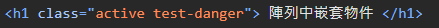
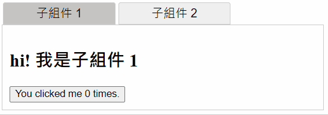

# Vue 3 學習筆記

主要根據 Vue 3 官方文檔整理的學習筆記，方便查閱。

## 官方文檔

> https://vuejs.org/ <br> https://cn.vuejs.org/

## 目錄

- [初始化專案](#初始化專案)
- [創建一個 Vue 應用](#創建一個-vue-應用)
- [模板語法](#模版語法)
- [v-bind 屬性(Attribute)綁定](#v-bind-屬性attribute綁定)
- [響應式狀態 ref & reactive](#響應式狀態-ref--reactive)
- [淺層響應式狀態 shallowRef & shallowReactive](#淺層響應式狀態-shallowref--shallowreactive)
- [readonly](#readonly)
- [DOM 更新時機](#dom-更新時機)
- [toRefs & toRef](#torefs--toref)
- [computed 計算屬性](#computed-計算屬性)
- [響應式數據監聽 watch & watchEffect](#響應式數據監聽-watch--watcheffect)
  - [watch](#watch)
  - [watcheffect](#watcheffect)
- [Class 與 Style 綁定](#class-與-style-綁定)
  - [綁定 class](#綁定-class)
  - [綁定 style](#綁定-style-內聯樣式)
- [條件渲染 v-if & v-show](#條件渲染-v-if--v-show)
- [列表渲染 v-for](#列表渲染-v-for)
  - [渲染多個元素](#渲染多個元素)
  - [v-for 使用物件](#v-for-使用物件)
  - [v-for 使用整數值](#v-for-使用整數值)
  - [v-if 不可與 v-for 同時使用](#v-if-不可與-v-for-同時使用)
  - [組件上使用 v-for](#組件上使用-v-for)
  - [陣列的變化偵測](#陣列的變化偵測)
- [事件處理 v-on](#事件處理-v-on)
  - [事件修飾符](#事件修飾符)
  - [按鍵修飾符](#按鍵修飾符)
- [雙向綁定 v-model](#雙向綁定-v-model)
  - [各類型輸入基本用法](#各類型輸入基本用法)
  - [動態值綁定](#動態值綁定)
  - [修飾符](#修飾符)
- [生命週期鉤子](#生命週期鉤子)
- [模板引用 ref 屬性](#模板引用-ref-屬性)
- [組件](#組件)
  - [定義一個組件](#定義一個組件)
  - [組件註冊](#組件註冊)
  - [使用組件](#使用組件)
  - [動態組件](#動態組件)
- [props 傳遞 (父傳子)](#props-傳遞-父傳子)
  - [基本用法](#基本用法)
  - [傳遞其他類型值](#傳遞除了字串外的其他類型值)
  - [使用物件綁定多個 props](#使用物件綁定多個-props)
  - [單向數據流](#單向數據流)
    - [props 為物件或陣列](#§-props-為物件或陣列)
    - [props 只用於傳入初始值](#§-props-只用於傳入初始值)
    - [根據 props 轉換 (computed)](#§-根據-props-轉換-computed)
  - [props 校驗](#props-校驗)

## 初始化專案

### 創建專案 (基於 Vite 創建)

```bash
npm create vue@latest
```

### 根據引導選擇專案依賴及環境


### 項目運行

```bash
cd <project-name>

npm install
npm run dev
```


### 目錄清理

1.刪除 /assets/base.css

2.刪除 /assets/main.css

3.刪除 /components 下全部範例組件

4.修改 main.js - 刪除 import main.css

```javascript
import { createApp } from 'vue';
import App from './App.vue';

const app = createApp(App);
app.mount('#app');
```

5.修改 App.vue

```vue
<script setup></script>

<template>
  <h1>Hello Vue3!</h1>
</template>

<style></style>
```

6.清理後運行結果


## 創建一個 Vue 應用

### 1. main.js 通過 `createApp()` 函數創建一個新的應用實例

```javascript
import { createApp } from 'vue';
const app = createApp({
  // 根組件選項設定
});
```

### 2. 根組件

`createApp()` 傳入的物件其實是一個組件，每個應用都需要一個根組件，其他組件將作為其子組件。

如果使用的是單文件組件(SFC)，則可以直接從另一個文件中導入根組件。

```javascript
import { createApp } from 'vue';
// 從一個單文件組件中導入根組件
import App from './App.vue';
const app = createApp(App);
```

### 3. 掛載應用

應用實例必須在調用了 `.mount()`方法後才會渲染出來，該方法接收一個 **容器** 作為參數，可以為 **實際的 DOM 元素** 或是一個 **CSS 選擇器**。

```html
<!-- index.html -->
<body>
  <div id="app"></div>
  <script type="module" src="/src/main.js"></script>
</body>
```

```javascript
// main.js
import { createApp } from 'vue';
// 從一個單文件組件中導入根組件
import App from './App.vue';

const app = createApp(App);
// 掛載在 id 為 app 的元素上
app.mount('#app');
```

> 注意：
>
> 1.根組件的內容將會渲染在容器元素裡面，容器元素自己不會被視為應用的一部份
>
> 2.`.mount()` 應該始終在整個應用配置和資源註冊完成之後被調用，且它的返回值是根組件實例而不是應用實例

**補充：DOM 中的根組件模板**

根組件的模板通常是組件本身的一部份，但也可以直接通過在掛載容器內編寫模版。

DOM 內模板通常用於**無構建步驟的 Vue 應用程序**，也可以與伺服器端框架一起使用，其中根模板可能是由伺服器動態生成的。

[Codepen demo](https://codepen.io/ypinpin/pen/bGJKzOL)

```html
<!-- index.html -->
<!-- 掛載容器 -->
<div id="app">
  <!-- 直接編寫根組件模板內容 -->
  <button @click="count++">{{ count }}</button>
</div>

<script>
  import {
    createApp,
    ref,
  } from 'https://unpkg.com/vue@3/dist/vue.esm-browser.js';

  const app = createApp({
    // 當根組件沒有設定 template 選項時
    // Vue 將自動使用容器的 innerHTML 作為模板
    setup() {
      const count = ref(0);
      return {
        count,
      };
    },
  });
  // 掛載
  app.mount('#app');
</script>
```

## 模版語法

### 1. 文本插值

最基本的數據綁定是文本插值，使用 Mustache 語法(雙大括號)，會將數據解析為**純文本**。

支持使用表達式( 可以合法地寫在 return 後面的即為表達式 )或引用 `<script>` 中聲明的變數、函數。

> 綁定在表達式中的函數在組件每次更新的時候都會被重新調用，因此不應該產生任何副作用，例如改變數據或觸發異步操作。

語法：`{{ 表達式 }}`

也可以使用 `v-text` 指令，它設置元素的 `textContent` 屬性。元素內不允許有內容。

語法：`v-text="值"`

```vue
<script setup>
const username = 'User1';
const message = () => '這是一個函數';
const html = '<span>元素會轉為純字串</span>';
</script>

<template>
  <div>
    <h1>{{ 'Vue 文本插值' }}</h1>
    <h1>{{ 8 > 5 ? 'true' : 'false' }}</h1>
    <h1>{{ username }}</h1>
    <h1>Username: {{ username }}</h1>
    <h1 v-text="username"></h1>
    <h1>{{ message() }}</h1>
    <h1>{{ html }}</h1>
  </div>
</template>
```


### 2. 原始 HTML

想插入 HTML，需要使用 `v-html` 指令

> 注意：小心使用，容易造成 [XSS 漏洞](https://zh.wikipedia.org/zh-tw/%E8%B7%A8%E7%B6%B2%E7%AB%99%E6%8C%87%E4%BB%A4%E7%A2%BC)，永遠不要使用使用者提供的 HTML 內容。

語法：`v-html="值"`

```vue
<script setup>
const rawHtml = '<i>html元素</i>';
</script>

<template>
  <p>Using text interpolation: {{ rawHtml }}</p>
  <p>Using v-html directive: <i v-html="rawHtml"></i></p>
</template>
```


## v-bind 屬性(Attribute)綁定

HTML 屬性中不能使用雙大括號，因此想要響應式的綁定一個 HTML 屬性或自定義屬性應該使用 `v-bind` 指令。

若綁定的變數值是 `null` 或是 `undefined` 該屬性會從渲染的元素上**移除**。

語法：`v-bind:屬性名="變數"`

可以簡寫為 `:屬性名="變數"`

```vue
<script setup>
const vue_url = 'https://vuejs.org/';
const google_url = 'https://www.google.com/';
</script>

<template>
  <h1><a v-bind:href="vue_url">Vue</a></h1>
  <h1><a :href="google_url">Google</a></h1>
</template>
```


一樣支持使用表達式、函數

```vue
<div :id="`list-${id}`"></div>

<time :title="toTitleDate(date)" :date-time="date">
  {{ formatDate(date) }}
</time>
```

**同名簡寫 (3.4+ 可用)**

```vue
// 與 :id="id" 相同
<div :id>layout</div>

// 這個一樣有效
<div v-bind:id>layout</div>
```

### Boolean 型屬性

會根據 `true` / `false` 值來決定屬性是否存在於該元素上，例如 disabled。

當 isButtonDisabled 為**真值或一個空字串**( `<button disabled="">` )時，元素會包含這個 disabled 屬性，而當其為其他假值時 disabled 屬性 將被忽略。

```vue
<script setup>
const isButtonDisabled = true;
</script>

<template>
  <button :disabled="isButtonDisabled">Button</button>
</template>
```


### 動態綁定多個屬性

通過使用**不帶參數的 `v-bind` 設定**，一次綁定多個屬性。

```vue
<script setup>
const objectOfAttrs = {
  id: 'container',
  class: 'wrapper',
};
</script>

<template>
  <div v-bind="objectOfAttrs">container</div>
</template>
```


## 響應式狀態 ref & reactive

當響應式狀態發生變化時，`<template>` 中使用到的會自動重新渲染。

- ref：基本類型數據、物件類型數據 (物件、陣列)

  - ref 的變數在 js 內必須使用 `.value` 取得值

- reactive：物件類型數據 (物件、陣列)
  - 屬性為基本數據類型被解構為本地變數或是傳遞給函數時會丟失響應性，可以使用 `toRefs` 及 `toRef` 解決。[原因說明](https://blog.csdn.net/qq_41370833/article/details/132565060)
  - 重新指定新的物件會失去響應式 (可以使用 `Object.assign` 去整體替換)
- 使用原則：
  - 基本類型數據使用 ref
  - 物件類型數據，層級不深，ref 及 reactive 都可以使用
  - 物件類型數據，層級較深，建議使用 reactive

```vue
<script setup>
import { ref, reactive } from 'vue';
const name = ref('小明');
const obj = ref({ count: 0 });
const fruit = reactive({
  name: 'apple',
  price: 20,
});

function changeName() {
  name.value = name.value === '小明' ? '小白' : '小明';
}

function addCount() {
  obj.value.count++;
}

function addPrice() {
  fruit.price += 10;
}
</script>

<template>
  <div>
    <div>
      name:
      {{ name }}
      <button @click="changeName">changeName</button>
    </div>
    <div>
      obj:
      {{ obj }}
      <button @click="addCount">add obj count</button>
    </div>
    <div>
      fruit:
      {{ fruit }}
      <button @click="addPrice">add fruit price</button>
    </div>
  </div>
</template>
```

## 淺層響應式狀態 shallowRef & shallowReactive

與前面的 ref & reactive 不同，只針對淺層數據具有響應式，對深層的數據不做處理，**可以避免大型數據的響應性造成的性能開銷**。

shallowRef：只會對 `.value` 的變化進行響應式處理

```vue
<script setup>
import { shallowRef } from 'vue';
const obj = shallowRef({ count: 1 });

function changeObjCount() {
  // 不會觸發響應
  obj.value.count++;
  console.log('obj', obj.value);
}
function changeObj() {
  // 會觸發響應
  let count = obj.value.count + 1;
  obj.value = { count: count };
  console.log('obj', obj.value);
}
</script>

<template>
  <div>
    <div>
      obj (shallowRef):
      {{ obj }}
      <button @click="changeObjCount">changeObjCount</button>
      <button @click="changeObj">changeObj</button>
    </div>
  </div>
</template>
```

shallowReactive：只會使物件的**最頂層屬性**為響應式狀態，內部的嵌套屬性則不會為響應式

```vue
<script setup>
import { shallowReactive } from 'vue';
const state = shallowReactive({
  foo: 1,
  nested: {
    bar: 2,
  },
});

function changeFoo() {
  // 更改頂層的屬性是響應式的
  state.foo++;
  console.log('state', state);
}
function changeNestedBar() {
  // 下層嵌套的屬性不會是響應式
  state.nested.bar++;
  console.log('state', state);
}
</script>

<template>
  <div>
    <div>
      state (shallowReactive):
      {{ state }}
      <button @click="changeFoo">changeFoo</button>
      <button @click="changeNestedBar">changeNestedBar</button>
    </div>
  </div>
</template>
```

## readonly

`readonly()` 接收一個物件(不論是普通的或響應式)或是一個 ref，返回一個原值的只讀代理(深層的，淺層的可以使用 [shallowReadonly](https://cn.vuejs.org/api/reactivity-advanced.html#shallowreadonly) )。

```vue
<script setup>
import { reactive, readonly } from 'vue';
const original = reactive({ count: 0 });

const copy = readonly(original);

function changeOriginal() {
  // 可以正常修改響應
  original.count++;
}

function changeCopy() {
  // 不能修改且會得到警告
  copy.count++;
}
</script>

<template>
  <div>
    <div>
      original:
      {{ original }}
      <button @click="changeOriginal">changeOriginal</button>
      <br />
      copy (readonly):
      {{ copy }}
      <button @click="changeCopy">changeCopy</button>
    </div>
  </div>
</template>
```

## DOM 更新時機

當修改了響應式狀態時，DOM 會被自動更新，但是**更新不是同步的**，Vue 會在 **next tick** 更新週期中緩衝所有狀態的修改，用來確保不管進行多少次狀態修改，每個組件都只會被更新一次

要等待 DOM 更新完成後再執行額外的程式碼，可以使用 `nextTick()` 全局 API

```vue
<script setup>
import { nextTick } from 'vue';
async function increment() {
  count.value++;
  await nextTick();
  //現在DOM已經更新了
}
</script>
```

## toRefs & toRef

將響應式物件中的每一個屬性轉換為 ref (響應式)

`toRefs` 可以批量轉換多個屬性

```vue
<script setup>
import { reactive, toRefs, toRef } from 'vue';

const person = reactive({
  personName: '小明',
  age: 18,
  gender: '男',
});

const { personName, age } = toRefs(person);
const gender = toRef(person, 'gender');

function changePersonName() {
  personName.value = personName.value === '小明' ? '小白' : '小明';
}

function changePersonAge() {
  age.value++;
}

function changePersonGender() {
  gender.value = gender.value === '男' ? '女' : '男';
}
</script>

<template>
  <div>
    person:
    {{ person }}
    <br />
    personName:
    {{ personName }}
    <button @click="changePersonName">changePersonName</button>
    <br />
    age:
    {{ age }}
    <button @click="changePersonAge">changePersonAge</button>
    <br />
    gender:
    {{ gender }}
    <button @click="changePersonGender">changePersonGender</button>
  </div>
</template>
```

## computed 計算屬性

語法：`computed(有返回值的函數)`

根據已有的數據計算出新數據並返回一個`計算屬性ref`，模板內無需添加 `.value`。

`computed` 會**自動追蹤響應式依賴**，所以當內部綁定的響應式數據變動時皆會更新。

與直接使用 function 定義返回的結果會相同，但是**使用計算屬性會對響應式資料進行緩存**，只有在內部響應式數據變動時才會重新計算，function 則每次皆會進行計算。

> 注意：const now = computed(() => Date.now())，會讀取緩存，永遠不會更新，因為 `Date.now()` 不是一個響應式依賴

計算屬性默認是**只讀的**，如果要進行修改需要同時設定 `getter` 及 `setter`

```vue
<script setup>
import { ref, computed } from 'vue';
const count = ref(0);
const firstName = ref('張');
const lastName = ref('三');

// 只讀取不修改
const doubleCount = computed(() => {
  return count.value * 2;
});
function addCount() {
  count.value++;
}

// 讀取又修改
const fullName = computed({
  get() {
    return firstName.value + '-' + lastName.value;
  },
  set(val) {
    firstName.value = val.split('-')[0];
    lastName.value = val.split('-')[1];
  },
});
function changeFullName() {
  fullName.value = fullName.value === '張-三' ? '李-四' : '張-三';
}
</script>

<template>
  <div>
    count : {{ count }}
    <br />
    doubleCount : {{ doubleCount }}
    <button @click="addCount">addCount</button>
    <hr />
    姓：<input type="text" v-model="firstName" /> <br />
    名：<input type="text" v-model="lastName" /> <br />
    全名：<span>{{ fullName }}</span> <br />
    <button @click="changeFullName">修改名字</button>
  </div>
</template>
```

## 響應式數據監聽 watch & watchEffect

當響應式數據發生改變時，可以執行指定的邏輯操作。

### watch

預設為**懶執行**，即有變化才執行指定的回調函數，若想馬上執行一次可以加上 `{immediate: true}`。

回調函數提供新值與舊值作為參數。

要手動停止監聽，可以調用 `watch` 返回的函數。

`watch` 可以監視以下四種數據：

1. ref (包含計算屬性)
2. reactive 物件
3. `getter` 函數
4. 以上多個數據組成的陣列

#### § ref (包含計算屬性)

監視 ref 的**基本類型**數據，**直接寫變數名**即可，監視 **value 值**的改變。

```vue
<script setup>
import { ref, watch } from 'vue';
// ref 的基本類型數據
const count = ref(0);
// 方法
function addCount() {
  count.value += 1;
}
// 監聽 ref 數據，並保存返回函數
const stopWatch = watch(count, (newVal, oldVal) => {
  console.log('count改變了', newVal, oldVal);
  if (newVal >= 10) {
    // 手動停止監聽
    stopWatch();
    console.log('停止監聽!!');
  }
});
</script>

<template>
  <div>
    <span>監視ref的基本類型數據：count: {{ count }}</span>
    <button @click="addCount">count+1</button>
  </div>
</template>
```

監視 ref 的**物件類型**數據，直接寫變數名監視的為物件的地址值變化(**只會監視 `.value` 的直接變化**)。

若要監視物件內部屬性的數據變化，必須**手動開啟深度監視 `{deep:true}`**。

> 注意：只有當物件地址值 (`.value`) 改變，才能夠取得不同的 newVal 和 oldVal。若修改的是物件中的屬性，newVal 與 oldVal 抓到的物件內容是相同的，因此皆會顯示為修改後的數據。

```vue
<script setup>
import { ref, watch } from 'vue';
// ref 的物件類型數據
const data = ref([1, 2, 3]);
// 方法 - 修改物件中的屬性
function addData() {
  let count = data.value.length + 1;
  data.value.push(count);
}
// // 方法 - 修改物件本身
function changeData() {
  data.value = [1];
}
// 監聽 ref 物件數據，要手動設定 deep
watch(
  data,
  (newVal, oldVal) => {
    console.log('data改變了', newVal, oldVal);
  },
  { deep: true }
);
</script>

<template>
  <div>
    <span>監視ref的物件類型數據：data: {{ data }}</span>
    <button @click="addData">addData</button>
    <button @click="changeData">changeData</button>
  </div>
</template>
```

#### § reactive 物件

監視 reactive 的物件類型數據，直接寫變數名監視，**會自動開啟深度監視**，且 `deep` 配置無效。

reactive 無法替換物件，但是可以使用 `Object.assign` 來**替換掉物件內的屬性**，需要注意實質上地址值是沒有改變的(同一個物件)。

> 注意：物件中的任意屬性修改後，獲取的 newVal 與 oldVal 仍然會是相同的物件，因此皆會顯示為修改後的數據。 <br />
> 想要正確監聽指定屬性的 oldVal 則可以使用 `getter` 函數的方式。

```vue
<script setup>
import { reactive, watch } from 'vue';
// reactive 的物件類型數據
const person = reactive({
  name: 'Peter',
  age: 18,
  books: {
    book1: 'book111',
    book2: 'book222',
    c: {
      d: '123',
    },
  },
});
// 更改屬性
function changeName() {
  person.name += '!';
}
function changeAge() {
  person.age += 2;
}
// 更改深層屬性
function changeBook1() {
  person.books.book1 += '~';
}
function changeBookD() {
  person.books.c.d += '-';
}
// 使用Object.assign替換reactive物件屬性(還是同一個物件，地址值無更改)
function changePerson() {
  Object.assign(person, {
    name: 'Joy',
    age: 40,
    books: {
      book1: 'book1',
      book2: 'book2',
      book3: 'book3',
      c: {
        d: '567',
      },
    },
  });
}
// 監視reactive定義的物件數據，默認深度監視
// newVal, oldVal 皆會為新值
watch(person, (newVal, oldVal) => {
  console.log('person改變了', newVal, oldVal);
});
</script>

<template>
  <div>
    <span>監視reactive的物件類型數據：person: {{ person }}</span>
    <br />
    <button @click="changeName">changeName</button>
    <button @click="changeAge">changeAge</button>
    <button @click="changeBook1">changeBook1</button>
    <button @click="changeBookD">changeBookD</button>
    <button @click="changePerson">changePerson</button>
  </div>
</template>
```

#### § getter 函數

可以使用 `getter` 函數形式來監聽 ref 或 reactive 定義的物件類型中的某個屬性變化。

當屬性值為**基本類型**時，可以正確獲取 newVal 與 oldVal。

當屬性值為**物件類型**時，此時監視的一樣是物件的**地址值變化**，監視內部屬性變化**需要手動開啟深度監視**，且 newVal 與 oldVal 只會在物件本身更改時正確獲取，直接修改物件內部屬性獲取的 newVal 與 oldVal 仍然會是相同的物件，因此皆會顯示為修改後的數據。

```vue
<script setup>
import { reactive, watch } from 'vue';
// 使用 getter 函數監聽屬性變化
const person2 = reactive({
  name: 'Peter',
  age: 18,
  books: {
    book1: 'book111',
    book2: 'book222',
  },
});
// 更改屬性
function changeP2Name() {
  person2.name += '!';
}
// 更改深層屬性
function changeP2Book1() {
  person2.books.book1 += '~';
}
// 更改物件屬性
function changeP2Book() {
  person2.books = {
    book1: 'book1',
    book2: 'book2',
    book3: 'book3',
  };
}
// 監視 reactive 定義的物件的屬性值為基本類型
watch(
  () => person2.name,
  (newVal, oldVal) => {
    console.log('person2 的 name 改變了', newVal, oldVal);
  }
);
// 監視 reactive 定義的物件的屬性值為物件類型
// 要手動開啟深度監視，沒開啟則只有 person2.books 本身被更改才會觸發
watch(
  () => person2.books,
  (newVal, oldVal) => {
    console.log('person2 的 books 改變了', newVal, oldVal);
  }
);
// 開啟深度監視後，此時的 newVal, oldVal 一樣只有 person2.books 本身被更改才會不同
watch(
  () => person2.books,
  (newVal, oldVal) => {
    console.log('深度監視 person2 的 books 改變了', newVal, oldVal);
  },
  { deep: true }
);
// 要正確獲取 book1 的 oldVal，則需要直接監聽 book1 屬性
watch(
  () => person2.books.book1,
  (newVal, oldVal) => {
    console.log('person2 的 books 的 book1 改變了', newVal, oldVal);
  }
);
</script>

<template>
  <div>
    <span>使用 getter 函數監聽屬性變化：person2: {{ person2 }}</span>
    <br />
    <button @click="changeP2Name">changeP2Name</button>
    <button @click="changeP2Book1">changeP2Book1</button>
    <button @click="changeP2Book">changeP2Book</button>
  </div>
</template>
```

#### § 監聽以上的多種數據

可以使用**陣列**將想要同時監聽的多個數據包起來，其中一個數據變動都會觸發同一個回調函數。

獲取的 newVal 和 oldVal 會是相同順序的一整個陣列 (是否能成功獲取不同的新舊值，參考前面的情況)

```vue
<script setup>
import { ref, reactive, watch } from 'vue';
// 監聽多個數據 ---------------------------------------------
const sum = ref(0);
const fruit = reactive({
  name: 'Apple',
  price: 20,
});

function addSum() {
  sum.value++;
}
function addFruitPrice() {
  fruit.price += 10;
}

watch([sum, () => fruit.price], (newVal, oldVal) => {
  console.log('sum 或 fruit 改變了', newVal, oldVal);
});
</script>

<template>
  <div>
    <span>監聽多個數據：sum: {{ sum }} | fruit: {{ fruit }}</span>
    <br />
    <button @click="addSum">addSum</button>
    <button @click="addFruitPrice">addFruitPrice</button>
  </div>
</template>
```

#### § 總結


---

### watchEffect

與 `watch` 相同都可以監聽數據的變化，差別為 `watchEffect` 不用明確指出監視的數據(**自動追蹤響應式依賴**)，且會**立即執行一次回調**。
[官方文檔](https://cn.vuejs.org/guide/essentials/watchers.html#watcheffect)。


```vue
<script setup>
import { ref, watchEffect } from 'vue';
const min = 1;
const max = 50;
const photoId = ref(min);
let data = ref(null);

function changeId(num) {
  photoId.value += num;
  if (photoId.value < min) {
    photoId.value = min;
  } else if (photoId.value > max) {
    photoId.value = max;
  }
}

function fetchPhoto(id) {
  fetch(`https://jsonplaceholder.typicode.com/photos/${id}`)
    .then((res) => res.json())
    .then((json) => {
      data.value = json;
      console.log(data.value);
    });
}
// photoId 變動時自動獲取新資料
watchEffect(() => {
  fetchPhoto(photoId.value);
});
</script>

<template>
  <div>
    {{ data }}
    <br />
    photoId: {{ photoId }}
    <br />
    <button @click="changeId(-1)" :disabled="photoId === min">prev</button>
    <button @click="changeId(1)" :disabled="photoId === max">next</button>
  </div>
</template>
```

## Class 與 Style 綁定

### 綁定 class

透過 `:class` 指令可以綁定指定的 class 值。也可以和一般的 `class` 共存。

#### § 綁定物件

可以在物件中設定屬性來操作多個 class。屬性名即為 class 名稱(字串)，根據屬性值的真假值判斷 class 是否存在。

- 內聯形式

  語法： `:class="{ 'class名稱2': class是否存在, 'class名稱2': class是否存在 }"`

  以下範例中，'active' 及 'text-danger' 是否存在取決於 isActive 及 hasError 的真假值。

  ```vue
  <script setup>
  import { ref } from 'vue';
  // 控制 class 的開關
  const isActive = ref(true);
  const hasError = ref(false);
  </script>

  <template>
    <div>
      <h1 class="static" :class="{ active: isActive, 'text-danger': hasError }">
        內聯形式
      </h1>
    </div>
  </template>
  ```

  

- 直接綁定一個物件

  語法： `:class="classObject"`

  ```vue
  <script setup>
  import { ref, reactive } from 'vue';
  // 控制 class 的物件
  const classObject = reactive({ active: true, 'text-danger': false });
  </script>

  <template>
    <div>
      <h1 :class="classObject">直接綁定一個物件</h1>
    </div>
  </template>
  ```

  

- 綁定一個返回物件的 `computed`

  語法： `:class="computed 返回的物件"`

  ```vue
  <script setup>
  import { ref, computed } from 'vue';
  // 控制 class 的物件
  const isShow = ref(true);
  const error = ref('fatal');
  // computed 返回一個物件
  const classObject2 = computed(() => ({
    show: isShow.value && !error.value,
    'text-danger': error.value && error.value === 'fatal',
  }));
  </script>

  <template>
    <div>
      <h1 :class="classObject2">綁定一個返回物件的 computed</h1>
    </div>
  </template>
  ```

  

#### § 綁定陣列

可以在陣列中直接設定要顯示的 class 名稱。class 名稱可以為變數或直接設定字串。

- 一般陣列形式

  語法： `:class="[class名稱1, class名稱2]"`

  ```vue
  <script setup>
  import { ref } from 'vue';
  // class 的名稱
  const activeClass = ref('active');
  const errorClass = ref('test-danger');
  </script>

  <template>
    <div>
      <h1 :class="[activeClass, errorClass, 'text-ted']">一般陣列形式</h1>
    </div>
  </template>
  ```

  

- 條件渲染

  語法： `:class="[條件判斷 ? class名稱1 : '', class名稱2]"`

  `errorClass`、`text-ted` 會一直存在，但 `activeClass` 只會在 `isActive` 為真時存在

  ```vue
  <script setup>
  import { ref } from 'vue';
  // class 的名稱
  const activeClass = ref('active');
  const errorClass = ref('test-danger');
  // 條件開關
  const isActive = ref(true);
  </script>

  <template>
    <div>
      <h1 :class="[isActive ? activeClass : '', errorClass, 'text-ted']">
        條件渲染
      </h1>
    </div>
  </template>
  ```

  

- 也可以在陣列中嵌套物件

  語法： `:class="[{ 'class名稱1': class是否存在 }, class名稱2]"`

  ```vue
  <script setup>
  import { ref } from 'vue';
  // class 的名稱
  const activeClass = ref('active');
  const errorClass = ref('test-danger');
  // 條件開關
  const isActive = ref(true);
  </script>

  <template>
    <div>
      <h1 :class="[{ active: isActive, 'text-ted': false }, errorClass]">
        陣列中嵌套物件
      </h1>
    </div>
  </template>
  ```

  

#### § 組件上綁定 class

只有一個根元素的組件，class 會**自動被添加到根元素上並與該元素已有的 class 合併**。

若組件有**多個根元素**，則必須指定由哪個根元素來接收 class，**可以通過 `$attrs` 屬性來指定**

- 父組件：

  組件上可以直接設定 `class`，也可以使用上方的方法進行 class 綁定 。

  ```vue
  <script setup>
  import { ref } from 'vue';
  import Demo11Child1 from './Demo11Child1.vue';
  import Demo11Child2 from './Demo11Child2.vue';

  // class 開關
  const isActive = ref(true);
  </script>

  <template>
    <div>
      <Demo11Child1 class="baz boo" />
      <Demo11Child1 :class="{ active: isActive }" />
      <Demo11Child2 class="baz boo" />
    </div>
  </template>
  ```

- 子組件 1 (單個根元素)：

  ```vue
  <template>
    <h1 class="foo bar">hi! 我是子組件 1</h1>
  </template>
  ```

- 子組件 2 (多個根元素)：

  在模板中的元素上使用 `$attrs` 屬性獲取 class

  語法：`:class="$attrs.class"`

  ```vue
  <template>
    <h1 class="foo bar" :class="$attrs.class">hi! 我是子組件 2</h1>
    <p>我是子組件 2 的其他根元素</p>
  </template>
  ```

  

---

### 綁定 style (內聯樣式)

透過 `:style` 指令支持綁定物件類型，物件內屬性對應的是 HTML 的 `style` 屬性。

#### § 綁定物件

推薦使用 `camelCase`，也支持 `kebab-cased` (對應 css 中的實際名稱)。

- 直接綁定樣式

  語法： `:style="{ style屬性: 屬性值 }"`

  ```vue
  <script setup>
  import { ref } from 'vue';
  // 控制 style 的樣式值
  const activeColor = ref('red');
  const fontSize = ref(30);
  </script>

  <template>
    <div>
      <h1 :style="{ color: activeColor, fontSize: fontSize + 'px' }">
        直接綁定樣式(使用 camelCase)
      </h1>
      <h1 :style="{ 'font-size': fontSize + 'px' }">
        直接綁定樣式(使用 kebab-cased)
      </h1>
    </div>
  </template>
  ```

  

- 綁定一個樣式物件

  語法： `:style="styleObject"`

  ```vue
  <script setup>
  import { reactive } from 'vue';
  // 樣式物件
  const styleObject = reactive({
    color: 'red',
    fontSize: '13px',
  });
  </script>

  <template>
    <div>
      <h1 :style="styleObject">綁定一個樣式物件</h1>
    </div>
  </template>
  ```

  

- 更複雜的邏輯也一樣可以使用返回樣式物件的 `computed`

#### § 綁定陣列

可以綁定一個**包含多個樣式物件的陣列**，這些物件會被**合併渲染**。

語法： `:style="[styleObject1, styleObject2]"`

```vue
<script setup>
import { reactive } from 'vue';
// 樣式物件
const baseStyles = reactive({
  color: 'red',
  letterSpacing: '5px',
});
const overridingStyles = reactive({
  color: 'blue',
  fontSize: '30px',
});
</script>

<template>
  <div>
    <h1 :style="[baseStyles, overridingStyles]">
      綁定一個包含多個樣式物件的陣列
    </h1>
  </div>
</template>
```


#### § 自動前綴

當在 `:style` 中使用了需要瀏覽器特殊前綴的 css 屬性時，Vue 會在運行時檢查該屬性是否支持在當前瀏覽器中使用，若不支持會嘗試自動加上相應的特殊前綴。

#### § 樣式多值

可以使用陣列對一個樣式屬性提供多個不同前綴的值。僅會渲染瀏覽器**支持的最後一個值**。

以下範例中，支持不需要特別前綴的瀏覽器中都會渲染為 `display: flex`。

```vue
<template>
  <div>
    <div :style="{ display: ['-webkit-box', '-ms-flexbox', 'flex'] }">
      <div>item1</div>
      <div>item2</div>
    </div>
  </div>
</template>
```


## 條件渲染 v-if & v-show

### v-if 指令

可以根據條件切換元素，切換時**會被銷毀及重建**。搭配 `v-else-if` 、 `v-else` 指令則可以設置多個條件切換。

需要同時切換多個元素時可以使用 `<template>` 包裝元素，將指令設置在 `<template>` 上。 `<template>` 是一個不可見的包裝器元素，最後渲染的結果不會包含 `<template>`。

語法：`v-if="條件1"` `v-else-if="條件2"` `v-else`

```vue
<script setup>
import { ref } from 'vue';
const awesome = ref(true);
const show = ref(1);

function changeShow() {
  show.value++;
}
function resetShow() {
  show.value = 1;
}
</script>

<template>
  <div>
    <!-- 切換單一元素 -->
    <button @click="awesome = !awesome">Toggle</button>
    <p v-if="awesome">Vue is awesome!</p>
    <br />
    <!-- 同時切換多個元素 -->
    <button @click="changeShow">Show : {{ show }}</button>
    <button @click="resetShow">resetShow</button>
    <template v-if="show === 1">
      <h1>Show 1</h1>
      <p>Paragraph 1</p>
      <p>Paragraph 2</p>
    </template>
    <template v-else-if="show === 2">
      <h1>Show 2</h1>
      <p>Paragraph 2222</p>
    </template>
    <template v-else>
      <h1>No More...</h1>
    </template>
  </div>
</template>
```


### v-show 指令

與 `v-if` 的差別為 `v-show` 會在 DOM 中保留元素(始終會渲染)，僅**切換 `display` 的 css 屬性**，且不支持在 `<template>` 上使用。

需要頻繁切換時推薦使用 `v-show`。

語法：`v-show="條件"`

```vue
<script setup>
import { ref } from 'vue';
const isDisplay = ref(true);

function changeDisplay() {
  isDisplay.value = !isDisplay.value;
}
</script>

<template>
  <div>
    <button @click="changeDisplay">changeDisplay</button>
    <h1 v-show="isDisplay">v-show 只是控制 display 屬性</h1>
  </div>
</template>
```


## 列表渲染 v-for

`v-for` 指令可以遍歷生成 HTML 結構，將 `v-for` 設置在需要重複生成的主元素上。

語法：`v-for="(數據項, 索引) in 數據陣列"`

=> `v-for="(item, index) in items"`

> 也可以使用 `of` 代替 `in`，更接近 js 語法。

**建議同時綁定 `key` 屬性**，作用為讓 Vue 針對 `key` 辨識元素是否相同，正確的渲染更新。`key` 只能為字串或是數字，且必須為**唯一值**。

**注意：不要使用 `index`作為 `key`，因為 `index` 會隨數據增刪而變化，會導致狀態錯誤。**

> Vue 默認會依照**就地更新**的方式來更新使用 `v-for` 渲染的元素列表，當數據的順序改變時，並不會移動 DOM 元素的順序，而是**直接重用原本索引位置的元素渲染更新**，因此若元素有依賴子組件或為有狀態的 DOM 元素 (表單輸入值) 則會使元素渲染發生錯誤。可以參考[解釋說明](https://www.zhihu.com/question/61064119)。

```vue
<script setup>
import { ref } from 'vue';
const items = ref([
  { id: 1, message: 'Hello!' },
  { id: 2, message: 'Welcome~' },
]);
</script>

<template>
  <div>
    <ul>
      <li v-for="item in items" :key="item.id">
        {{ item.id }} : {{ item.message }}
      </li>
    </ul>
    <!-- 支持使用解構 -->
    <ul>
      <li v-for="({ id, message }, index) in items" :key="id">
        {{ index }} : {{ message }}
      </li>
    </ul>
  </div>
</template>
```


---

### 渲染多個元素

與 `v-if` 類似，也可以使用 `<template>` 來重複生成多個元素。

```vue
<script setup>
import { ref } from 'vue';
const items = ref([
  { id: 1, message: 'Hello!' },
  { id: 2, message: 'Welcome~' },
]);
</script>

<template>
  <div>
    <ul>
      <template v-for="item in items" :key="item.id">
        <li>{{ item.message }}</li>
        <hr />
      </template>
    </ul>
  </div>
</template>
```


---

### v-for 使用物件

可以遍歷物件的所有屬性，順序依照 `Object.keys()` 的返回值決定。

語法：`v-for="(屬性值, 屬性key, 索引) in 物件"`

=> `v-for="(value, key, index) in myObject"`

```vue
<script setup>
import { reactive } from 'vue';
const myObject = reactive({
  title: 'How to do lists in Vue',
  author: 'Jane Doe',
  publishedAt: '2016-04-10',
});
</script>

<template>
  <div>
    <p>Object.keys(myObject) :{{ Object.keys(myObject) }}</p>
    <ul>
      <li v-for="(value, key, index) in myObject" :key="key">
        {{ index }}. {{ key }}: {{ value }}
      </li>
    </ul>
  </div>
</template>
```


---

### v-for 使用整數值

會基於 1...n 的範圍重複生成元素。

語法：`v-for="值 in 整數"`

=> `v-for="n in 5"`

```vue
<template>
  <div>
    <p v-for="n in 5" :key="n">{{ n }}</p>
  </div>
</template>
```


---

### v-if 不可與 v-for 同時使用

因 `v-if` 優先級較高，會導致 `v-if` 先執行時會無法讀取到 `v-for` 提供的變數。

```vue
<template>
  <!-- 錯誤用法 ❌ v-if 無法取得 todo -->
  <div>
    <ul>
      <li v-for="todo in todos" :key="todo.id" v-if="!todo.isComplete">
        {{ todo.message }}
      </li>
    </ul>
  </div>
</template>
```

可以多包裝一層 `<template>` 來解決。

```vue
<script setup>
import { reactive } from 'vue';
const todos = ref([
  { id: 1, message: 'Todo1', isComplete: false },
  { id: 2, message: 'Todo2', isComplete: true },
]);
</script>

<template>
  <!-- 正確用法 ✔️ 包裝一層 <template> -->
  <div>
    <ul>
      <template v-for="todo in todos" :key="todo.id">
        <li v-if="!todo.isComplete">
          {{ todo.message }}
        </li>
      </template>
    </ul>
  </div>
</template>
```

---

### 組件上使用 v-for

可以直接使用跟一般元素沒有區別，但是**數據不會自動傳遞到組件中**，需要傳遞 `props`給組件。

父組件：

```vue
<script setup>
import { ref } from 'vue';
import Demo14Child1 from './Demo14Child1.vue';
const items = ref([
  { id: 1, message: 'Hello!' },
  { id: 2, message: 'Welcome~' },
]);
</script>

<template>
  <div>
    <ul>
      <Demo14Child1
        v-for="item in items"
        :key="item.id"
        :message="item.message"
      />
    </ul>
  </div>
</template>
```

子組件：

```vue
<script setup>
const props = defineProps({
  message: {
    type: String,
    required: true,
  },
});
</script>

<template>
  <h2>hi! 我是子組件</h2>
  <p>message : {{ message }}</p>
  <hr />
</template>
```


---

### 陣列的變化偵測

能自動偵測以下的陣列的變更方法，會觸發相關的更新：

- `push()`
- `pop()`
- `shift()`
- `unshift()`
- `splice()`
- `sort()`
- `reverse()`

不會更改原陣列而是返回新陣列的方法則**需要將舊陣列替換才會進行更新**，例如：`filter()`、`concat()`、`slice()`。

```javascript
items.value = items.value.filter((item) => item.message.match(/Foo/));
```

若希望展示過濾或排序過後的數據，而**不實際更改原始數據，則可以使用 `computed`**。

> 注意：`computed` 中陣列使用 `reverse()` 及 `sort()` 時，由於**會變更原始數據陣列**，會導致循環觸發 `computed`，因此可以先創建一個原陣列的拷貝在執行 `reverse()` 及 `sort()`。參考[解釋說明](https://segmentfault.com/q/1010000044261491)。

```vue
<script setup>
import { ref, computed } from 'vue';
const numbers = ref([1, 2, 3, 4, 5]);
const reverseNumbers = computed(() => {
  return [...numbers.value].reverse();
});
const evenNumbers = computed(() => {
  return numbers.value.filter((n) => n % 2 === 0);
});
</script>

<template>
  <div>
    <p>numbers：{{ numbers }}</p>
    <p>reverseNumbers：</p>
    <ul>
      <li v-for="n in reverseNumbers" :key="n">{{ n }}</li>
    </ul>
    <p>evenNumbers：</p>
    <ul>
      <li v-for="n in evenNumbers" :key="n">{{ n }}</li>
    </ul>
  </div>
</template>
```


## 事件處理 v-on

`v-on` 指令用於綁定 js 原生事件或自定義事件。

語法：`v-on:事件名稱="事件處理器(handler)"`

=> `v-on:click="handler"`

可以簡寫為 `@事件名稱="事件處理器(handler)"`

=> `@click="handler"`

### 事件處理器(handler)的值可以是以下幾種：

#### § 直接執行的 js 語句

```vue
<script setup>
import { ref } from 'vue';
const count = ref(0);
</script>

<template>
  <div>
    <p>count is: {{ count }}</p>
    <button v-on:click="count++">count + 1</button>
  </div>
</template>
```


#### § 一個函數

會自動接收原生的 DOM 事件 `event` 為參數並執行函數。

```vue
<script setup>
import { ref } from 'vue';
const name = ref('Vue.js');
function greet(event) {
  alert(`Hello ${event.target.innerHTML}`);
}
</script>

<template>
  <div>
    <h1 @click="greet">{{ name }}</h1>
  </div>
</template>
```


#### § 帶自定義參數的函數

向函數傳入自訂義參數將會取代原生事件參數。

```vue
<script setup>
function say(message) {
  alert(message);
}
</script>

<template>
  <div>
    <button @click="say('Hello~~')">Say Hello~~</button>
  </div>
</template>
```


想要同時使用事件參數可以使用 `$event` 或是透過箭頭函數調用。

```vue
<script setup>
function showText(message, submitEvent) {
  submitEvent.preventDefault();
  const textElement = submitEvent.target.elements.text;
  alert(`${message}, ${textElement.value}`);
  textElement.value = '';
}
</script>

<template>
  <div>
    <!-- 傳遞事件參數 $event -->
    <form @submit="showText('Welcome', $event)">
      <div>
        <label for="example">Let's submit some text</label>
        <input id="example" type="text" name="text" />
      </div>
      <div>
        <input type="submit" value="Submit text" />
      </div>
    </form>
    <!-- 使用箭頭函數 -->
    <form @submit="(event) => showText('Hello', event)">
      <div>
        <label for="example">Let's submit some text</label>
        <input id="example" type="text" name="text" />
      </div>
      <div>
        <input type="submit" value="Submit text" />
      </div>
    </form>
  </div>
</template>
```


---

### 事件修飾符

提供給 `v-on` 的指令後綴，方便直接設定 `event.preventDefault()` 或 `event.stopPropagation()` 等等。

#### § .stop

事件將停止傳遞，即 `event.stopPropagation()`。

```html
<a @click.stop="doThis">...</a>
```

#### § .prevent

停止事件默認動作，例如表單 Submit 刷新，即 `event.preventDefault()`。

```html
<form @submit.prevent="onSubmit">...</form>
```

#### § .self

僅當 `event.target` 是元素本身時才會觸發事件處理，例如：事件不來自子元素。

```html
<div @click.self="doThis">...</div>
```

#### § .capture

添加事件監聽時使用 `capture` 模式(由外向內處理)。

```html
<div @click.capture="doThis">...</div>
```

#### § .once

事件最多被觸發一次。

```html
<a @click.once="doThis">...</a>
```

#### § .passive

無視 `event.preventDefault()`，禁止與 `.prevent` 同時使用。

一般用於捲軸的 `onscroll` 事件上，提早通知瀏覽器不阻止默認行為(scrolling)發生，可以改善移動端上的使用效能。

```html
<div @scroll.passive="onScroll">...</dvi>
```

#### § 可以鏈式調用

```html
<a @click.stop.prevent="doThis">...</a>
```

但是需要注意調用順序。

```html
<!-- 點擊時會先阻止默認事件(不會開啟連結頁面)，再判斷觸發點擊的是否為自己 -->
<a @click.prevent.self="doThis">...</a>

<!-- 點擊時會先判斷觸發點擊的元素是否為自己，若不是自己會直接結束事件不會執行 prevent，因此還是會開啟連結頁面，是自己時才會執行 prevent(不開啟連結頁面) -->
<a @click.self.prevent="doThis">...</a>
```

---

### 按鍵修飾符

提供給 `v-on` 的按鍵修飾，方便設定觸發事件的按鍵。

只要是在 [`KeyboardEvent.key`](https://developer.mozilla.org/en-US/docs/Web/API/UI_Events/Keyboard_event_key_values) 上的按鍵名稱都可以用 `kebab-case` 的方式設定在修飾符上。

```html
<!-- 只在key為 enter 時調用 -->
<input @keyup.enter="submit" />

<!-- 只在key為 Page Down 時調用 -->
<input @keyup.page-down="onPageDown" />
```

常用的按鍵別名：

- `.enter`
- `.tab`
- `.delete` ('Delete'和'Backspace'都會觸發)
- `.esc`
- `.space`
- `.up`
- `.down`
- `.left`
- `.right`

系統按鍵修飾符：

- `.ctrl`
- `.alt`
- `.shift`
- `.meta`

```html
<!-- Alt + Enter -->
<input @keyup.alt.enter="clear" />

<!-- Ctrl + 點擊 -->
<div @click.ctrl="doSomething">Do something</div>
```

`.exact` 修飾符

一定要**完全符合**才會觸發，不能同時按住指定外的按鍵。

```html
<!-- 按下ctrl時，同時按下shift也會觸發 -->
<button @click.ctrl="onClick">A</button>

<!-- 僅當按下ctrl時，未按其他按鍵才會觸發 -->
<button @click.ctrl.exact="onCtrlClick">A</button>
```

滑鼠按鍵修飾符：

- `.left`
- `.right`
- `.middle`

## 雙向綁定 v-model

`v-model` 指令可以對表單元素 `<input>`、`<textarea>` 及 `<select>` 進行資料的雙向綁定(`data` 驅動 `view`，也能從 `view` 改變 `data`)。

`v-model` 會根據使用的表單元素自動使用對應的屬性及事件組合，可以簡化手動綁定屬性值與設定事件監聽的操作。


設置 `v-model` 後，會忽略所有表單元素上初始的 `value`, `checked`, `selected`，始終根據綁定的響應式數據設定。

```vue
<script setup>
import { ref } from 'vue';
const text = ref('');
</script>

<template>
  <div>
    <p>text: {{ text }}</p>
    <!-- 手動綁定 & 監聽事件 -->
    <input
      type="text"
      :value="text"
      @input="(event) => (text = event.target.value)"
    />
    <!-- 使用v-model簡化 -->
    <input type="text" v-model="text" />
    <hr />
  </div>
</template>
```


---

### 各類型輸入基本用法：

#### § text 文本

綁定的是字串。

```vue
<script setup>
import { ref } from 'vue';
const message = ref('');
</script>

<template>
  <div>
    <p>Message is: {{ message }}</p>
    <input v-model="message" placeholder="edit me" />
  </div>
</template>
```


#### § textarea 多行文本

綁定的是字串。

```vue
<script setup>
import { ref } from 'vue';
const message2 = ref('');
</script>

<template>
  <div>
    <span>Multiline message is:</span>
    <p style="white-space: pre-line">{{ message2 }}</p>
    <textarea v-model="message2" placeholder="add multiple lines" />
  </div>
</template>
```


#### § checkbox

單一 checkbox：

綁定的是布林值，判斷這個選項是否有勾選。

```vue
<script setup>
import { ref } from 'vue';
const checked = ref(true);
</script>

<template>
  <div>
    <input type="checkbox" id="checkbox" v-model="checked" />
    <label for="checkbox">{{ checked }}</label>
  </div>
</template>
```


多個 checkbox：

綁定的是陣列，綁定的陣列會包含所有被選中的 input 標籤的 value 屬性值(依照點選順序)。

```vue
<script setup>
import { ref } from 'vue';
const checkedNames = ref([]);
</script>

<template>
  <div>
    <div>Checked names: {{ checkedNames }}</div>
    <input type="checkbox" id="A" value="A" v-model="checkedNames" />
    <label for="A">A</label>
    <input type="checkbox" id="B" value="B" v-model="checkedNames" />
    <label for="B">B</label>
    <input type="checkbox" id="C" value="C" v-model="checkedNames" />
    <label for="C">C</label>
  </div>
</template>
```


#### § radio

綁定的是字串。

```vue
<script setup>
import { ref } from 'vue';
const picked = ref('One');
</script>

<template>
  <div>
    <div>Picked: {{ picked }}</div>
    <input type="radio" id="one" value="One" v-model="picked" />
    <label for="one">One</label>
    <input type="radio" id="two" value="Two" v-model="picked" />
    <label for="two">Two</label>
  </div>
</template>
```


#### § select

綁定的是字串。

> 注意：如果初始值沒有符合任何的選項時， `select` 會處於未選擇的狀態，也就是選項框中沒有任何值，在 IOS 下會有問題，因此建議提通一個空值得禁用選項來解決此問題。

`select` 可以用 `v-for` 渲染選項

```vue
<script setup>
import { ref } from 'vue';
const selected = ref('');
const options = ref([
  { text: 'One - A', value: 'A' },
  { text: 'Two - B', value: 'B' },
  { text: 'Three - C', value: 'C' },
]);
</script>

<template>
  <div>
    <div>Selected: {{ selected }}</div>
    <select v-model="selected">
      <option disabled value="">Please select one</option>
      <option
        v-for="option in options"
        :key="option.value"
        :value="option.value"
      >
        {{ option.text }}
      </option>
    </select>
  </div>
</template>
```


---

### 動態值綁定

希望將值綁定為組件上的動態數據時可以使用 `v-bind`，並且可以綁定非字串的數據。

#### § checkbox

checkbox 可以使用 `true-value` 及 `false-value` 分別綁定勾選及未勾選時的資料。也可以通過 `v-bind` 綁定其他動態值。

> 注意：
>
> - `true-value` 及 `false-value` 為 Vue 特有的 attribute，僅支持與 `v-model` 配套使用。
> - `true-value` 及 `false-value` attribute 並不會影響輸入元素的 `value` attribute，因為瀏覽器在提交表單時不會包含未被選中的複選框。如果要確保表單中這兩個值中的一個能夠被提交，(即 'yes' 或 'no' )，請改用單選按鈕 `radio`。

```vue
<script setup>
import { ref } from 'vue';
const toggle = ref('yes');

const dynamicTrueValue = ref('yes!!!!');
const dynamicFalseValue = ref('false!!!!');
const toggle2 = ref(dynamicFalseValue.value);
</script>

<template>
  <div>
    <!-- toggle 會在被選中時設定為'yes'，取消時設為'no' -->
    <input
      type="checkbox"
      id="toggle"
      v-model="toggle"
      true-value="yes"
      false-value="no"
    />
    <label for="toggle">{{ toggle }}</label>
    <hr />
    <!-- 其他動態值 -->
    <input
      type="checkbox"
      id="toggle2"
      v-model="toggle2"
      :true-value="dynamicTrueValue"
      :false-value="dynamicFalseValue"
    />
    <label for="toggle2">{{ toggle2 }}</label>
  </div>
</template>
```


#### § radio

使用 `v-bind` 綁定 `value`。

```vue
<script setup>
import { ref } from 'vue';
const first = ref('first radio');
const second = ref('second radio');
const picked = ref(first.value);
</script>

<template>
  <div>
    <!-- picked 會在第一個 radio 選中時被設為 first ，在第二個 radio 選中時被設為 second -->
    <div>Picked: {{ picked }}</div>
    <input type="radio" id="first" v-model="picked" :value="first" />
    <label for="first">first</label>
    <input type="radio" id="second" v-model="picked" :value="second" />
    <label for="second">second</label>
  </div>
</template>
```


#### § select

也可以綁定非字串類型的值。

```vue
<script setup>
import { ref } from 'vue';
const selected = ref('');
</script>

<template>
  <div>
    <!-- 也可以綁定非字串類型的值 -->
    <div>Selected: {{ selected }}</div>
    <select v-model="selected">
      <option disabled value="">Please select one</option>
      <option :value="{ number: 123 }">123</option>
      <option :value="{ number: 456 }">456</option>
      <option :value="{ number: 789 }">789</option>
    </select>
  </div>
</template>
```


---

### 修飾符

#### § .lazy

`v-model` 默認在每次 `input` 之後更新數據，`.lazy` 可以設定為 `change` 事件之後更新數據。

```vue
<script setup>
const message = ref('');
</script>

<template>
  <div>Message: {{ message }}</div>
  <input v-model.lazy="message" />
</template>
```


#### § .number

讓使用者輸入自動轉換為數字，如果值無法被 `parseFloat()` 處理，則會返回原始值。

`.number` 修飾符會在輸入框有 `type="number"` 時自動啟用。

```vue
<script setup>
const age = ref(undefined);
const age2 = ref(undefined);
</script>

<template>
  <div>Age: {{ age }} type: {{ typeof age }}</div>
  <input v-model="age" />
  <div>Age (with .number): {{ age2 }} type: {{ typeof age2 }}</div>
  <input v-model.number="age2" />
</template>
```


#### § .trim

默認自動去除使用者輸入內容中兩端的空格。

```vue
<script setup>
const trimMsg = ref('');
</script>

<template>
  <div>trimMsg: {{ trimMsg }}</div>
  <input v-model.trim="trimMsg" />
</template>
```


## 生命週期鉤子


- 1.渲染器遇到組件
- 2.setup(組合式 API)
- 3.beforeCreate
- 4.初始化選項式 API
- 5.created
- 6.檢查是否存在預編譯模板，沒有則即時編譯模板
- 7.beforeMount
- 8.初始渲染，創建和插入 DOM 節點
- 9.mounted
- 10.掛載 -> 當數據有變化時執行 11，當組件被取消掛載時執行 14
- 11.beforeUpdated
- 12.重新渲染
- 13.updated 更新完回到 10 等待
- 14.beforeUnmounted
- 15.unmounted 取消掛載

### Composition API

- onBeforeMount() -> 組件被掛載之前
- onMounted() -> 組件掛載之後
- onBeforeUpdate() -> 因響應式狀態變更而**更新 DOM 之前**
- onUpdated() -> 因響應式狀態變更而**更新 DOM 之後**，父組件的 onUpdated 會在子組件的 onUpdated 之後調用
- onBeforeUnmount() -> 組件卸載之前
- onUnmounted() -> 組件卸載之後

> 需要注意在 Option API 裡面有許多的生命週期鉤子可以用，但是到了 Composition API 裡面就有了一些變化。

| Option API      | Composition API |
| --------------- | --------------- |
| beforeCreate    | **Not needed**  |
| created         | **Not needed**  |
| beforeMount     | onBeforeMount   |
| mounted         | onMounted       |
| beforeUpdated   | onBeforeUpdate  |
| updated         | onUpdated       |
| beforeUnmounted | onBeforeUnmount |
| unmounted       | onUnmounted     |

原本的 `beforeCreate`、`created` 沒有了， 現在的 `setup` 這個函式就等同於 `beforeCreate`、`created` 這兩個效果一樣。[參考資料](https://ithelp.ithome.com.tw/articles/10242633)。

```vue
<script setup>
import {
  ref,
  onBeforeMount,
  onMounted,
  onBeforeUpdate,
  onUpdated,
  onBeforeUnmount,
  onUnmounted,
} from 'vue';

const count = ref(0);
const cc = ref(null);
console.log('created---');

onBeforeMount(() => {
  console.log('onBeforeMount---', cc.value);
});
onMounted(() => {
  console.log('onMounted---', cc.value);
});
onBeforeUpdate(() => {
  console.log('onBeforeUpdate---', cc.value.innerHTML);
});
onUpdated(() => {
  console.log('onUpdated---', cc.value.innerHTML);
});
onBeforeUnmount(() => {
  console.log('onBeforeUnmount---', cc.value);
});
onUnmounted(() => {
  console.log('onUnmounted---', cc.value);
});
</script>

<template>
  <div>
    <div ref="cc">Count: {{ count }}</div>
    <button @click="count++">count + 1</button>
  </div>
</template>
```


## 模板引用 ref 屬性

只可以在組件掛載後才可以引用，組件掛載前為 `null`。

語法：

Script：`const 變數名稱 = ref(null);`

模板中：`ref="變數名稱"`

- 在普通的 DOM 標籤上設置 `ref` 屬性獲取的是 DOM 節點。

  ```vue
  <script setup>
  import { ref } from 'vue';
  const title1 = ref(null);

  function showLog() {
    console.log(title1.value);
    console.log(title1.value.innerHTML);
  }
  </script>

  <template>
    <div>
      <h1 ref="title1">Hello~~</h1>
      <button @click="showLog">log</button>
    </div>
  </template>
  ```

  

- 在組件標籤上設置，則獲取的是**組件實例物件**。

  - 若組件是使用 Option API 或未使用 `<script setup>` 則獲取的組件實例與組件的 `this` 相同，**可直接訪問屬性及方法**。
  - 而使用 `<script setup>` 的組件默認是**私有的**，無法直接訪問子組件的內容，因此**要使用 `defineExpose` 暴露內容**。

  子組件 1： Option API

  ```vue
  <script>
  export default {
    data() {
      return {
        name: '小明',
        age: 18,
      };
    },
    methods: {
      show() {
        console.log('嗨~~~');
      },
    },
  };
  </script>

  <template>
    <div>
      <h2>hi! 我是子組件 1</h2>
      <p>name : {{ name }}, age : {{ age }}</p>
    </div>
  </template>
  ```

  子組件 2： Composition API

  ```vue
  <script setup>
  import { ref } from 'vue';
  const name = ref('小美');
  const age = ref(20);
  function show() {
    console.log('哈哈哈');
  }
  // 使用 defineExpose 將組件中的數據交給外部
  defineExpose({ name, age, show });
  </script>

  <template>
    <div>
      <h2>hi! 我是子組件 2</h2>
      <p>name : {{ name }}, age : {{ age }}</p>
    </div>
  </template>
  ```

  父組件：

  ```vue
  <script setup>
  import { ref } from 'vue';
  import Demo19Child1 from './Demo19Child1.vue';
  import Demo19Child2 from './Demo19Child2.vue';

  const child1 = ref(null);
  function showChild1() {
    console.log(child1.value);
    console.log(child1.value.name);
    console.log(child1.value.age);
    child1.value.show();
  }

  const child2 = ref(null);
  function showChild2() {
    console.log(child2.value);
    console.log(child2.value.name);
    console.log(child2.value.age);
    child2.value.show();
  }
  </script>

  <template>
    <div>
      <Demo19Child1 ref="child1" />
      <button @click="showChild1">log child1</button>
      <Demo19Child2 ref="child2" />
      <button @click="showChild2">log child2</button>
    </div>
  </template>
  ```

  

## 組件

將 UI 分為獨立的可重用的部分，可以在組件內封裝自定義內容及邏輯。

### 定義一個組件

#### § 單文件組件(SFC)

使用構建步驟時，通常會使用單文件組件(SFC)，將組件定義在一個單獨的 `.vue` 文件中。

```vue
<!-- App.vue -->
<script setup>
import { ref } from 'vue';
const count = ref(0);
</script>

<template>
  <div>
    <button @click="count++">You clicked me {{ count }} times.</button>
  </div>
</template>
```

#### § 包含 Vue 特定選項的物件

不使用構建步驟時，使用一個包含 Vue 特定選項的 js 物件來定義。並在一個 `.js` 文件裡默認導出它自己。[Github](https://github.com/YPINPIN/vue3-cdn-test/blob/main/index.html) | [demo](https://ypinpin.github.io/vue3-cdn-test/)。

```javascript
// App.js
const { ref } = Vue;
export default {
  setup() {
    const count = ref(0);
    return { count };
  },
  template: `
    <div>
     <button @click="count++">
       You clicked me {{ count }} times.
     </button>
    </div>
  `,
};
```

---

### 組件註冊

組件使用前需要先進行註冊，有兩種方式：全局註冊和局部註冊。

#### § 全局註冊

使用 Vue 應用實例的 `.component()` 方法，**使組件在當前 Vue 應用中全局可用**。

語法：`app.component('註冊的組件名字', 組件的實現);`

> 雖然方便，但是全局註冊時未使用的組件無法在生產打包時自動移除 (tree-shaking)，仍然會出現在打包後的 js 文件中。在大型項目中會使項目的依賴關係不明確，像使用過多的全局變量一樣，不好維護。

```javascript
// main.js
import { createApp } from 'vue';
import App from './App.vue';
// 導入組件
import HelloVue3 form './components/HelloVue3.vue'

const app = createApp(App);

// 組件全局註冊
// app.component('註冊的組件名字', 組件的實現);
app.component('HelloVue3', HelloVue3)

app.mount('#app');
```


`.component()` 也可以鏈式調用。

```javascript
app
  .component('ComponentA', ComponentA)
  .component('ComponentB', ComponentB)
  .component('ComponentC', ComponentC);
```

#### § 局部註冊

只可再導入的父組件中使用，使組件間的依賴關係更明確，對 tree-shaking 更友好。

在使用 `<script setup>` 的單文件組件中可以**直接導入使用無需註冊**。

```vue
<script setup>
import ComponentA from './components/ComponentA.vue';
</script>

<template>
  <ComponentA />
</template>
```

沒有使用 `<script setup>` 則需要使用 `components` 選項來註冊。

```vue
<script>
import ComponentA from './components/ComponentA.vue';

export default {
  components: {
    // 註冊的組件名:組件 -> ComponentA: ComponentA
    // 使用 ES6 縮寫語法
    ComponentA,
  },
  setup() {
    //...
  },
};
</script>

<template>
  <ComponentA />
</template>
```

---

### 使用組件

使用一個子組件需要在父組件中導入或是全局註冊。

組件可以多次使用，但是**每個組件都有自己的實例來維護自己的狀態**。

```vue
<script setup>
import Demo21Child1 from './Demo21Child1.vue';
</script>

<template>
  <div>
    <Demo21Child1 />
    <Demo21Child1 />
  </div>
</template>
```


---

### 動態組件

需要在組件間來回切換時，例如 Tab 介面，可以使用動態組件 `<component :is="..."></component>`，被切換掉的組件會**被卸載**，可以另外透過 `<KeepAlive>` 內置組件緩存組件狀態。

`:is` 的值為導入或註冊的組件名稱。

```vue
<script setup>
import { ref } from 'vue';
import Demo22Child1 from './Demo22Child1.vue';
import Demo22Child2 from './Demo22Child2.vue';

const currentTab = ref('Demo22Child1');
const tabs = {
  Demo22Child1,
  Demo22Child2,
};
</script>

<template>
  <div>
    <button
      v-for="(comp, tab) in tabs"
      :key="tab"
      :class="['tab-button', { active: currentTab === tab }]"
      @click="currentTab = tab"
    >
      {{ tab }}
    </button>
    <component :is="tabs[currentTab]" class="tab"></component>
  </div>
</template>
```



## props 傳遞 (父傳子)

父組件在子組件上使用屬性綁定要傳遞的 `props`，子組件中則需要聲明接受的 `props`，才能知道傳入的那些是 `props`。

### 基本用法

#### § 父組件向子組件傳遞 props

為了跟 HTML attribute 對齊建議使用 `kebab-case` 的命名形式。

語法：`<子組件名稱 屬性名稱="值(字串)" />` or `<子組件名稱 :屬性名稱="變數值" />`

- 靜態 props：

  不使用 `v-bind` 的形式傳遞的 `props` 為字串。

  ```vue
  <script setup>
  import Demo23Child1 from './Demo23Child1.vue';
  </script>

  <template>
    <div>
      <Demo23Child1 greeting-message="Hello Vue" />
    </div>
  </template>
  ```

- 動態 props：

  使用 `v-bind` 動態綁定 `props`。

  ```vue
  <script setup>
  import { ref } from 'vue';
  import Demo23Child1 from './Demo23Child1.vue';
  const message = ref('Hello Vue');
  </script>

  <template>
    <div>
      <!-- 根據變數動態傳入 -->
      <Demo23Child1 :greeting-message="message" />
      <!-- 根據表達式動態傳入 -->
      <Demo23Child1 :greeting-message="message + '!!!!!!'" />
    </div>
  </template>
  ```

#### § 子組件聲明接收 props

聲明時推薦使用 `camelCase`，**可以直接在模板中使用**，也可以避免作為屬性 key 時必須加上引號。

- 在 `<script setup>` 中使用：

  使用 `defineProps()` 傳入字串陣列聲明接收的 `props`，且 `defineProps()` 會返回一個包含傳遞給組件的所有 `props` 的物件。

  ```vue
  <script setup>
  const props = defineProps(['greetingMessage']);
  console.log(props.greetingMessage);
  </script>

  <template>
    <div>
      <h2>hi! 我是子組件 1</h2>
      <p>{{ greetingMessage }}</p>
    </div>
  </template>
  ```

- 沒有使用 `<script setup>` 時：

  使用 `props` 選項聲明，`setup()` 會接收 `props` 作為第一個參數。

  ```vue
  <script>
  export default {
    props: ['greetingMessage'],
    setup(props) {
      console.log(props.greetingMessage);
    },
  };
  </script>

  <template>
    <div>
      <h2>hi! 我是子組件 1</h2>
      <p>{{ greetingMessage }}</p>
    </div>
  </template>
  ```

- `defineProps()` 傳入物件的形式：

  也可以傳入物件分別聲明 `props` 的類型及其他可選屬性。

  ```vue
  <script setup>
  const props = defineProps({
    greetingMessage: String,
  });
  </script>
  ```

  ```vue
  <script>
  export default {
    props: {
      greetingMessage: String,
    },
  };
  </script>
  ```


---

### 傳遞除了字串外的其他類型值

#### § Number

```vue
<script setup>
import { ref } from 'vue';
import Demo23Child2 from './Demo23Child2.vue';
const likes = ref(120);
</script>

<template>
  <div>
    <Demo23Child2 :likes="42" />
    <Demo23Child2 :likes="likes" />
  </div>
</template>
```


#### § Boolean

```vue
<script setup>
import { ref } from 'vue';
import Demo23Child3 from './Demo23Child3.vue';
const isPublished = ref(false);
</script>

<template>
  <div>
    <!-- 僅寫上prop名字不傳值，會自動轉換為 true -->
    <Demo23Child3 is-published />
    <!-- 不傳，則會自動轉換為 false -->
    <Demo23Child3 />
    <!-- 動態綁定 -->
    <Demo23Child3 :is-published="isPublished" />
  </div>
</template>
```


#### § Array

```vue
<script setup>
import { ref } from 'vue';
import Demo23Child4 from './Demo23Child4.vue';
const list = ref([111, 222, 654]);
</script>

<template>
  <div>
    <Demo23Child4 :list="[234, 266]" />
    <Demo23Child4 :list="list" />
  </div>
</template>
```


#### § Object

```vue
<script setup>
import { ref } from 'vue';
import Demo23Child5 from './Demo23Child5.vue';
const author = ref({
  name: 'Joy',
  company: 'Alphabet',
});
</script>

<template>
  <div>
    <Demo23Child5
      :author="{
        name: 'Peter',
        company: 'Google',
      }"
    />
    <Demo23Child5 :author="author" />
  </div>
</template>
```


---

### 使用物件綁定多個 props

要將一個物件中的所有屬性都當作 props 傳入，可以使用**沒有參數的 `v-bind`**。

語法：`<子組件名稱 v-bind="變數值" />`

```vue
<script setup>
import { ref } from 'vue';
import Demo23Child6 from './Demo23Child6.vue';
const post = {
  id: 1,
  title: 'My Journey with Vue',
};
</script>

<template>
  <div>
    <!-- 等同於 
      <Demo23Child6 :id="post.id" :title="post.title" />
    -->
    <Demo23Child6 v-bind="post" />
  </div>
</template>
```


---

### 單向數據流

`props` 遵循著單向數據綁定原則，`props` 會因父組件的更新而變化，但是禁止在子組件中去更改 `props`。

父組件：

```vue
<script setup>
import { ref } from 'vue';
import Demo24Child1 from './Demo24Child1.vue';

const message = ref('Hello');
</script>

<template>
  <div>
    <p>父組件 message：{{ message }}</p>
    <label>父組件的message：</label>
    <input type="text" v-model="message" />
    <hr />
    <Demo24Child1 :message="message" />
  </div>
</template>
```

子組件：

```vue
<script setup>
const props = defineProps({
  message: String,
});

function edit() {
  props.message += '!';
}
</script>

<template>
  <div>
    <p>hi! 我是子組件 1： {{ props }}</p>
    <button @click="edit">修改message</button>
  </div>
</template>
```


#### § props 為物件或陣列

當 `props` 傳入的為**物件**或**陣列**時，雖然不能直接更改 `props` 綁定，但是因為物件和陣列是按**引用傳遞**，直接更改物件或陣列內部的屬性值是可以成功的。

> 但是這會造成子組件以不明顯的方式影響父組件的狀態，易使數據混亂，因此**應該避免這樣的更改，正常情況子組件應該透過拋出一個事件來通知父組件做出改變**。

父組件：

```vue
<script setup>
import { ref } from 'vue';
import Demo24Child2 from './Demo24Child2.vue';

const data = ref({
  msg: 'Hello2',
});
</script>

<template>
  <div>
    <p>父組件 data：{{ data }}</p>
    <label>父組件的data.msg：</label>
    <input type="text" v-model="data.msg" />
    <hr />
    <Demo24Child2 :data="data" />
  </div>
</template>
```

子組件：

```vue
<script setup>
const props = defineProps({
  data: Object,
});

function edit() {
  props.data.msg += '!';
}
function editData() {
  props.data = { msg: 'Vue' };
}
</script>

<template>
  <div>
    <p>hi! 我是子組件 2： {{ props }}</p>
    <button @click="edit">修改data.msg</button>
    <button @click="editData">修改data</button>
  </div>
</template>
```


#### § props 只用於傳入初始值

當我們有需要在子組件中修改 `props` 時，例如： `props` 用於傳入初始值，建議新聲明一個變數存放 `props` 給的初始值，後續只操作這個變數即可。

> `props` 為物件時需要使用**深拷貝**複製，深層物件才不會修改到原始數據。[關於淺拷貝及深拷貝](https://medium.com/andy-blog/關於js中的淺拷貝-shallow-copy-以及深拷貝-deep-copy-5f5bbe96c122)。

父組件：

```vue
<script setup>
import { ref } from 'vue';
import Demo24Child3 from './Demo24Child3.vue';

const initialCounter = ref(10);
const data2 = ref({
  name: 'Peter',
  age: 18,
  books: {
    book1: 'Vue',
    book2: 'Pinia',
  },
});
</script>

<template>
  <div>
    <p>父組件 initialCounter：{{ initialCounter }}</p>
    <label>父組件的initialCounter：</label>
    <input type="number" v-model="initialCounter" />
    <p>父組件 data2：{{ data2 }}</p>
    <label>父組件的data2.books.book1：</label>
    <input type="text" v-model="data2.books.book1" />
    <hr />
    <Demo24Child3 :initialCounter="initialCounter" :data2="data2" />
  </div>
</template>
```

子組件：

```vue
<script setup>
import { ref } from 'vue';
const props = defineProps({
  initialCounter: Number,
  data2: Object,
});

// 只用作初始值，後續與 props 無關
const counter = ref(props.initialCounter);
// 淺拷貝
// const user = ref({ ...props.data2 });
// const user = ref(Object.assign({}, props.data2));
// 深拷貝
const user = ref(JSON.parse(JSON.stringify(props.data2)));

function add() {
  counter.value++;
}
</script>

<template>
  <div>
    <p>hi! 我是子組件 3： {{ props }}</p>
    <p>counter: {{ counter }}</p>
    <button @click="add">counter + 1</button>
    <p>user: {{ user }}</p>
    <label>user.age：</label>
    <input type="number" v-model="user.age" />
    <label>user.books.book1：</label>
    <input type="text" v-model="user.books.book1" />
  </div>
</template>
```


#### § 根據 props 轉換 (computed)

也可以定義一個計算屬性根據 `props` 做進一步的轉換。

父組件：

```vue
<script setup>
import { ref } from 'vue';
import Demo24Child4 from './Demo24Child4.vue';

const title = ref('Harry Potter');
</script>

<template>
  <div>
    <p>父組件 title：{{ title }}</p>
    <label>父組件的title：</label>
    <input type="text" v-model="title" />
    <hr />
    <Demo24Child4 :title="title" />
  </div>
</template>
```

子組件：

```vue
<script setup>
import { computed } from 'vue';
const props = defineProps({
  title: String,
});

const newTitle = computed(() => props.title.trim().toLowerCase());
</script>

<template>
  <div>
    <p>hi! 我是子組件 4： {{ props }}</p>
    <p>newTitle: {{ newTitle }}</p>
  </div>
</template>
```


---

### props 校驗

可以對 `defineProps()` 提供一個帶有校驗選項的物件，若傳入的值不符合類型要求，會印出警告提醒。


> 注意：`defineProps()` 中的參數不可以訪問 `<script setup>` 中定義的其他變數，因為在編譯時整個表達式都會被移到外部的函數中。

```vue
<script setup>
const props = defineProps({
  // 基礎類型檢查
  propA: Number,
  // 多種可能的類型
  propB: [String, Number],
  // 必傳，且為String
  propC: {
    type: String,
    required: true,
  },
  // Boolean類型，未傳遞預設將會為 false
  // 可以設置 default 更改
  propD: {
    type: Boolean,
    // default: undefined,
  },
  // Number類型的默認值
  propE: {
    type: Number,
    default: 100,
  },
  // 物件類型的默認值
  propF: {
    type: Object,
    // 物件或陣列的默認值必須從一個函數返回
    // 該函數接收組件所接收到的原始 props 作為參數
    default(rawProps) {
      console.log('rawProps', rawProps);
      return { message: 'hello' };
    },
  },
  // 自定義校驗函數
  // 在 3.4+ 中完整的 props 作為第二個參數傳入
  propG: {
    validator(value, props) {
      console.log('value', value);
      // value必須為其中一個字串
      return ['success', 'warning', 'danger'].includes(value);
    },
  },
  // 函數類型的默認值
  propH: {
    type: Function,
    // 不像物件或陣列的默認，這是一個用來作為默認值的函數
    default() {
      return 'Default function';
    },
  },
});
</script>

<template>
  <div>
    <p>hi! 我是子組件 5：</p>
    <p>propA : {{ propA }}</p>
    <p>propB : {{ propB }}</p>
    <p>propC : {{ propC }}</p>
    <p>propD : {{ propD }}</p>
    <p>propE : {{ propE }}</p>
    <p>propF : {{ propF }}</p>
    <p>propG : {{ propG }}</p>
    <p>propH : {{ propH }}</p>
  </div>
</template>
```


#### § 其他細節：

- `prop` 默認是可選的，除非設定了 `required: true`

- 除 `Boolean` 之外的可選 `prop` 會有默認值為 `undefined`

- `Boolean` 類型的未傳遞 `prop` 將會轉換為 `false`，可以另外設定 `default` 來更改，例如：`default: undefined`，則可以與其他類型保持一致

- 如果設定了 `default`，當 `prop` 的值被解析為 `undefined` 時，不論是否傳遞 `prop`，都會設為 `default` 值

- `type` 選項可以設定為以下原生構造函數：

  - String
  - Number
  - Boolean
  - Array
  - Object
  - Date
  - Function
  - Symbol
  - Error

- `type` 也可以是自定義的類或構造函數，Vue 會通過 `instanceof` 來檢查類型是否匹配

  ```vue
  <script setup>
  import Person from '../Class/Person.js';

  //可以將其作為一個prop的類型
  defineProps({
    author: Person,
  });
  </script>
  ```
